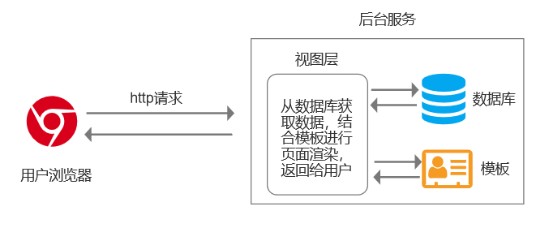
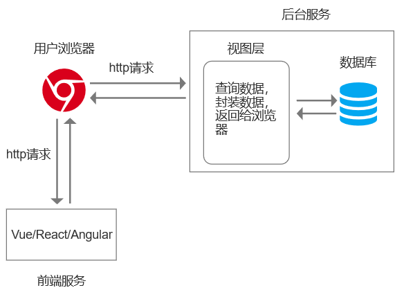
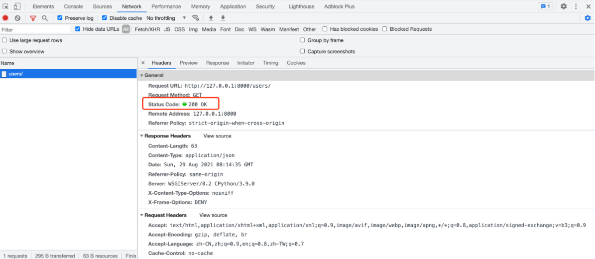

# restful开发规范介绍

## 一、Web开发前后端模式

### 1. 前后端不分离

前后端不分离的开发模式，常见于早期的 Web 开发中（现在也有部分网站延用该模式）。在该模式下，前端人员只需要构建好页面结构样式，提供页面模板即可；后端人员除了要编写相关后台的业务处理接口，还需要根据前端模板将数据进行填充渲染。因此该模式下，前后端的开发关联性较强，比较适合开发用户量少、简单的项目。

```
特点：
    - 用户访问 URL
    - 执行视图函数，视图进行业务处理
    - 视图 render，读取 HTML 模块 + 数据渲染，将渲染完成的 HTML/CSS/JS 返回并呈现在用户浏览器上。

配合开发：
    - 前端，写HTML、CSS、JS
    - 后端，前端代码给后端，后端代码 + 前端代码集成到项目中。
```

从用户的角度而言，前后端的代码都从同一个地址就能拿到

  

### 2. 前后端分离

前后端不分离的开发模式存在以下缺陷：

- 后端的工作量较大，除了要编写业务接口，还需要兼顾前端模板的数据渲染
- 前后端关联性太强，对于大型项目或多人协作的项目，可能会造成项目进度阻塞

因此现在大部分的Web开发都是采用的前后端分离的开发模式。在该模式下，前端人员通常借助一些前端框架（Vue、React、Angular）来编写前端页面，同时也支持逻辑处理和数据请求，从而可以从后端直接获取数据并实现数据的动态渲染，前端不必再为后端提供页面模板，后端也可以只专注于业务逻辑的编写。

```
特点：
    - 一般基于 vue.js、react.js、angular.js 框架来编写前端页面（本质上是HTML、CSS、JS）。
    - 页面上如果需要呈现数据，则需要则需要通过 ajax 的形式向后端发送请求（URL）并获取数据。
    - 后端接收到请求后，执行视图函数并进行业务处理
    - 后端的视图执行完毕后，给前端返回 JSON 格式数据。
    - 前端接收到 JSON 格式数据后呈现在浏览器上即可。

配合开发：
    - 前端，写 HTML、CSS、JS（数据都是通过调用后端API获得）
    - 后端，写 API 接口
    - 前后端约定好接口的规则。
```

从用户的角度而言，前后端的代码会从不同的地址上拿到

 

使用前后端分离开发模式的好处如下：

- 前后端职责清晰，前端开发者只编写页面，后端开发者只编写业务逻辑代码（两者通过 `json` 格式请求数据的传输）
- 开发高效，前后端做自己擅长的领域，且前端开发者使用前端框架开发，比传统的 `HTML`、`CSS`、`JS`、`jQuery`等技术高效
- 有利于项目的扩展（支持多 `APP`、微信小程序等）

## 二、restful规范

### 1. 为什么要有开发规范

基于前后端分离的开发模式进行开发，前后端的开发者关联性较弱，各自负责自己领域的开发工作，这就要求前后端必须有一套互相约束的开发规范，避免冲突，例如：

- 数据传输用什么格式？XML 格式？JSON 格式？
- 出现错误时，错误信息有谁来提供？错误码怎么定义？
- 其他等等等……

目前使用最多的就是 restful 开发规范，它是主流的一套 `API` 规范，企业进行前后端分离开发一般都会遵循它。restful 中定义了很多规范的条款，涉及到数据交互格式、请求方式、状态码、错误处理等等。

### 2. restful 内容介绍

#### 2.1 HTTPS 协议

restful 建议使用 `https` 协议替代 `http` 协议，让接口数据更加安全。

#### 2.2 域名

对于后端 `API` 接口中要体现 `API` 标识，例如：

```apl
# 通过二级域名体现
https://api.example.com

# 通过URL后缀体现
https://www.example.com/api/
```

#### 2.3 版本

对于后端 `API` 接口中要体现版本，便于实现接口的兼容性，例如：

```apl
# 通过URL后缀体现
http://api.example.com/v1/

# 通过URL携带的参数体现
http://api.example.com/?version=v1

# 通过二级域名体现
http://v1.example.com/

# 通过请求头体现
Accept: application/json; version=v1
```

#### 2.4 路径

restful 规范中认为网络上的一切都称是资源，围绕着资源可以进行增删改查等操作。这些资源，在URL中要使用名词表示（可复数），围绕着资源进行的操作就用方法名进行区分。

```apl
https://api.example.com/v1/person
https://api.example.com/v1/zoos
https://api.example.com/v1/animals
https://api.example.com/v1/employees
```

#### 2.5 请求方法

根据请求方法不同进行不同的操作。

```apl
# 请求方法
GET		在服务器取出资源（一项或多项）
POST	在服务器新建一个资源
PUT		在服务器更新资源（客户端提供改变后的完整资源）
PATCH	在服务器更新资源（客户端提供改变的属性）
DELETE	在服务器删除资源

# 示例
https://api.example.com/v1/users
https://api.example.com/v1/users/1/

接口：/users/			方法：GET     =>   用户列表
接口：/users/			方法：POST    =>   添加用户
接口：/users/(\d+)/	方法：GET     =>   获取单条数据
接口：/users/(\d+)/	方法：DELETE  =>   删除数据
接口：/users/(\d+)/	方法：PUT     =>   更新数据
接口：/users/(\d+)/	方法：PATCH   =>   局部更新
```

#### 2.6 搜索条件

在URL中通过参数的形式来传递搜索条件。

```apl
# 指定返回记录的数量
https://api.example.com/v1/zoos?limit=10

# 指定返回记录的开始位置
https://api.example.com/v1/zoos?offset=10

# 指定第几页，以及每页的记录数
https://api.example.com/v1/zoos?page=2&per_page=100

# 指定返回结果按照哪个属性排序，以及排序顺序
https://api.example.com/v1/zoos?sortby=name&order=asc

# 指定筛选条件
https://api.example.com/v1/zoos?animal_type_id=1
```

#### 2.7 返回数据

针对不同操作，服务器向用户返回的结果结构应该不同。

| URL           | 方法   | 描述         | 返回数据                                                     |
| ------------- | ------ | ------------ | ------------------------------------------------------------ |
| /users/       | GET    | 列表         | 返回资源对象的列表<br />[ {"id": 1, "name": "CDC"},   {"id": 2, "name": "TR"}  ] |
| /users/       | POST   | 添加         | 返回新生成的资源对象<br />{ "id": 3, "name": "CDDC"}         |
| /users/(\d+)/ | GET    | 获取单条数据 | 返回单个资源对象<br />{ "id": 1, "name": "CDC"}              |
| /users/(\d+)/ | DELETE | 删除数据     | 返回一个空文档<br />null                                     |
| /users/(\d+)/ | PUT    | 更新数据     | 返回完整的资源对象<br />{ "id": 1, "name": "CDCC" }          |
| /users/(\d+)/ | PATCH  | 局部更新     | 返回完整的资源对象<br />{ "id": 1, "name": "CDCC" }          |

一般在实际的开发过程中会对上述返回数据进行补充和完善，例如每次请求都返回一个字典，其中包含：

- code：表示返回码，用于表示请求执行请求，例如：0 表示请求成功，1003 表示参数非法，40009 数据量太大等。
- data：表示数据
- error：错误信息

```json
{
    code: 0,
    data: [ {"id": 1, "name": "CDC"},   {"id": 2, "name": "TR"}  ]
}
```

```json
{
    code: 1003,
    error: "query params invalid"
}
```

#### 2.8 状态码

后端 `API` 在对请求进行响应时，除了返回数据以外，还应该返回状态码来表示请求状况。常见的通用状态码如下：

```apl
200 OK - [GET]：服务器成功返回用户请求的数据
201 CREATED - [POST/PUT/PATCH]：用户新建或修改数据成功。
202 Accepted - [*]：表示一个请求已经进入后台排队（异步任务）
204 NO CONTENT - [DELETE]：用户删除数据成功。
400 INVALID REQUEST - [POST/PUT/PATCH]：用户发出的请求有错误，服务器没有进行新建或修改数据的操作。
401 Unauthorized - [*]：表示用户未认证（令牌、用户名、密码错误）。
403 Forbidden - [*] 表示用户得到授权（与401错误相对），但是访问是被禁止的。
404 NOT FOUND - [*]：用户发出的请求针对的是不存在的记录，服务器没有进行操作。
406 Not Acceptable - [GET]：用户请求的格式不可得（比如用户请求JSON格式，但是只有XML格式）。
410 Gone -[GET]：用户请求的资源被永久删除，且不会再得到的。
422 Unprocesable entity - [POST/PUT/PATCH] 当创建一个对象时，发生一个验证错误。
500 INTERNAL SERVER ERROR - [*]：服务器发生错误，用户将无法判断发出的请求是否成功。

更多看这里：http://www.w3.org/Protocols/rfc2616/rfc2616-sec10.html
```

  

通用的状态码可以表示一部分的服务端的处理请求，但特别细致的信息无法全都都包括，所以一般在开发中，后端 `API` 会额外再返回一个自定义的状态码来表示额外的请求结果。

```python
from django.http import JsonResponse


def query_user(request):
    query_param = request.GET.get("uid", "")

    try:
        user_id = int(query_param)

        if user_id == 1:
            ret_data = {"code": 1000, "data": {"id": 1, "name": "CDC"}}
        else:
            ret_data = {"code": 1001, "error": "no user"}
    except Exception as e:
        ret_data = {"code": 1002, "error": "invalid query params"}

    return JsonResponse(ret_data)
```

#### 2.9 错误处理

当后端 `API` 报错，应该返回导致错误的信息

```json
{
    "error": "Invalid API key"
}
```