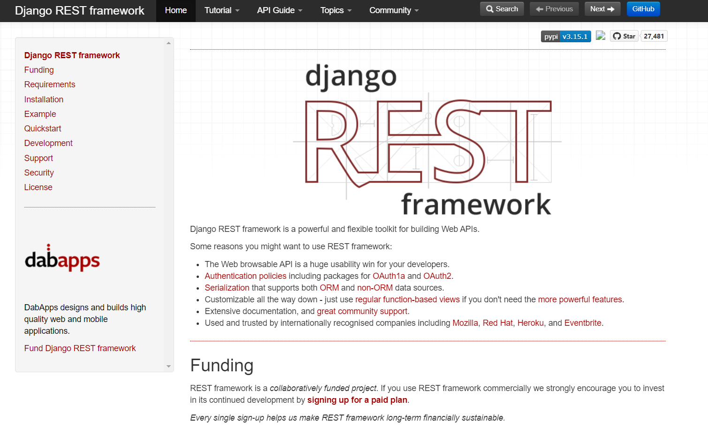
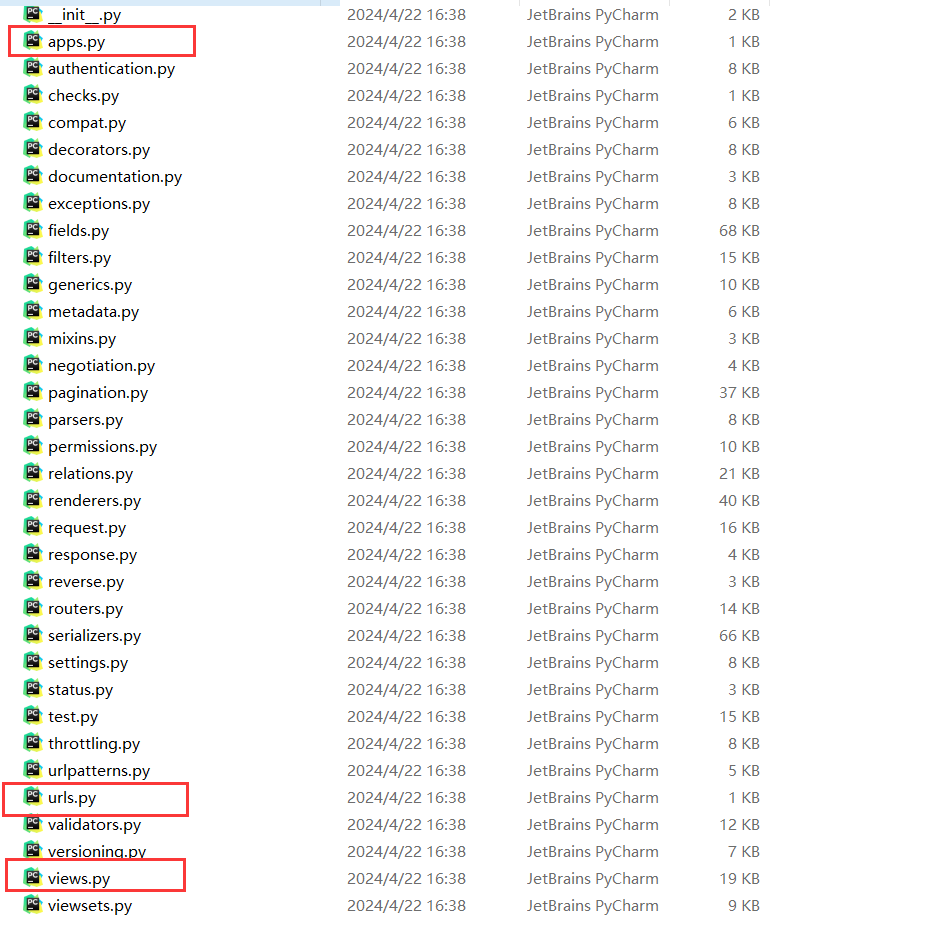
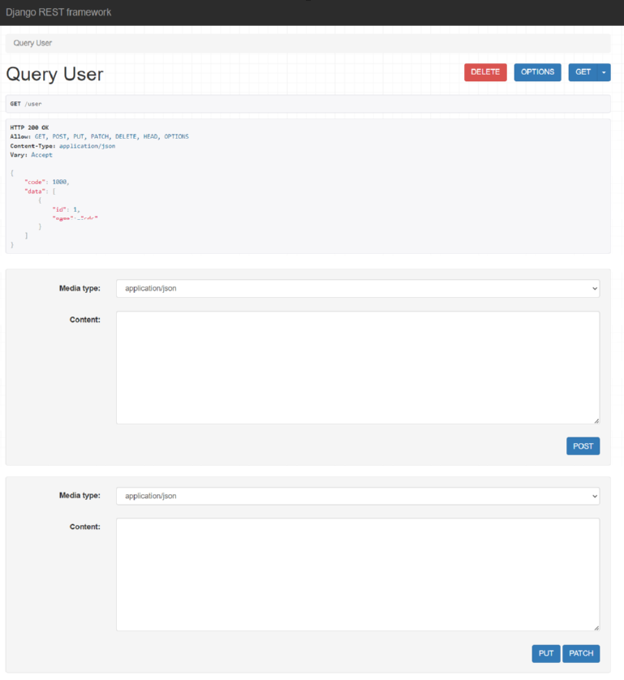
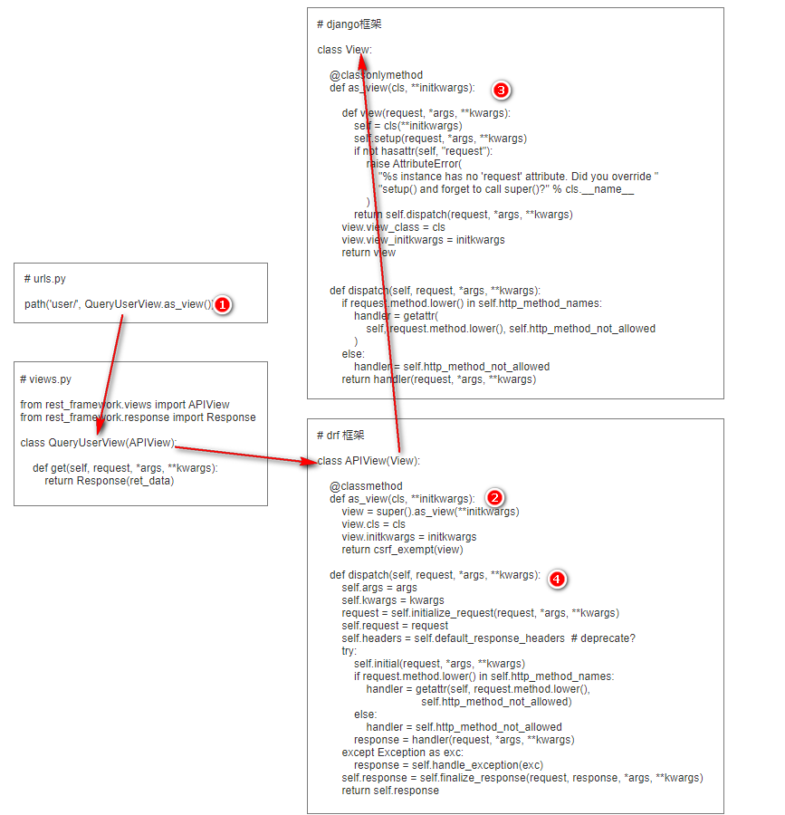

# DRF的使用

## 一、DRF 简介

django restframework（简称drf）是一套基于 `Django` 的 restful 风格框架，里面集成了很多 restful API 相关的便捷功能。

官网地址：https://www.django-rest-framework.org/

   

## 二、DRF 快速上手

### 1. 安装

由于 `DRF` 是基于 `Django` 的，因此使用前必须先安装 `Django`，且对版本有一定的要求，先本地检查下版本是否正确：

```
版本要求：djangorestframework==3.12.4
	Python (3.5, 3.6, 3.7, 3.8, 3.9)
	Django (2.2, 3.0, 3.1)
    
版本要求：djangorestframework==3.11.2
	Python (3.5, 3.6, 3.7, 3.8)
	Django (1.11, 2.0, 2.1, 2.2, 3.0)
```

执行 `pip` 命令安装 drf 框架

```powershell
pip install djangorestframework==3.12.4
```

### 2. 修改配置文件

安装完成以后查看目录结构，我们可以发现 `DRF` 的目录结构和我们在 `Django` 项目中新建的 `App` 是很类似的。

 

其实 `DRF` 本质上就是一个别人写好的 `Django` 下的 `App`，里面帮我们封装了很多的功能，所以使用前必须注册

```python
# settings.py

INSTALLED_APPS = [
    'django.contrib.admin',
    'django.contrib.auth',
    'django.contrib.contenttypes',
    'django.contrib.sessions',
    'django.contrib.messages',
    'django.contrib.staticfiles',
    'rest_framework'
]
```

此外，要想使用 `DRF` 提供的其他功能，也必须在 `settings.py` 中配置：

```python
# settings.py

# drf相关配置以后编写在这里 
REST_FRAMEWORK = {
   
}
```

### 3. 编写视图层接口

```python
# app02/views.py

from rest_framework.views import APIView
from rest_framework.response import Response


class QueryUserView(APIView):

    # get 请求会触发该方法
    def get(self, request, *args, **kwargs):
        user_info = [
            {"id": 1, "name": "cdc", "age": 18},
        ]

        ret_data = {
            "code": 1000,
            "data": user_info
        }

        return Response(ret_data)

    # post 请求会触发该方法
    def post(self, request, *args, **kwargs):
        pass

    # delete 请求会触发该方法
    def delete(self, request, *args, **kwargs):
        pass

    # put 请求会触发该方法
    def put(self, request, *args, **kwargs):
        pass

    # patch 请求会触发该方法
    def patch(self, request, *args, **kwargs):
        pass
```

```python
# urls.py

from django.urls import path
from app02.views import QueryUserView

urlpatterns = [
    path('user/', QueryUserView.as_view())
]
```

启动服务，打开浏览器访问：http://127.0.0.1:8000/user/，可以看到以下界面，`DRF` 不仅优化了结果展示界面，还提供了简单调试接口的功能 ：

 

## 三、DRF 原理分析

`DRF` 中视图层是基于 `CBV` 模式进行开发的，其原理也和 `django.views.View` 类似，我们可以结合源码来看下：

 

- 第一步，当路由系统匹配到访问的地址后缀为 `/user/` 时，会执行  `QueryUserView` 视图类中的 `as_view` 方法；

- 第二步，我们自己定义的视图类中并没有 `as_view` 这个方法，所以要再去继承的父类 `APIView` 中寻找；

- 第三步，`APIView` 类的 `as_veiw` 方法中，执行了它父类中的 `as_view` 方法：

  ```python
  view = super().as_view(**initkwargs)
  ```

  即最终调用的其实是 `django.view.View` 中的 `as_view` 方法；

- 第四步，`django.view.View` 的 `as_view` 方法中，定义了一个 `view` 函数对象，函数中会执行一个 `dispatch` 方法，并把接收到的相关的参数都传给函数对象，最终返回这个函数；

- 第五步，`APIView` 类的 `as_veiw` 方法中，在执行完父类的 `as_view` 方法拿到返回的函数对象后，又对该函数做了一个免除 `csrf token` 校验的操作：

  ```python
  return csrf_exempt(view)
  ```

- 第六步，执行 `dispatch` 方法，首先还是先去我们自己定义的视图类中寻找，找不到再去父类 `APIView` 中寻找，再找不到就继续去 `APIView` 的父类中寻找…… 最终我们在 `APIView` 中就已经找到了该方法。我们先关注 `dispatch` 方法中的这一部分：

  ```python
  if request.method.lower() in self.http_method_names:
      handler = getattr(self, request.method.lower(),
                        self.http_method_not_allowed)
  else:
      handler = self.http_method_not_allowed
  
      response = handler(request, *args, **kwargs)
  ```

  主要做了以下几件事情：

  - 对请求的类型进行全小写处理，即请求类型 GET/POST/PUT/DELETE 等会转换成 get/post/put/delete
  - 判断请求的类型是否在框架支持的范围内
  - 利用类的反射机制去视图类中寻找是否存在和请求类型同名的方法，如果存在，就执行该方法。这就是为什么我们只需要在视图类中去定义 `get()`、`post()` 等方法就能自动去处理对应请求类型的原因。