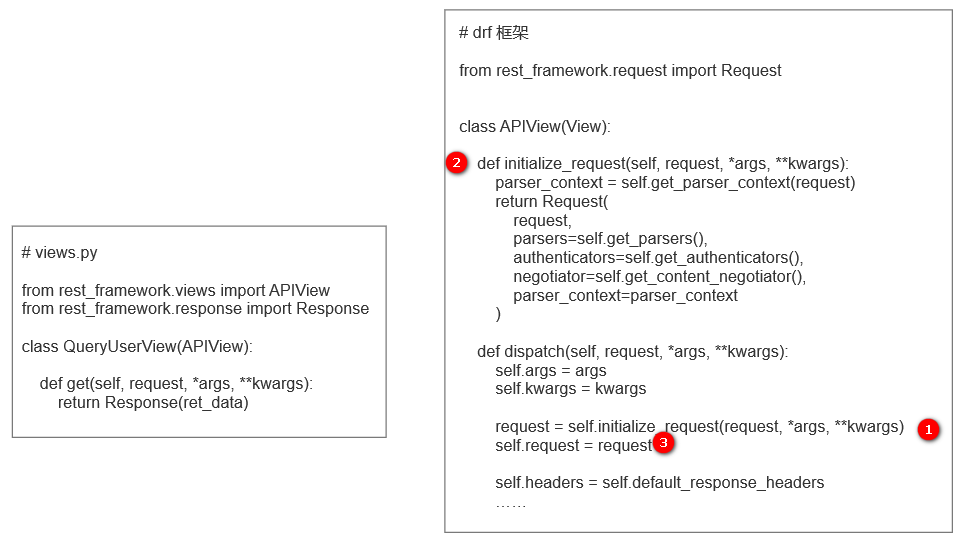

# DRF 请求数据封装

## 一、请求对象的区别

### 1. Django 中的请求对象

通过 `Django` 进行项目开发时，视图层方法或者视图类中的方法都会接收一个 `request` 对象参数

```python
from django.http import JsonResponse

def query_user(request):
    return JsonResponse("OK")
```

该 `request` 对象是 `django.core.handlers.wsgi.WSGIRequest` 类的对象，其中包含了请求相关的所有数据

```python
def query_user(request):
    # 获取请求的方法
    request.method
    
    # 获取post请求的参数
	request.POST
    
    # 获取get请求的参数
	request.GET
    
    # 获取请求体
	request.body
    
    return JsonResponse("OK")
```

虽然可以满足大多数开发场景，但原始的 `request` 对象还是有很多用着不方便的地方，以 `POST` 请求举例：

- 当前端发送的请求头中 `content-type: url-form-encoded`，参数为 `v1=123&v2=456&v3=999`，`django` 一旦读取到该请求头，就会自动把请求参数解析为键值对格式，即 `{"v1":123,"v2":456,"v3":999}`，并把解析后的值放在 `request.POST` 中，方便使用者调用；
- 当前端发送的请求头中 `content-type: application/json`，参数为 `{"v1":123,"v2":456,"v3":999}` 时，`django` 是无法解析的，因此通过 `request.POST` 方法无法直接拿到数据，使用者必须从 `request.body` 中读出请求内容，再通过序列化操作以后才能拿到请求的参数。

### 2. DRF 中的请求对象

使用 `drf` 框架时，视图中的 `request` 对象是 `rest_framework.request.Request` 类的对象，其本质上是对 `django` 的 `request` 进行了一次封装优化，除了包含 `django` 原 `request` 对象相关的功能和属性以外，还丰富了其他的内容。

- `rest_framework.request.Request` 类部分源码

```python
class Request:
    """
    Wrapper allowing to enhance a standard `HttpRequest` instance.
    Kwargs:
        - request(HttpRequest). The original request instance. （django中的request）
        - parsers(list/tuple). The parsers to use for parsing the
          request content.
        - authenticators(list/tuple). The authenticators used to try
          authenticating the request's user.
    """

    def __init__(self, request, parsers=None, authenticators=None,negotiator=None, parser_context=None):
    	# 传入的request参数就是django原来的request
        self._request = request
        self.parsers = parsers or ()
        self.authenticators = authenticators or ()
        ...
	
    @property
    def query_params(self):
        """
        More semantically correct name for request.GET.
        """
        return self._request.GET

    @property
    def data(self):
        if not _hasattr(self, '_full_data'):
            self._load_data_and_files()
        return self._full_data
    
    # 面向对象中，内置方法 __getattr__ 会在 "对象.属性" 且属性不存的时候触发
	def __getattr__(self, attr):
        try:
            return getattr(self._request, attr) # self._request.method
        except AttributeError:
            return self.__getattribute__(attr)
```

- `rest_framework.request.Request` 类的使用

```python
from rest_framework.views import APIView
from rest_framework.response import Response

class QueryUserView(APIView):

    def get(self, request, *args, **kwargs):
        
        # 通过对象的嵌套直接找到原request，读取相关值
        # request._request 就是原来 django 中的 request
        request._request.method
        request._request.GET
        request._request.POST
        request._request.body

        # 直接读取新request对象中的值，一般此处会对原始的数据进行一些处理，方便开发者在视图中使用。
        # 内部本质上就是 request._request.GET
        request.query_params  
        
        # 内部读取请求体中的数据，并进行处理
        # 例如：请求者发来JSON格式，内部会对json字符串进行反序列化。
        request.data  
		
        # 针对 drf 的 Request 类中未定义而 django 的 Request 类中定义的成员
        # 可以通过 __getattr__ 去访问 request._request 中的值
        # 面向对象中，内置方法 __getattr__ 会在 "对象.属性" 且属性不存的时候触发
        request.method
        request.META
        request.path

        return Response("OK")
```

## 二、源码剖析

`drf` 对 `request` 对象的再次封装的过程，可以通过源码来了解

 

- 第一步，当前前面的流程都走完，一直到执行 `dispatch` 方法这一步，`dispatch` 内部执行了一个 `self.initialize_request` 方法；
- 第二步，`initialize_request` 方法接收的参数 `request` 就是原来 `django` 中的 `request` 对象，将该参数传入 `rest_framework.request.Request` 类中，最后返回了一个该类的对象；
- 第三步，将 `rest_framework.request.Request`  类对象重新赋值给 `self.request`，即 `DRF` 中视图层方法使用的 `request` 对象都是 `rest_framework.request.Request`  类的对象