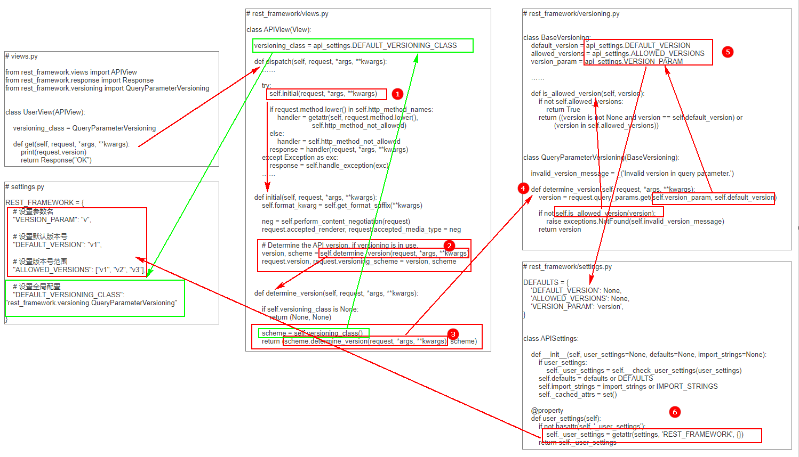
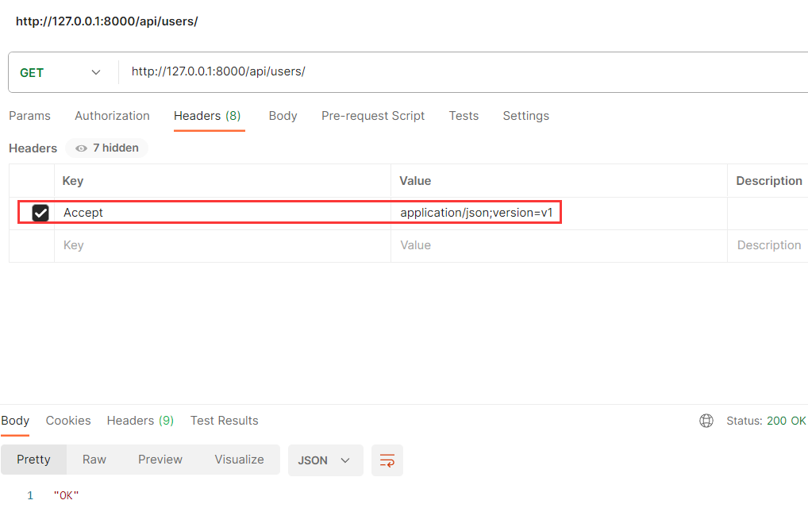
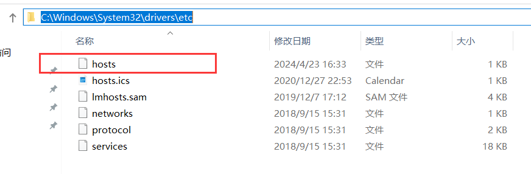
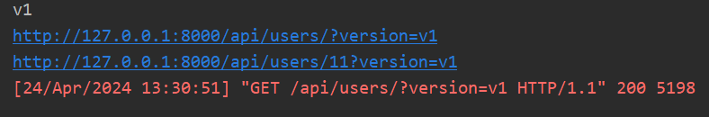

# DRF组件之版本管理

## 一、版本传递的五种方式

### 1. URL的GET参数传递版本

#### 1.1 基本用法

- 在视图类中引入 `rest_framework.versioning` 下的 `QueryParameterVersioning` 类

```python
# views.py

from rest_framework.views import APIView
from rest_framework.response import Response

# 导入通过路由参数解析版本的操作类
from rest_framework.versioning import QueryParameterVersioning


class UserView(APIView):
    # 必须要配置
    versioning_class = QueryParameterVersioning

    def get(self, request, *args, **kwargs):
        
        # 通过 request.version 可以获取版本信息
        print(request.version)

        return Response("OK")
```

- 路由

```python
# urls.py

from django.urls import path
from api import views

urlpatterns = [
    path('api/users/', views.UserView.as_view()),
]
```

- 启动服务，浏览器访问路由时，要携带一个版本的参数，且参数名只能为 `version`，后端会根据该参数名提取出版本的值

```
http://127.0.0.1:8000/api/users/?version=123
```

#### 1.2 用法配置

版本管理组件支持一些配置，可以修改传参名，设置默认值等等，这些配置要写在 `settings.py` 中。

```python
# settings.py

REST_FRAMEWORK = {
    # 设置参数名
    # 设置该配置后，url携带的参数名就不能是version了，必须是设置的名称
    # 即 http://127.0.0.1:8000/api/users/?v=123
    "VERSION_PARAM": "v",
    
    # 设置默认版本号
    # 当路由中未携带版本号，后端获取到的版本号默认为配置的值
    "DEFAULT_VERSION": "v1",
    
    # 设置版本号范围
    # 如果路由中携带的版本号值不在配置指定的范围内，后端接口获取版本号时直接抛出异常
    "ALLOWED_VERSIONS": ["v1", "v2", "v3"],
}
```

#### 1.3 全局使用

如果有多个视图类，一个一个去添加版本解析类显然是不现实的。`drf` 提供了全局配置方式，可以将功能作用于所有的视图

```python
# settings.py

REST_FRAMEWORK = {
    # 设置全局配置
    "DEFAULT_VERSIONING_CLASS": "rest_framework.versioning.QueryParameterVersioning"
}
```

```python
# views.py

from rest_framework.views import APIView
from rest_framework.response import Response
from rest_framework.versioning import QueryParameterVersioning


class UserView(APIView):
    # 设置全局配置以后，视图类中就不用再做配置了
    # 如果设置了全局配置，视图类中也进行了配置，优先使用视图类中的配置
    # versioning_class = QueryParameterVersioning

    def get(self, request, *args, **kwargs):
        # 通过 request.version 可以获取版本信息
        print(request.version)

        return Response("OK")
```

#### 1.4 源码分析

通过解析 `URL` 携带的版本参数来获取版本值是怎么实现的？我们可以根据源码来简单分析下：

 

先来看红色框和箭头部分：

- 第一步，通过视图类走到了 `rest_framework/views.py` 中 `APIView` 的 `dispatch` 方法，该方法中调用了一个 `initial`  方法；
- 第二步，`initial` 方法中调用了对版本号处理的方法 `determine_version`，该方法会返回两个值，最后把两个值分别赋值给 `request.version` 和 `request.versioning_scheme` 两个 `request` 对象的变量，这就是为什么我们可以在自己写的视图类中，通过 `request.version` 拿到版本号的原因了；
- 第三步， `determine_version` 方法中，尝试去找视图类中的 `versioning_class` 变量，即我们在 `UserView` 视图类中的 `versioning_class = QueryParameterVersioning` 这一行。变量如果有值，则执行 `scheme = self.versioning_class()`，相当于执行 `scheme = QueryParameterVersioning()`，即生成了一个 `QueryParameterVersioning` 类的对象，最后去执行对象中的 `determine_version` 方法；
- 第四步，`QueryParameterVersioning` 类中的 `determine_version` 方法里，实际就是通过 `request.query_params.get` ，即 `request.GET.get` 方法去获取 `GET` 请求中的参数值，而获取的变量名和默认值是由其父类 `BaseVersioning` 中定义的，获取到版本值以后，再判断值是否在指定的范围内，判断的范围也是从父类中获取；
- 第五步，`BaseVersioning` 类中定义的版本号参数的变量名、默认值、取值范围均是从 `rest_framework/settings.py` 中获取；
- 第六步，`rest_framework/settings.py` 中会去我们工程下的 `settings.py` 中寻找 `REST_FRAMEWORK` 变量，读取里面的值作为版本相关配置的值，如果读取不到相关的变量，则使用自己定义的默认变量，这就是为什么我们不进行版本配置时，传参的变量名只能为 "version" 的原因。

**补充**：如果我们在自己编写的视图类中没有定义 `versioning_class`，在执行到 `determine_version` 方法时，就会去寻找视图类父类中的 `versioning_class` ，即 `APIView` 中的 `versioning_class`（绿色箭头所展示的流程）。 `APIView` 中的 `versioning_class` 的值为 `DEFAULT_VERSIONING_CLASS` ，所以给 `DEFAULT_VERSIONING_CLASS` 赋值以后就可以作用于全局的视图函数了，而且也解释了为什么同时配置了全局和视图类中的 `versioning_class`，视图类中的配置会被优先使用。

### 2. URL路径传递版本

#### 2.1 基本用法

- 在视图类中引入 `rest_framework.versioning` 下的 `URLPathVersioning` 类

```python
# views.py

from rest_framework.views import APIView
from rest_framework.response import Response
from rest_framework.versioning import URLPathVersioning


class UserView(APIView):
    versioning_class = URLPathVersioning

    def get(self, request, *args, **kwargs):
        print(request.version)

        return Response("OK")
```

- 路由中要定义接收版本的变量名

```python
# urls.py

from django.urls import path
from api import views

urlpatterns = [
    path('api/<str:version>/users/', views.UserView.as_view()),
]
```

- 启动服务，浏览器访问路由

```
http://127.0.0.1:8000/api/v1/users/
```

#### 2.2 用法配置

```python
# settings.py

REST_FRAMEWORK = {
    # 设置参数名
    # 设置该配置后，路由中定义要接收的版本变量名就不能是version了，必须是设置的名称
    # 即 path('api/<str:v>/users/', views.UserView.as_view())
    "VERSION_PARAM": "v",
    
    # 设置默认版本号
    # 对于URL路径传递版本号方式而言，这个配置没有作用，因为版本号是用户必填的
    "DEFAULT_VERSION": "v1",
    
    # 设置版本号范围
    "ALLOWED_VERSIONS": ["v1", "v2", "v3"],
}
```

#### 2.3 全局使用

```python
# settings.py

REST_FRAMEWORK = {
    # 设置全局配置
    "DEFAULT_VERSIONING_CLASS": "rest_framework.versioning.URLPathVersioning"
}
```

#### 2.4 源码分析

所有的流程都是差不多的，只是在第四步获取版本值的方式上有所不同

```python
# rest_framework/versioning.py

class URLPathVersioning(BaseVersioning):

    invalid_version_message = _('Invalid version in URL path.')

    def determine_version(self, request, *args, **kwargs):
        version = kwargs.get(self.version_param, self.default_version)
        if version is None:
            version = self.default_version

        if not self.is_allowed_version(version):
            raise exceptions.NotFound(self.invalid_version_message)
        return version
```

当路由使用分组方式来接收变量时，解析出的数据会存放在 `**kwargs` 形参中一层一层传递，直到传给了 `URLPathVersioning.determine_version` 方法中。

### 3. 请求头传递版本

#### 3.1 基本用法

- 在视图类中引入 `rest_framework.versioning` 下的 `AcceptHeaderVersioning` 类

```python
from rest_framework.views import APIView
from rest_framework.response import Response
from rest_framework.versioning import AcceptHeaderVersioning

class UserView(APIView):
    versioning_class = AcceptHeaderVersioning

    def get(self, request, *args, **kwargs):
        # 通过 request.version 可以获取版本信息
        print(request.version)

        return Response("OK")
```

- 路由

```python
# urls.py

from django.urls import path
from api import views

urlpatterns = [
    path('api/users/', views.UserView.as_view()),
]
```

- 启动服务，此时无法使用浏览器设置请求头来访问，可以借助 `Post man` 发送请求，请求头必须添加：

```
Accept: application/json;version=v1
```

 

#### 3.2 用法配置

```python
# settings.py

REST_FRAMEWORK = {
    # 设置参数名
    # 设置该配置后，请求头设置的版本变量名就不能是version了，必须是设置的名称
    # 即：Accept: application/json;v=v1
    "VERSION_PARAM": "v",
    
    # 设置默认版本号
    "DEFAULT_VERSION": "v1",
    
    # 设置版本号范围
    "ALLOWED_VERSIONS": ["v1", "v2", "v3"],
}
```

#### 3.3 全局使用

```python
# settings.py

REST_FRAMEWORK = {
    # 设置全局配置
    "DEFAULT_VERSIONING_CLASS": "rest_framework.versioning.AcceptHeaderVersioning"
}
```

#### 3.4 源码分析

```python
# rest_framework/versioning.py

class AcceptHeaderVersioning(BaseVersioning):
    """
    GET /something/ HTTP/1.1
    Host: example.com
    Accept: application/json; version=1.0
    """
    invalid_version_message = _('Invalid version in "Accept" header.')

    def determine_version(self, request, *args, **kwargs):
        media_type = _MediaType(request.accepted_media_type)
        version = media_type.params.get(self.version_param, self.default_version)
        version = unicode_http_header(version)
        if not self.is_allowed_version(version):
            raise exceptions.NotAcceptable(self.invalid_version_message)
        return version
```

`AcceptHeaderVersioning` 类中的 `determine_version` 方法是通过将请求头中内容进行解析，根据配置的版本变量名去获取版本值。

### 4. 二级域名传递版本

#### 4.1 基本用法

- 在视图类中引入 `rest_framework.versioning` 下的 `HostNameVersioning` 类

```python
from rest_framework.views import APIView
from rest_framework.response import Response
from rest_framework.versioning import HostNameVersioning

class UserView(APIView):
    versioning_class = HostNameVersioning

    def get(self, request, *args, **kwargs):
        # 通过 request.version 可以获取版本信息
        print(request.version)

        return Response("OK")
```

- 路由

```python
# urls.py

from django.urls import path
from api import views

urlpatterns = [
    path('api/users/', views.UserView.as_view()),
]
```

- 修改访问限制，允许其他地址访问服务

```python
# settings.py

ALLOWED_HOSTS = ["*"]
```

- 因为涉及到域名解析，需要在本地 hosts 文件中添加以下内容

```
127.0.0.1       v1.cdc.com
127.0.0.1       v2.cdc.com
```

 

- 启动服务，浏览器访问

```
http://v1.cdc.com:8000/api/users/
http://v2.cdc.com:8000/api/users/
```

#### 4.2 用法配置

```python
# settings.py

REST_FRAMEWORK = {
    # 设置参数名
    # 由于是解析域名获取，该配置没有作用
    "VERSION_PARAM": "v",
    
    # 设置默认版本号
    "DEFAULT_VERSION": "v1",
    
    # 设置版本号范围
    "ALLOWED_VERSIONS": ["v1", "v2", "v3"],
}
```

#### 4.3 全局使用

```python
# settings.py

REST_FRAMEWORK = {
    # 设置全局配置
    "DEFAULT_VERSIONING_CLASS": "rest_framework.versioning.HostNameVersioning"
}
```

#### 4.4 源码分析

```python
class HostNameVersioning(BaseVersioning):
    hostname_regex = re.compile(r'^([a-zA-Z0-9]+)\.[a-zA-Z0-9]+\.[a-zA-Z0-9]+$')
    invalid_version_message = _('Invalid version in hostname.')

    def determine_version(self, request, *args, **kwargs):
        hostname, separator, port = request.get_host().partition(':')
        match = self.hostname_regex.match(hostname)
        if not match:
            return self.default_version
        version = match.group(1)
        if not self.is_allowed_version(version):
            raise exceptions.NotFound(self.invalid_version_message)
        return version
```

`HostNameVersioning` 类中的 `determine_version` 方法是将访问后台的域名进行拆分解析，获取到版本号的值。

### 5. 路由名称空间传递版本

#### 5.1 基本用法

- 在视图类中引入 `rest_framework.versioning` 下的 `NamespaceVersioning` 类

```python
from rest_framework.views import APIView
from rest_framework.response import Response
from rest_framework.versioning import NamespaceVersioning

class UserView(APIView):
    versioning_class = NamespaceVersioning

    def get(self, request, *args, **kwargs):
        # 通过 request.version 可以获取版本信息
        print(request.version)

        return Response("OK")
```

- 路由分组

```python
# urls.py

from django.urls import path, include

urlpatterns = [
    path('api/v1/', include("api.urls", namespace="v1")),
    path('api/v2/', include("api.urls", namespace="v2")),
]


# api/urls.py
from django.urls import path
from api import views

urlpatterns = [
    path('users/', views.UserView.as_view()),
]

app_name = "api"
```

- 启动服务，浏览器访问

```
http://127.0.0.1:8000/api/v1/users/
http://127.0.0.1:8000/api/v2/users/
```

#### 5.2 用法配置

```python
# settings.py

REST_FRAMEWORK = {
    # 设置参数名
    # 由于是通过路由的Namespace解析，所以该配置无效
    "VERSION_PARAM": "v",
    
    # 设置默认版本号
    # 该配置无效，namespace必须指定
    "DEFAULT_VERSION": "v1",
    
    # 设置版本号范围
    "ALLOWED_VERSIONS": ["v1", "v2", "v3"],
}
```

#### 5.3 全局使用

```python
# settings.py

REST_FRAMEWORK = {
    # 设置全局配置
    "DEFAULT_VERSIONING_CLASS": "rest_framework.versioning.NamespaceVersioning"
}
```

#### 5.4 源码分析

```python
class NamespaceVersioning(BaseVersioning):
    
    invalid_version_message = _('Invalid version in URL path. Does not match any version namespace.')

    def determine_version(self, request, *args, **kwargs):
        resolver_match = getattr(request, 'resolver_match', None)
        if resolver_match is None or not resolver_match.namespace:
            return self.default_version

        # Allow for possibly nested namespaces.
        possible_versions = resolver_match.namespace.split(':')
        for version in possible_versions:
            if self.is_allowed_version(version):
                return version
        raise exceptions.NotFound(self.invalid_version_message)
```

`NamespaceVersioning` 类中的 `determine_version` 方法是借助路由分组反向解析来获取 `Namespace` 的值，即版本号的值。

## 二、反向生成URL

在 `QueryParameterVersioning` 、`URLPathVersioning`、`NamespaceVersioning`  这三个版本处理的类中还定义了`reverse`方法，用来反向生成 URL 并携带相关的的版本信息。

- 路由

```python

from django.urls import path
from api import views

urlpatterns = [
    path('api/users/', views.UserView.as_view(), name="u1"),
    path('api/users/<int:pk>', views.UserView.as_view(),  name="u2"),
]
```

- 视图

```python
from rest_framework.views import APIView
from rest_framework.response import Response
from rest_framework.versioning import QueryParameterVersioning

class UserView(APIView):
    versioning_class = QueryParameterVersioning

    def get(self, request, *args, **kwargs):
        # 通过 request.version 可以获取版本信息
        print(request.version)

        url1 = request.versioning_scheme.reverse("u1", request=request)
        print(url1)

        url2 = request.versioning_scheme.reverse("u2", args=(11,), request=request)
        print(url2)

        return Response("OK")
```

 