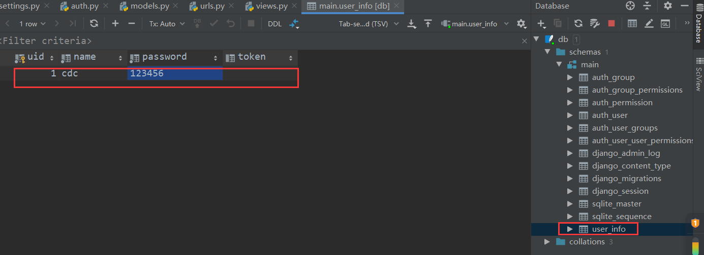
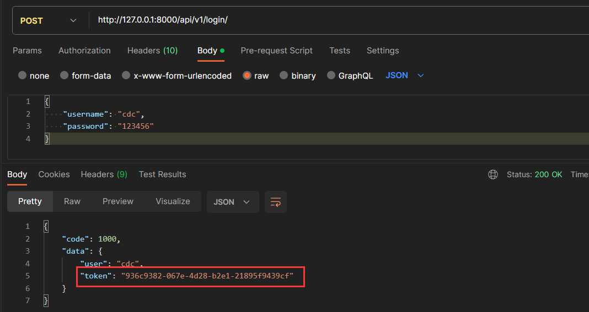
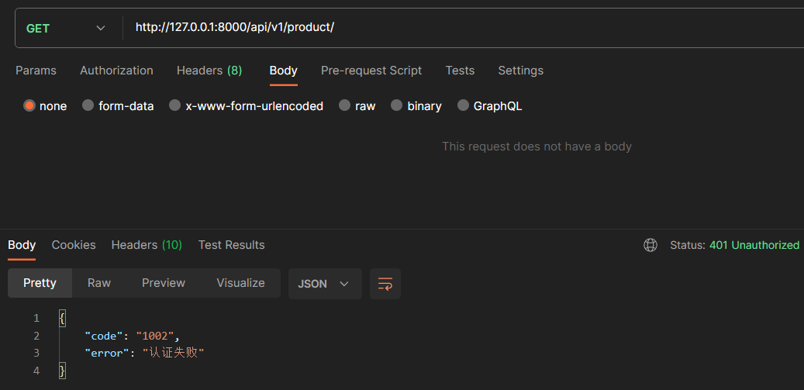
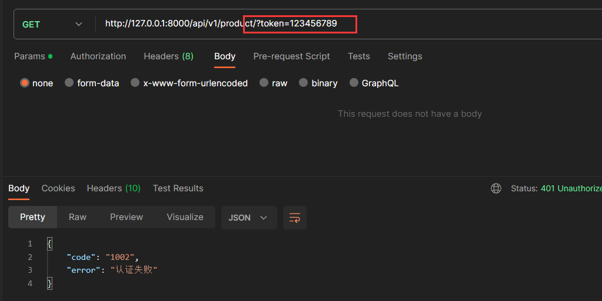
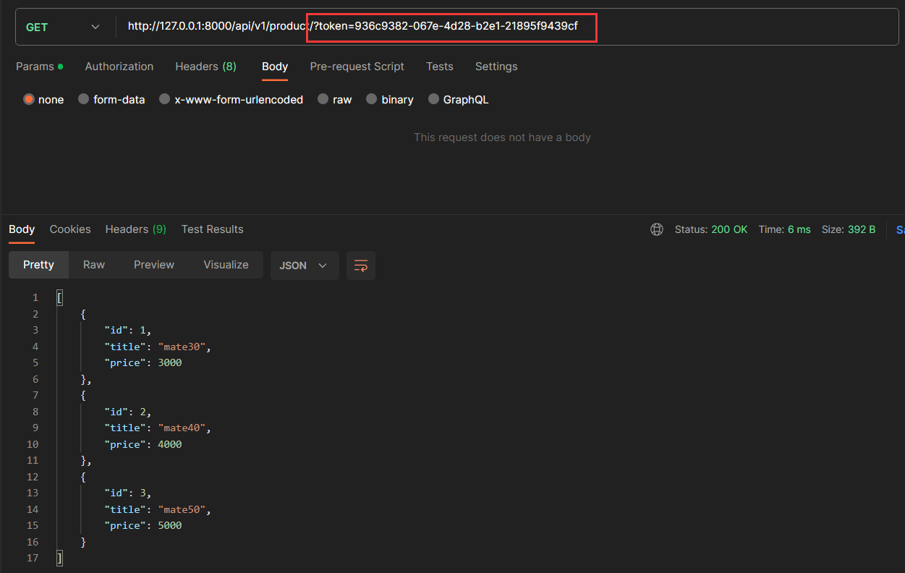
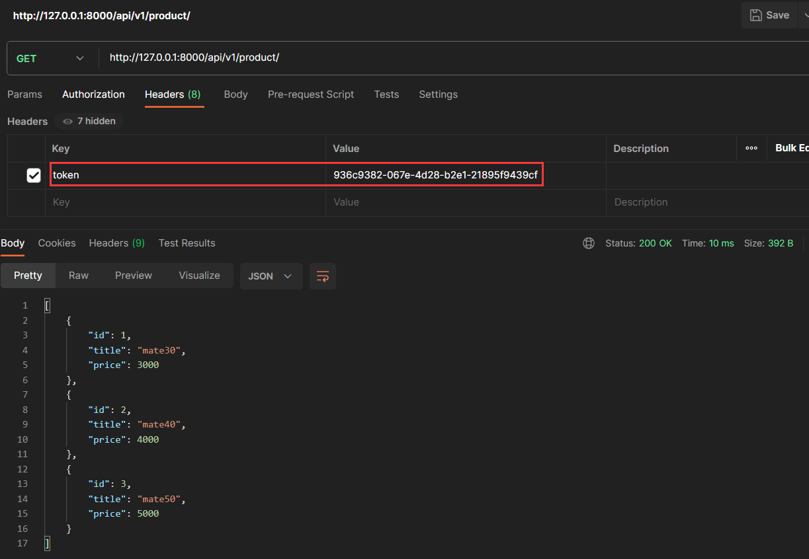
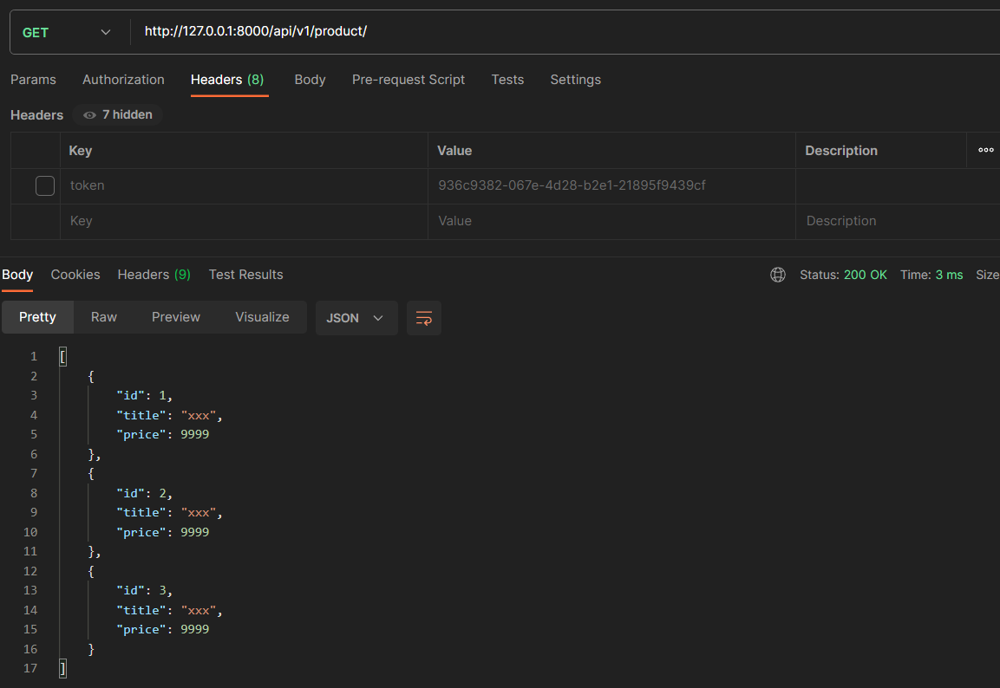
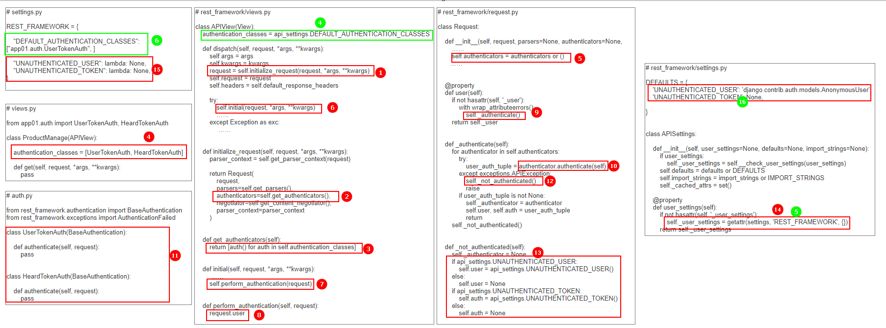

# DRF组件之认证

## 一、认证组件介绍

### 1. 用户认证的作用

在开发后端 `API` 时，要考虑不同的功能会有不同限制的场景，例如：

- 无需认证，就可以访问并获取数据（游客模式）
- 需认证，用户先登录，后续发送请求要携带登录时发放的凭证

`django` 中可以借鉴装饰器、中间件等对所有接口执行之前先进行用户身份认证。`drf` 中直接提供了用户认证的组件，可以帮助我们快速高效的完成用户身份识别功能。

### 2. 认证组件的使用

#### 2.1 编写认证类

一般功能性的组件不会跟业务代码放在一起，我们可以单独新建一个文件或者目录，存放我们自己编写的组件。

```python
# app01/auth.py

from rest_framework.authentication import BaseAuthentication
from rest_framework.exceptions import AuthenticationFailed
from app01.models import UserInfo

class UserTokenAuth(BaseAuthentication):

    def authenticate(self, request):
        token = request.query_params.get("token", "")
		
        # 如果请求路由未携带token，表示未登录，验证不通过
        if not token:
            raise AuthenticationFailed({"code": 1002, "error": "认证失败"})
		
         # 如果请求路由携带token的token不对，表示未登录，验证不通过
        user_obj = UserInfo.objects.filter(token=token).first()
        if not user_obj:
            raise AuthenticationFailed({"code": 1002, "error": "认证失败"})

        return user_obj, token

    def authenticate_header(self, request):
        return 'Bearer realm="API"'

```

认证类的使用要注意以下几点：

- 认证类必须继承 `rest_framework.authentication.BaseAuthentication` 类，且必须实现类中 `authenticate` 方法，该方法实现的就是认证的功能。`authenticate_header` 方法可以不用实现；
- 对于认证失败的情况，要用 `rest_framework.exceptions.AuthenticationFailed` 类抛出异常；
- 认证通过后，最后会返回两个值，两个值会分别赋值给 `request.user` 和 `request.auth` ，即可以在业务接口中直接查询访问的用户信息。

#### 2.2 编写数据表模型

我们简单创建一张用户表，用于存储用户相关信息。当用户登录时，后端生成一个随机的 `token` 值，并将值存入表中。

```python
# app01/models.py

from django.db import models

class UserInfo(models.Model):
    uid = models.AutoField(primary_key=True, verbose_name="用户ID")
    name = models.CharField(max_length=10, verbose_name="用户名", null=False)
    password = models.CharField(max_length=16, verbose_name="用户密码", null=False)
    token = models.CharField(max_length=32, verbose_name="用户登录token", null=True)

    def __str__(self):
        return self.name

    class Meta:
        verbose_name_plural = "user_info"
        db_table = verbose_name_plural
```

创建完表模型后，执行数据库迁移命令（这里直接使用 sqlite 数据库）

```python
# 在项目根目录，即 manage.py 同级目录下打开终端执行

python manage.py makemigrations
python manage.py migrate
```

表生成以后手动插入一条数据

 

#### 2.3 路由

创建两条路由，一个用于用户登录，另一个用于查看商品信息

```python
# urls.py

from django.urls import path
from app01 import views

urlpatterns = [
    path('api/v1/login/', views.UserLoginView.as_view()),
    path('api/v1/product/', views.ProductManage.as_view()),
]
```

####  2.4 编写视图类

```python
# app01/views.py

import uuid
from rest_framework.views import APIView
from rest_framework.response import Response
from app01.models import UserInfo
from app01.auth import UserTokenAuth

class UserLoginView(APIView):

    def post(self, request, *args, **kwargs):
        data = request.data
        user_name = data.get("username", "")
        pwd = data.get("password", "")

        user_obj = UserInfo.objects.filter(name=user_name, password=pwd).first()

        if not user_obj:
            ret_data = {"code": 1001, "error": "用户名或密码错误"}
            return Response(ret_data)

        user_token = str(uuid.uuid4())
        user_obj.token = user_token
        user_obj.save()

        ret_data = {
            "code": 1000,
            "data": {
                "user": user_name,
                "token": user_token
            }
        }

        return Response(ret_data)


class ProductManage(APIView):
    
    # 如果想对接口使用用户认证，需要做以下配置
    authentication_classes = [UserTokenAuth, ]

    def get(self, request, *args, **kwargs):
        product_list = [
            {"id": 1, "title": "mate30", "price": 3000},
            {"id": 2, "title": "mate40", "price": 4000},
            {"id": 3, "title": "mate50", "price": 5000},
        ]

        return Response(product_list)
```

上述两个视图类，`UserLoginView` 为用户登录接口，无需进行身份验证；`ProductManage` 类为查看商品信息，只有认证通过即登录过的用户才能请求看到数据。

#### 2.5 用户认证校验

- 用户先进行登录操作，拿到后端接口返回的 `token` 信息

 

- 访问查询商品接口时，路由未携带 `token`，请求认证不通过

 

- 访问查询商品接口时，路由携带 `token` 值不正确，请求认证不通过

 

- 访问查询商品接口时，路由携带正确的 `token` ，请求认证通过，后端返回商品信息

  

#### 2.6 认证组件的全局使用

```python
# settings.py

REST_FRAMEWORK = {
    # 将自己编写的认证类作用于全局的视图
    # 键名为 DEFAULT_AUTHENTICATION_CLASSES
    # 值为一个列表，里面存放认证类的文件路径
    "DEFAULT_AUTHENTICATION_CLASSES": ["app01.auth.UserTokenAuth", ]
}
```

设置好全局配置后，需要经过认证的视图类中就不用再配置 `authentication_classes` ，而针对于不想使用认证的视图类，只需要设置 `authentication_classes = []` 即可

```python
# 登录的接口不需要做用户认证

class UserLoginView(APIView):
    # 重新设置 authentication_classes 的值，覆盖全局配置
    authentication_classes = []
    
    def post(self, request, *args, **kwargs):
      pass
```

## 二、多个认证类

### 1. 多个认证类的使用

在实际的开发场景中，一个 `api` 可能被多方调用（PC端、App、小程序等等），各方使用的认证方式可能也不一样，我们的接口应该尽量兼容各种认证情况。

在视图类的 `authentication_classes` 中定义认证类时，传入的是一个列表，这就意味着 `drf` 是支持定义多个认证类的。当出现多个认证类时，`drf` 内部会按照列表的顺序，逐一执行认证类的 `authenticate` 方法，如果返回元组或抛出异常则会终止后续认证类的执行；如果返回 `None`，则会继续执行后续的认证类。

- 编写多个认证类

```python
# app01/auth.py

from rest_framework.authentication import BaseAuthentication
from rest_framework.exceptions import AuthenticationFailed
from app01.models import UserInfo

from rest_framework.authentication import BaseAuthentication
from rest_framework.exceptions import AuthenticationFailed
from app01.models import UserInfo


class UserTokenAuth(BaseAuthentication):
    """
    从请求路由中获取token值进行验证
    """

    def authenticate(self, request):
        token = request.query_params.get("token", "")
		
        # 如果请求路由中没有携带token参数，则跳过该认证，继续走后面的认证
        if not token:
            return None

        user_obj = UserInfo.objects.filter(token=token).first()
        if not user_obj:
            raise AuthenticationFailed({"code": 1002, "error": "认证失败"})

        return user_obj, token

    def authenticate_header(self, request):
        return 'Bearer realm="API"'


class HeardTokenAuth(BaseAuthentication):
    """
     从请求头中获取token值进行验证
     """

    def authenticate(self, request):
		
        # 从请求头中获取token
        token = request.META.get("HTTP_TOKEN", "")

        if not token:
            raise AuthenticationFailed({"code": 1002, "error": "认证失败"})

        user_obj = UserInfo.objects.filter(token=token).first()
        if not user_obj:
            raise AuthenticationFailed({"code": 1002, "error": "认证失败"})

        return user_obj, token

    def authenticate_header(self, request):
        return 'Bearer realm="API"'

```

- 编写视图类

```python
# app01/views.py

from rest_framework.views import APIView
from rest_framework.response import Response
from app01.auth import UserTokenAuth, HeardTokenAuth

class ProductManage(APIView):
    authentication_classes = [UserTokenAuth, HeardTokenAuth]

    def get(self, request, *args, **kwargs):
        product_list = [
            {"id": 1, "title": "mate30", "price": 3000},
            {"id": 2, "title": "mate40", "price": 4000},
            {"id": 3, "title": "mate50", "price": 5000},
        ]

        return Response(product_list)
```

 

### 2. 关于认证的返回值

认证类中的 `authenticate` 方法返回值主要有以下几种情形：

- 返回元组，即直接返回两个值，例如：`return user_obj, token` 或者直接 `return None, None`，此时会把两个值分别赋值给 `request.user` 和 `request.auth`，后续的认证类也不会执行了；
- 抛出异常，例如：`raise AuthenticationFailed({"code": 1002, "error": "认证失败"})`，此时后续的认证类也不会执行了。
- 返回 `None`，例如：`return None`，此时会继续执行后续的认证类，如果所有的认证类的 `authenticate` 都返回了None，则默认 `request.user="AnonymousUser"`（匿名用户）  和  `request.auth=None` 。当然，这两个默认值也可以通过配置来重新定义

```python
# settings.py

REST_FRAMEWORK = {
    "UNAUTHENTICATED_USER": lambda: None,
    "UNAUTHENTICATED_TOKEN": lambda: None,
}

```

### 3. 关于返回 None 的用法

- 认证类

```python
# app01/auth.py

from rest_framework.authentication import BaseAuthentication
from rest_framework.exceptions import AuthenticationFailed
from app01.models import UserInfo

from rest_framework.authentication import BaseAuthentication
from rest_framework.exceptions import AuthenticationFailed
from app01.models import UserInfo


class UserTokenAuth(BaseAuthentication):
    """
    从请求路由中获取token值进行验证
    """

    def authenticate(self, request):
        token = request.query_params.get("token", "")
		
        # 如果请求路由中没有携带token参数，则跳过该认证，继续走后面的认证
        if not token:
            return None

        user_obj = UserInfo.objects.filter(token=token).first()
        if not user_obj:
            raise AuthenticationFailed({"code": 1002, "error": "认证失败"})

        return user_obj, token

    def authenticate_header(self, request):
        return 'Bearer realm="API"'


class HeardTokenAuth(BaseAuthentication):
    """
     从请求头中获取token值进行验证
     """

    def authenticate(self, request):
		
        # 从请求头中获取token
        token = request.META.get("HTTP_TOKEN", "")

        if not token:
            return None

        user_obj = UserInfo.objects.filter(token=token).first()
        if not user_obj:
            raise AuthenticationFailed({"code": 1002, "error": "认证失败"})

        return user_obj, token

    def authenticate_header(self, request):
        return 'Bearer realm="API"'
```

- 视图类

```python
# app01/views.py

class ProductManage(APIView):
    authentication_classes = [UserTokenAuth, HeardTokenAuth]

    def get(self, request, *args, **kwargs):

        # 如果没有通过认证，证明是游客模式，返回一些其他数据
        if not request.user:
            product_list = [
                {"id": 1, "title": "xxx", "price": 9999},
                {"id": 2, "title": "xxx", "price": 9999},
                {"id": 3, "title": "xxx", "price": 9999},
            ]
        else:
            product_list = [
                {"id": 1, "title": "mate30", "price": 3000},
                {"id": 2, "title": "mate40", "price": 4000},
                {"id": 3, "title": "mate50", "price": 5000},
            ]

        return Response(product_list)
```

- 不管是路由还是请求头都不携带 `token`

 

- 请求头携带 `token`

 

## 三、认证组件源码分析

认证组件功能的实现可以通过源码简单剖析一下

 

- 第一步，还是通过视图类先走到 `APIView` 中的 `dispatch` 方法，里面有两个地方涉及到认证功能，首先是对请求数据的封装，即 `request = self.initialize_request(request, *args, **kwargs)`；

-  第二步，`self.initialize_request` 中实例化`rest_framework.request.Request` 类时，将 `self.get_authenticators()` 方法的返回值赋值给了参数 `authenticators`，`self.get_authenticators()` 方法中主要实现了对视图类中 `authentication_classes` 变量内所有的认证类都进行了实例化，并将所有的实例化对象放在了一个列表，即经过上述步骤会得到：`authenticators=[UserTokenAuth(), HeardTokenAuth()]`；
- 第三步，回到 `dispatch` 方法中，继续执行 `self.initial(request, *args, **kwargs)` 方法，该方法内部又调用了 `self.perform_authentication(request)` 方法，`perform_authentication` 内部又调用了 `request.user`，而 `request.user` 是 `rest_framework.request.Request` 类的一个属性；
- 第四步，在 `rest_framework.request.Request` 的属性方法 `user` 中调用了 `self._authenticate()` 方法，该方法也是实现认证过程的核心部分；
- 第五步，`self._authenticate()` 对 `self.authenticators` 中所有对象进行循环，即对我们自己编写的所有认证类的实例化对象进行循环操作，调用每个对象的 `authenticate` 方法：
  - 如果方法执行报错，调用 `self._not_authenticated()`，抛出异常，后续认证过程停止，认证过程结束；
  - 如果方法正常执行完，会返回一个结果，如果结果不是 `None`，则结果为一个元组，将两个值分别赋值给 `self.user` 和 `self.auth`，后续认证过程停止，认证过程结束；如果结果是 `None`，则继续循环；
  - 如果所有对象都循环完了，证明所有对象 `authenticate` 方法返回的都是 `None` ，则调用 `self._not_authenticated()` 方法,，认证过程结束；
- 第六步，在 `self._not_authenticated()` 中主要是针对认证类异常和全部跳过情况下，对  `self.user` 和 `self.auth` 两个变量取值做了一些处理。首先会先优先从工程下的 `settings.py` 中查找开发者是否做了相关配置，如果没有配置，则采用 `rest_framework/settings.py` 内的默认配置。

**补充**：当我们自己编写的视图类中没有定义 `authentication_classes`，则会去父类，即 `APIView` 中寻找，最终会找到我们在配置文件中定义的 `DEFAULT_AUTHENTICATION_CLASSES`，从而使得认证组件的功能可以作用于全局。