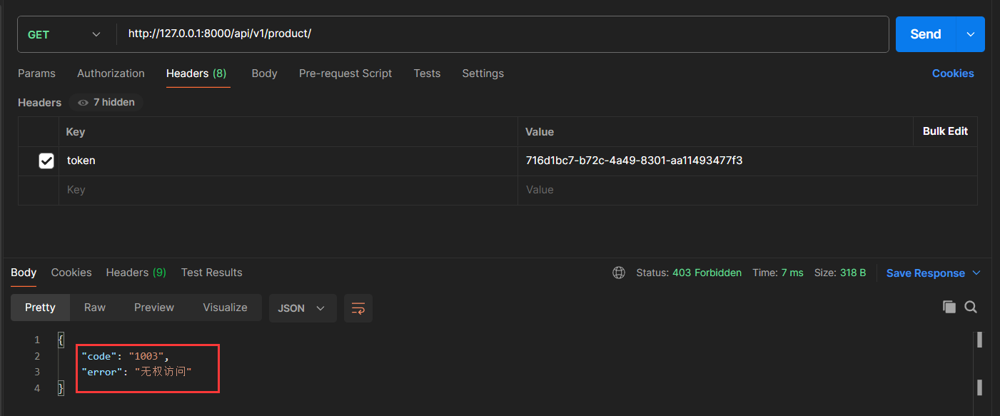
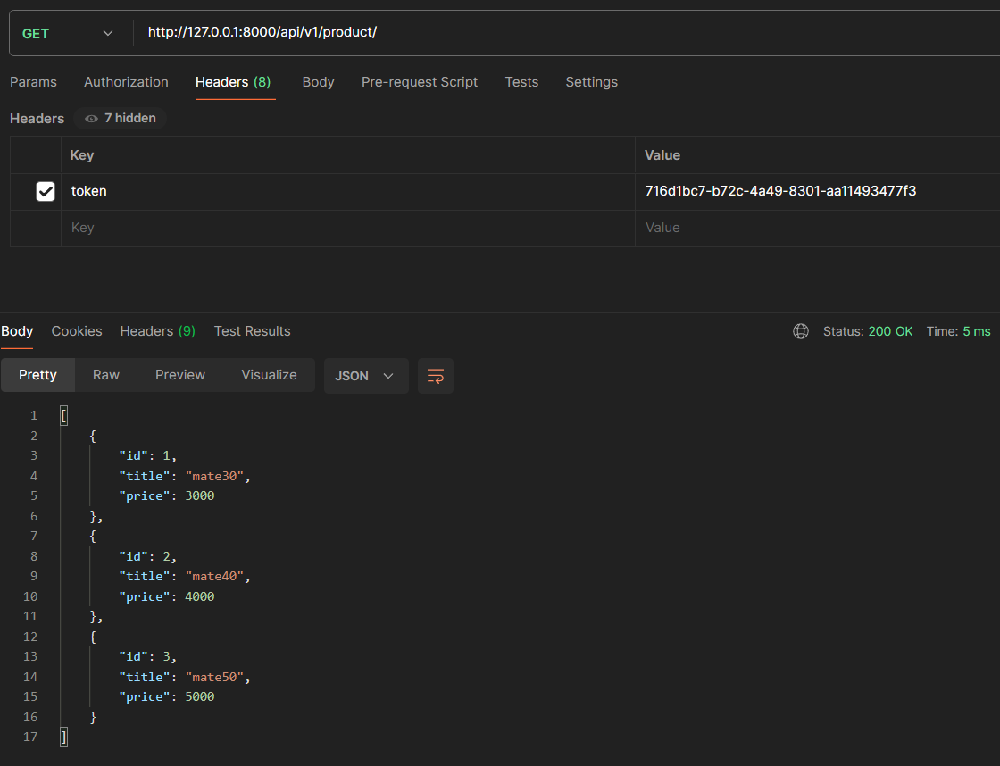
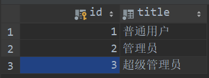
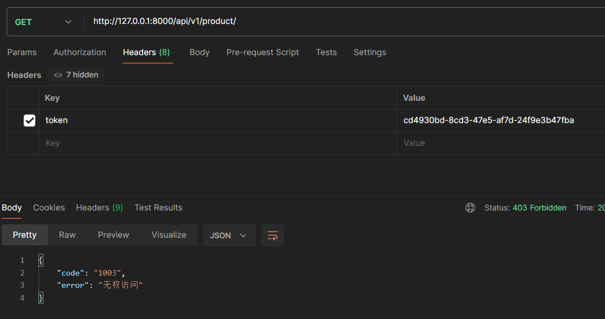
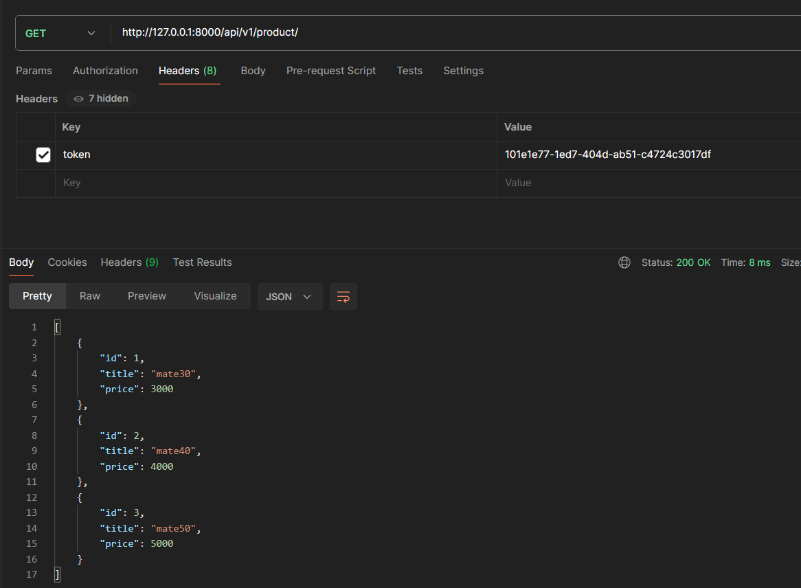
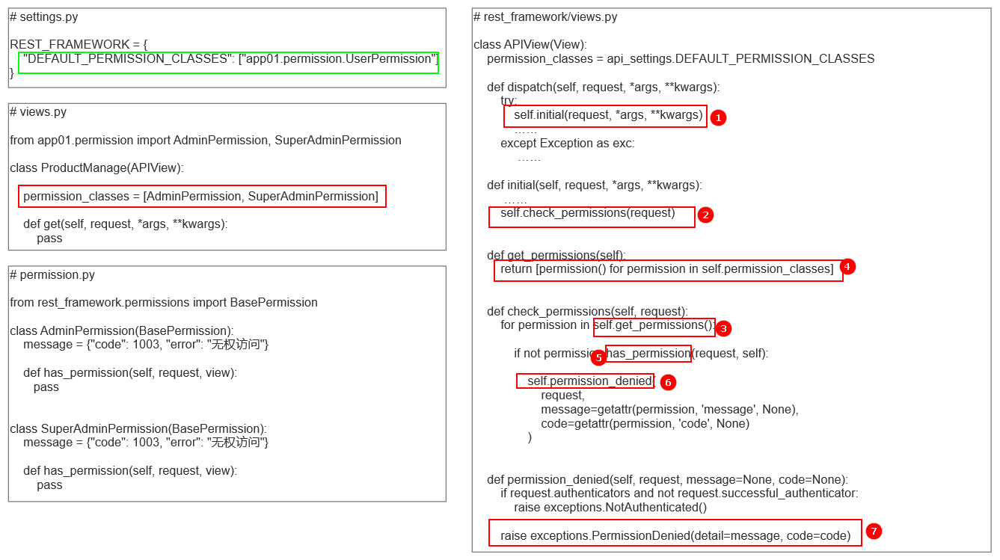

# DRF组件之权限

## 一、权限组件介绍

### 1. 用户权限的作用

在一个系统中，每个用户都应该有一个或多个角色，如普通用户、管理员、会员、超级会员等等，不同的角色有着不同的权限。`drf` 中提供了权限操作的组件，可以帮助开发者对不同角色进行相应的业务处理。

权限操作的前提是必须知道当前登录用户是谁，因此权限组件往往是和用户认证组件联合使用的。

### 2. 权限组件的使用

#### 2.1 编写数据表模型

```python
# app01/models.py

from django.db import models

class UserInfo(models.Model):
    role_choice = ((1, "普通用户"), (2, "管理员"), (3, "超级管理员"))
    role = models.SmallIntegerField(choices=role_choice, verbose_name="用户角色", default=1)

    name = models.CharField(max_length=10, verbose_name="用户名", null=False)
    password = models.CharField(max_length=16, verbose_name="用户密码", null=False)
    token = models.CharField(max_length=32, verbose_name="用户登录token", null=True)

    def __str__(self):
        return self.name

    class Meta:
        verbose_name_plural = "user_info"
        db_table = verbose_name_plural
```

#### 2.2 编写权限类

权限类必须继承 `rest_framework.permissions.BasePermission` 类，且必须实现内部的 `has_permission` 方法，而 `has_object_permission` 方法可以根据不同的视图类去实现（也可以不实现）

```python
# app01/permission.py

from rest_framework.permissions import BasePermission

class UserPermission(BasePermission):
    # 权限验证失败最后返回的内容
    message = {"code": 1003, "error": "无权访问"}

    def has_permission(self, request, view):
        # 判断当前用户角色信息，普通用户权限不通过
        if request.user.role == 1:
            return False

        return True

    def has_object_permission(self, request, view, obj):
        return True
```

#### 2.3 编写认证类 

```python
from rest_framework.authentication import BaseAuthentication
from rest_framework.exceptions import AuthenticationFailed
from app01.models import UserInfo


class HeardTokenAuth(BaseAuthentication):
    """
     从请求头中获取token值进行验证
     """

    def authenticate(self, request):

        token = request.META.get("HTTP_TOKEN", "")

        if not token:
            raise AuthenticationFailed({"code": 1002, "error": "认证失败"})

        user_obj = UserInfo.objects.filter(token=token).first()
        if not user_obj:
            raise AuthenticationFailed({"code": 1002, "error": "认证失败"})

        return user_obj, token

    def authenticate_header(self, request):
        return 'Bearer realm="API"'
```

#### 2.4 路由

```python
from django.urls import path
from app01 import views

urlpatterns = [
    # 用户登录
    path('api/v1/login/', views.UserLoginView.as_view()),
    
    # 查询产品信息
    path('api/v1/product/', views.ProductManage.as_view()),
]
```

#### 2.5 编写视图类

```python
import uuid
from rest_framework.views import APIView
from rest_framework.response import Response
from app01.models import UserInfo
from app01.auth import HeardTokenAuth
from app01.permission import UserPermission

class UserLoginView(APIView):
    # 重新设置 authentication_classes 的值，覆盖全局配置
    authentication_classes = []

    def post(self, request, *args, **kwargs):
        data = request.data
        user_name = data.get("username", "")
        pwd = data.get("password", "")

        user_obj = UserInfo.objects.filter(name=user_name, password=pwd).first()

        if not user_obj:
            ret_data = {"code": 1001, "error": "用户名或密码错误"}
            return Response(ret_data)

        user_token = str(uuid.uuid4())
        user_obj.token = user_token
        user_obj.save()

        ret_data = {
            "code": 1000,
            "data": {
                "user": user_name,
                "token": user_token
            }
        }

        return Response(ret_data)


class ProductManage(APIView):
    # 视图中使用认证组件
    authentication_classes = [HeardTokenAuth, ]

    # 视图中使用权限组件
    permission_classes = [UserPermission, ]

    def get(self, request, *args, **kwargs):
        product_list = [
            {"id": 1, "title": "mate30", "price": 3000},
            {"id": 2, "title": "mate40", "price": 4000},
            {"id": 3, "title": "mate50", "price": 5000},
        ]

        return Response(product_list)
```

#### 2.6 权限校验

启动服务，使用 `post man` 进行请求，先访问 `http://127.0.0.1:8000/api/v1/login/` 进行用户登录获取 `token`，访问 `http://127.0.0.1:8000/api/v1/product/` 时，在请求头中携带 `token` 。

- 当前用的角色值为普通用户

 

-  在数据库中修改当前用户角色为管理员

  

#### 2.7 权限组件的全局使用

```python
# settings.py

REST_FRAMEWORK = {   
    # 权限组件的全局使用
    "DEFAULT_PERMISSION_CLASSES": ["app01.permission.UserPermission"]
}
```

## 二、多个权限类

和认证类一样，视图也可以指定多个权限类，且必须通过所有指定的权限类以后，权限验证才算通过。

- 修改数据表模型

```python
class Role(models.Model):
    """
    角色表
    """
    title = models.CharField(max_length=10, verbose_name="角色名称", null=False)

    def __str__(self):
        return self.title

    class Meta:
        verbose_name_plural = "role"
        db_table = verbose_name_plural


class User_info(models.Model):
    """
    用户表
    """
    name = models.CharField(max_length=10, verbose_name="用户名", null=False)
    password = models.CharField(max_length=16, verbose_name="用户密码", null=False)
    token = models.CharField(max_length=32, verbose_name="用户登录token", null=True)

    # 用户和角色多对多
    role = models.ManyToManyField(to="Role")

    def __str__(self):
        return self.name

    class Meta:
        verbose_name_plural = "user_info"
        db_table = verbose_name_plural
```

执行数据库迁移命令后，手动给角色表添加三条数据

 

再分别创建两个用户，其中一个用户绑定管理员和超级管理员两个角色，另一个用户只绑定管理员角色。

-  编写多个权限类

```python
from rest_framework.permissions import BasePermission

class AdminPermission(BasePermission):
    """校验管理员权限"""
    message = {"code": 1003, "error": "无权访问"}

    def has_permission(self, request, view):
        if request.user.role.filter(title="管理员").exists():
            return True

        return False

    def has_object_permission(self, request, view, obj):
        return True


class SuperAdminPermission(BasePermission):
    """校验超级管理员权限"""
    message = {"code": 1003, "error": "无权访问"}

    def has_permission(self, request, view):
        if request.user.role.filter(title="超级管理员").exists():
            return True

        return False

    def has_object_permission(self, request, view, obj):
        return True
```

- 修改视图类

```python
class ProductManage(APIView):
    # 视图中使用认证组件
    authentication_classes = [HeardTokenAuth, ]

    # 校验多个权限类，必须全部通过
    # 即当前用户必须同时是管理员和超级管理员
    permission_classes = [AdminPermission, SuperAdminPermission]

    def get(self, request, *args, **kwargs):
        product_list = [
            {"id": 1, "title": "mate30", "price": 3000},
            {"id": 2, "title": "mate40", "price": 4000},
            {"id": 3, "title": "mate50", "price": 5000},
        ]

        return Response(product_list)
```

- 使用只有管理员权限的用户登录后查询数据

 

- 使用同时拥有管理员和超级管理员权限的用户查询数据

  

## 三、权限组件源码分析

权限组件功能的实现可以通过源码简单剖析一下

 

- 第一步，还是通过视图类先走到 `APIView` 中的 `dispatch` 方法，执行里面的 `self.initial` ；
- 第二步，`self.initial` 里调用了一个 `check_permissions` 方法，权限组件的验证功能就是通过该方法实现的；
- 第三步，`check_permissions` 中主要做了以下几件事
  - 调用 `get_permissions` 方法，将视图类中 `permission_classes` 中所有的权限类进行实例化，返回一个全是实例化对象的列表（如果视图类中未定义 `permission_classes`，则去父类 `APIView` 中寻找）；
  - 循环对象列表，执行每个对象的 `has_permission` 方法，返回 True 则继续循环，返回 False 则调用 `permission_denied` 抛弃异常，权限校验流程结束。

