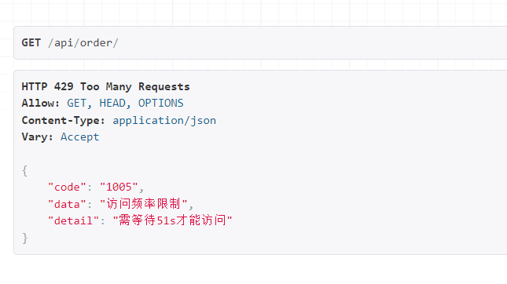
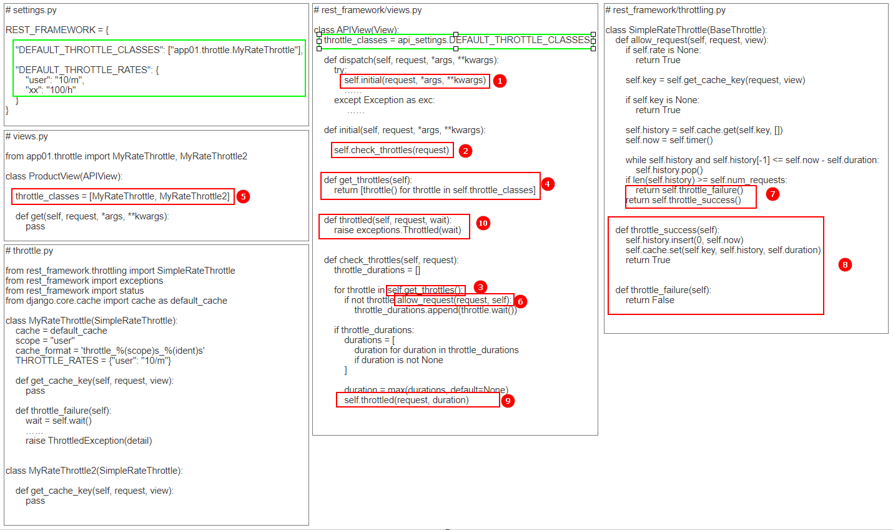

# DRF组件之限流

## 一、限流组件介绍

### 1. 限流功能简介

#### 1.1 限流的作用

为了对用户的访问行为进行限制，例如普通用户和会员用户对同一接口允许访问的次数不一样，或避免用户恶意压测接口对服务进行攻击，后台提供的 `API` 接口应当对用户进行限流。

#### 1.2 限流功能实现的原理

- 第一步，后台会对访问的用户进行一个身份标识
  - 对于匿名用户（未登录），使用用户 `IP` 作为唯一标识
  - 对于登录用户，使用用户 `ID` 或名称作为唯一标识
- 第二步，后台将用户每次访问的时间都记录到缓存之中

```python
{
    # 匿名用户
	"127.0.0.1": ["13:00:00", "12:30:23", "12:00:00", "11:10:58"]
    
    # 已登录的用户
    "cdc": ["13:00:00", "12:30:23", "12:00:00", "11:10:58"]
}
```

- 第三步，根据限流规则进行判断，例如假设限流规则为 `10次/小时`，后台会将本次用户访问的时间作为开始时间，向前倒退一小时的时间作为截止时间，从缓存中将该用户在截止时间之前的记录都删除，判断剩下的记录数量是否已经达到上限，若未达到则允许访问

### 2. 限流组件的使用

#### 2.1 限流信息缓存配置

用户访问记录存放的缓存载体种类可以有很多种，一般都是使用  `redis` 缓存（本机上要先安装 `redis` 并启动）：

- 安装三方库连接 `redis`

```powershell
pip install django-redis==4.*
```

- 添加缓存配置

```python
# settings.py

CACHES = {
    "default": {
        "BACKEND": "django_redis.cache.RedisCache",
        "LOCATION": "redis://127.0.0.1:6379",
        "OPTIONS": {
            "CLIENT_CLASS": "django_redis.client.DefaultClient",
            "PASSWORD": "123456",
        }
    }
}
```

#### 2.2 编写限流类

限流类必须继承 `rest_framework.throttling.SimpleRateThrottle` 类，必须实现 `get_cache_key` 方法

```python
# app01/throttle.py

from rest_framework.throttling import SimpleRateThrottle
from rest_framework import exceptions
from rest_framework import status
from django.core.cache import cache as default_cache

class ThrottledException(exceptions.APIException):
    """
    用于定义限流后返回的错误码
    这个类可以不用写
    """
    status_code = status.HTTP_429_TOO_MANY_REQUESTS
    default_code = 'throttled'


class MyRateThrottle(SimpleRateThrottle):

    # 用户访问记录存放在django的缓存中（需设置缓存）
    cache = default_cache

    # 缓存中存放用户记录区域的key
    scope = "user"

    # 每条用户记录的key
    # throttle_user_cdc
    # throttle_user_127.0.0.1
    cache_format = 'throttle_%(scope)s_%(ident)s'

    # 设置访问频率，例如：1分钟允许访问10次
    # 其他：'s', 'sec', 'm', 'min', 'h', 'hour', 'd', 'day'
    THROTTLE_RATES = {"user": "10/m"}

    def get_cache_key(self, request, view):
        """
        针对访问的用户构造一个标识（键），存放在缓存中
        :param request:
        :param view:
        :return:
        """
        if request.user:
            # 如果用户登录了，则获取用户ID
            ident = request.user.pk
        else:
            # 获取请求用户IP（底层去request中找请求头）
            ident = self.get_ident(request)

        return self.cache_format % {'scope': self.scope, 'ident': ident}

    def throttle_failure(self):
        """
        定义用户被限流后返回的错误信息
        :return:
        """
        # 用户再等多久才能访问
        wait = self.wait()

        detail = {
            "code": 1005,
            "data": "访问频率限制",
            'detail': "需等待{}s才能访问".format(int(wait))
        }
        
        raise ThrottledException(detail)
```

#### 2.3 路由

```python
# urls.py

from django.urls import path
from app01 import views

urlpatterns = [
    path('api/order/', views.ProductView.as_view()),
]
```

#### 2.4 编写视图类

```python
# app01/views.py

from rest_framework.views import APIView
from rest_framework.response import Response
from app01.throttle import MyRateThrottle


class ProductView(APIView):
    # 视图类中想使用限流组件，必须设置 throttle_classes
    throttle_classes = [MyRateThrottle, ]

    def get(self, request, *args, **kwargs):
        ret_data = {"code": 1000, "data": "访问成功"}

        return Response(ret_data)
```

#### 2.5 限流校验

启动服务，连续访问路由 `http://127.0.0.1:8000/api/order/` 10 次都可以拿到正常的后台响应，访问第 11 次时报错

 

#### 2.6 限流组件的全局使用

```python
# settings.py

REST_FRAMEWORK = {
    # 配置限流组件全局使用
    "DEFAULT_THROTTLE_CLASSES": ["app01.throttle.MyRateThrottle"],
    
    # 针对多个限流类分别指定限流规则，键为每个限流类中定义的scope变量的值
    "DEFAULT_THROTTLE_RATES": {
        "user": "10/m",
        "xxx": "100/h"
    }
}
```

## 二、多个限流类

### 1. 多个限流类的使用

和认证组件、权限组件一样，视图类也支持多个限流组件，多个限流类存放在视图类的 `throttle_classes` 中，按照顺序依次执行。

- 编写多个限流类

```python
from rest_framework.throttling import SimpleRateThrottle
from rest_framework import exceptions
from rest_framework import status
from django.core.cache import cache as default_cache


class MyRateThrottle(SimpleRateThrottle):
    cache = default_cache
    scope = "user"
    cache_format = 'throttle_%(scope)s_%(ident)s'
	
    # 如果全局配置中设置了，这行就不用写了
    THROTTLE_RATES = {"user": "10/m"}

    def get_cache_key(self, request, view):
        if request.user:
            ident = request.user.pk
        else:
            ident = self.get_ident(request)

        return self.cache_format % {'scope': self.scope, 'ident': ident}

    def throttle_failure(self):
        wait = self.wait()
        detail = {
            "code": 1005,
            "data": "接口1访问频率限制",
            'detail': "接口1需等待{}s才能访问".format(int(wait))
        }

        raise ThrottledException(detail)


class MyRateThrottle2(SimpleRateThrottle):
    cache = default_cache
    scope = "xxx"
    cache_format = 'throttle_%(scope)s_%(ident)s'

    # 如果全局配置中设置了，这行就不用写了
    THROTTLE_RATES = {"xxx": "3/m"}

    def get_cache_key(self, request, view):
        if request.user:
            ident = request.user.pk
        else:
            ident = self.get_ident(request)
        return self.cache_format % {'scope': self.scope, 'ident': ident}

    def throttle_failure(self):
        wait = self.wait()

        detail = {
            "code": 1005,
            "data": "接口2访问频率限制",
            'detail': "接口2需等待{}s才能访问".format(int(wait))
        }

        raise ThrottledException(detail)
```

- 视图类

```python
from rest_framework.views import APIView
from rest_framework.response import Response
from app01.throttle import MyRateThrottle, MyRateThrottle2

class ProductView(APIView):
    # 视图类中想使用限流组件，必须设置 throttle_classes
    throttle_classes = [MyRateThrottle, MyRateThrottle2]

    def get(self, request, *args, **kwargs):
        ret_data = {"code": 1000, "data": "访问成功"}

        return Response(ret_data)

```

### 2. 多个限流类的执行过程

存在多个限流类的情况下，每个限流类校验无非最终会有两种结果

- 限流类执行过程中报错，抛出异常。此时表示当前限流类校验未通过，后续的其他限流类也不再执行；
- 限流类执行过程未报错，校验完成会返回一个布尔值，如果返回结果为 `False` ，则将该限流类存放在一个全局的列表中，否则就不做任何操作；继续执行下一个限流类，根据返回结果重复上手步骤；当所有限流类都执行完，判断全局的列表中是否存在未通过的限流类，存在则会调用内部的一个 `self.throttled` 方法返回异常，但是往往 `self.throttled` 方法返回的信息比较简单，我们可以在视图类中重写该方法：

```python
# 限流类中不抛出异常，失败就直接返回 False

class MyRateThrottle(SimpleRateThrottle):
    cache = default_cache
    scope = "user"
    cache_format = 'throttle_%(scope)s_%(ident)s'
	
    # 如果全局配置中设置了，这行就不用写了
    THROTTLE_RATES = {"user": "10/m"}

    def get_cache_key(self, request, view):
        if request.user:
            ident = request.user.pk
        else:
            ident = self.get_ident(request)

        return self.cache_format % {'scope': self.scope, 'ident': ident}

    def throttle_failure(self):
        return False

class MyRateThrottle2(SimpleRateThrottle):
    cache = default_cache
    scope = "xxx"
    cache_format = 'throttle_%(scope)s_%(ident)s'

    # 如果全局配置中设置了，这行就不用写了
    THROTTLE_RATES = {"xxx": "3/m"}

    def get_cache_key(self, request, view):
        if request.user:
            ident = request.user.pk
        else:
            ident = self.get_ident(request)
        return self.cache_format % {'scope': self.scope, 'ident': ident}

    def throttle_failure(self):
        return False
```

```python
# 在视图类中抛出异常信息

from rest_framework.views import APIView
from rest_framework.response import Response
from app01.throttle import MyRateThrottle, MyRateThrottle2

class ProductView(APIView):
    # 视图类中想使用限流组件，必须设置 throttle_classes
    throttle_classes = [MyRateThrottle, MyRateThrottle2]

    def get(self, request, *args, **kwargs):
        ret_data = {"code": 1000, "data": "访问成功"}

        return Response(ret_data)
    
    def throttled(self, request, wait):
        detail = {
            "code": 1005,
            "data": "访问频率",
            'detail': "需等待{}s才能访问".format(int(wait))
        }
        raise ThrottledException(detail)
```

建议校验失败时还是直接在限流类中抛出异常，一旦当前的类校验失败了，后续的类再进行校验已经没有意义了。

## 三、限流组件源码分析

限流组件功能的实现可以通过源码简单剖析一下

 

- 第一步，还是通过视图类先走到 `APIView` 中的 `dispatch` 方法，执行里面的 `self.initial` ；
- 第二步，`self.initial` 里调用了一个 `check_throttles` 方法，权限组件的验证功能就是通过该方法实现的；
- 第三步，`check_throttles` 方法中，针对视图类中使用每一个限流类都进行了实例化，并调用实例化对象的 `allow_request` 方法，该方法用于返回校验的结果，返回值为布尔值。将返回值为 `False` 的结果存储在一个全局列表 `throttle_durations` 中，等所有的限流类都执行完成，检查列表内是否有值，有值则证明部分限流类认证未通过，调用 `self.throttled` 抛出异常；如果循环过程中，有一个类抛出异常了，则循环终止，逐层向上抛出异常；
- `allow_request` 里实现了从缓存中读取当前用户访问记录，并判断是否达到限制条件的功能。