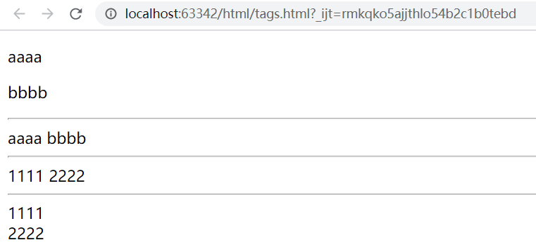

# HTML

## 一、HTML简介

### 1. 网页的构成

一个 web 页面主要由 HTML、CSS、JavaScript（JS） 三部分构成，尽管现在有许多的 web 框架和组件，使得构建 web 页面越来越方便快捷，但是究其本质还是离不开这三个要素。笼统的来说，HTML 负责给页面添加元素，CSS 负责为元素添加样式，JavaScript 负责实现页面的动态效果。如果将一个 web 页面想象成画一个人物，HTML 就负责画出一个个人物形象；CSS 就负责给这些人物起名字，规定他们的性格，给他们穿上不同款式的衣服；JavaScript 则负责让这些人物动起来。

 

​       					                                                          

​			 html                                                             html + css                                                       html + css + js

### 2. HTML是什么

HTML是一种用于创建网页的超文本标记语言（Hypertext Markup Language），并不是一门编程语言，其本质上是浏览器可识别的规则，我们按照规则写网页，浏览器根据规则渲染我们的网页。对于不同的浏览器，对同一个标签可能会有不同的解释。（兼容性问题）

### 3. HTML的结构

#### 3.1 文档结构

- 一个 HTML 文档最外层是 `<html></html>` 标签包裹，里层为文档头部 head 和主体 body 部分。
- `<head></head>` 定义了 HTML 文档的开头部分，**它们的内容不会在浏览器的文档窗口显示**。head 标签包含了文档的元数据。
- `<body></body>` 之间的文本是我们能看到的网页主体内容。
- `<!DOCTYPE>` 声明不是 HTML 标签，它是指示 web 浏览器关于页面使用哪个 HTML 版本进行编写的指令，它必须是 HTML 文档的第一行，位于 `<html>` 标签之前。

```html
<!DOCTYPE html>
<html lang="zh-CN">
    <head>
        ...
    </head>

    <body>
        ....
    </body>
</html>   
```

#### 3.2 标签结构

- HTML 标签是由尖括号包围的关键字，如 `<html>`、 `<div>` 等
- HTML 标签通常是成对出现的，比如：`<div></div>`，第一个标签是开始，第二个标签是结束，结束标签会有斜线。也有一部分标签是单独呈现的，比如：`<br/>`、`<hr/>`、`` 等。
- 标签里面可以有若干属性，也可以不带属性。

#### 3.3 标签的几个重要属性

- id：定义标签的 ID，且在 HTML 文档中，ID 的值是唯一的；
- class：为 HTML 元素定义一个或多个类名（主要用于 CSS 样式类的操作）
- style：规定元素的行内样式（CSS样式）
- 处了上述常用属性以外，标签还可以自定义属性，如  `<div cdc="ok"></div>`

```html
<!DOCTYPE html>
<html lang="en">
<head>
    <meta charset="UTF-8">
    <title>Title</title>
</head>
<body>
    <!-- 标签示例-->
    <div id="d1" class="aaa bbb" cdc="ok">
        我是div标签
    </div>
</body>
</html>
```

## 二、HTML常用标签

### 1. head中的标签

#### 1.1 title

`<title></title>` 标签主要用于定义网页的标题。

```html
<!DOCTYPE html>
<html lang="en">
<head>
    <meta charset="UTF-8">
    <title>cdc的个人网站</title>
</head>
<body>
	...
</body>
</html>
```

 

#### 1.2 style

`<style></style>` 标签主要用于导入 CSS 样式，在后续的 CSS 学习中会具体介绍。

#### 1.3 link

`<link>` 标签主要用于导入  JavaScript 代码，在后续的 JavaScript 学习中会具体介绍。

#### 1.4 meta

meta 标签可提供有关页面的元信息(mata-information)、针对搜索引擎和更新频度的描述和关键词。该标签位于文档的头部，不包含任何内容，且该标签提供的信息是用户不可见的。

meta 标签有两个重要属性：

- **http-equiv **：相当于 http 的文件头作用，它可以向浏览器传回一些有用的信息，以帮助正确地显示网页内容；与之对应的属性值为 content，content 中的内容其实就是各个参数的变量值。

```html
<!DOCTYPE html>
<html lang="en">
<head>
    <!--2秒后跳转到对应的网址，注意引号-->
    <meta http-equiv="refresh" content="2;URL=https://www.baidu.com">
    <!--指定文档的编码类型，可以简写成 <meta charset="UTF-8"> -->
    <meta http-equiv="content-Type" charset=UTF8">                                   
    <!-- 告诉IE以最高级模式渲染文档 -->
    <meta http-equiv="x-ua-compatible" content="IE=edge">
</head>
<body>
	...
</body>
</html>
```

-  **name**： 主要用于描述网页，与之对应的属性值为 content，content 中的内容主要是便于搜索引擎机器人查找信息和分类信息用的。

```html
<!DOCTYPE html>
<html lang="en">
<head>
    <!--网页关键词-->
    <meta name="keywords" content="meta总结,html meta,meta属性,meta跳转">
    <!--网页的描述信息-->
    <meta name="description" content="cdc的博客前端学习">
</head>
<body>
    ...
</body>
</html>
```

###  2. body中的标签

| 标签      | 作用                     |
| :-------- | :----------------------- |
| `<b></b>` | 字体加粗                 |
| `<i></i>` | 字体倾斜                 |
| `<u></u>` | 给文字内容加上下划线     |
| `<s></s>` | 删除线，一条横线贯穿文字 |

#### **2.1  hn  标签**

`<hn></hn>` 标签主要用于显示标题，其中 n 的取值范围为 1~6，代表六种不同级别的标题。

```html
<!DOCTYPE html>
<html lang="en">
<head>
    <meta charset="UTF-8">
    <title>cdc的个人网站</title>
</head>
<body>
    <h1>一级标题</h1>
    <h2>二级标题</h2>
    <h3>三级标题</h3>
    <h4>四级标题</h4>
    <h5>五级标题</h5>
    <h6>六级标题</h6>
</body>
</html>
```

  

####  **2.2  p 标签**

`<p></p>` 标签主要用于显示网页中的段落，段落与段落之间会自动换行且会间隔一行空白行。例如我们想要文章显示以下的排版效果：

 

我们先在 `<body></body>` 中直接尝试写如内容：

```html
<!DOCTYPE html>
<html lang="en">
<head>
    <meta charset="UTF-8">
    <title>cdc的个人网站</title>
</head>
<body>
    aaaaa
    
    bbbbb
    
    ccccc
    
    ddddd
</body>
</html>
```

而网页中实际显示的内容为：

 

这是因为浏览器在解析 html 文档时，遇到`回车符号`或者`文字间的多个空格`都会统一解析成一个空格，这种现象称为**空白折叠**，所以直接按照文本的排版格式写入数据是没有效果的，要想实现上述的排版样式，我们可以使用`<p></p>` 标签。

```html
<!DOCTYPE html>
<html lang="en">
<head>
    <meta charset="UTF-8">
    <title>cdc的个人网站</title>
</head>
<body>
    <p>aaaaa</p>
    <p>bbbbb</p>
    <p>ccccc</p>
    <p>ddddd</p>
</body>
</html>
```

#### **2.3 br 标签**

`<br>` 标签可以实现内容的换行，作用相当回车符号。

```html
<!DOCTYPE html>
<html lang="en">
<head>
    <meta charset="UTF-8">
    <title>cdc的个人网站</title>
</head>
<body>
    aaaaa<br>
    bbbbb<br>
    ccccc<br>
    ddddd<br>
</body>
</html>
```

  

**`<br>` 标签和`<p></p>` 标签比较**

- 都可以用于实现内容的换行；
- `<p></p>` 标签用于显示的是段落效果，换行后内容之间会间隔一行空白行；`<br>` 标签实现的换行则不会间隔空白行；

#### **2.4 strong 标签**

`<strong></strong>` 标签用于给显示的内容加粗。

```html
<!DOCTYPE html>
<html lang="en">
<head>
    <meta charset="UTF-8">
    <title>cdc的个人网站</title>
</head>
<body>
	aaaaa<br>
	<strong>aaaaa</strong>
</body>
</html>
```

 

#### **2.5 em 标签**

`<em></em>` 标签用于将显示的内容变为斜体。

```html
<!DOCTYPE html>
<html lang="en">
<head>
    <meta charset="UTF-8">
    <title>cdc的个人网站</title>
</head>
<body>
	aaaaa<br>
	<em>aaaaa</em>
</body>
</html>
```

 

#### **2.6 hr 标签**

`<hr>` 标签可以在网页中画出一条横线

```html
<!DOCTYPE html>
<html lang="en">
<head>
    <meta charset="UTF-8">
    <title>cdc的个人网站</title>
</head>
<body>
    aaaaa
    <hr>
    bbbbb
</body>
</html>
```

 

#### **2.7 ul 标签**

`<ul></ul>` 标签（unordered list）用于在网页上显示一些无序的信息列表。

```html
<!DOCTYPE html>
<html lang="en">
<head>
    <meta charset="UTF-8">
    <title>cdc的个人网站</title>
</head>
<body>
    <ul>
        <li>aaaaa</li>
        <li>bbbbb</li>
        <li>ccccc</li>
    </ul>
</body>
</html>
```

 

我们可以通过设置 `<ul></ul>` 标签的 **type** 属性的值，来修改每行数据前的标记样式，**type** 的取值及作用如下：

- disc（实心圆点，默认值）
- circle（空心圆圈）
- square（实心方块）
- none（无样式）

#### **2.8 ol 标签**

`<ol></ol>` 标签（ordered list）用于在网页上显示一些有序的信息列表。

```html
<!DOCTYPE html>
<html lang="en">
<head>
    <meta charset="UTF-8">
    <title>cdc的个人网站</title>
</head>
<body>
    <ol>
        <li>aaaaa</li>
        <li>bbbbb</li>
        <li>ccccc</li>
    </ol>
</body>
</html>
```

 

同样的，我们也可以通过设置 `<ol></ol>` 标签的 **type** 属性和 **start** 属性来修改信息前的序号值和样式。属性的取值和效果如下：

**type属性：**

- 1 数字列表，默认值
- A 大写字母
- a 小写字母
- Ⅰ大写罗马
- ⅰ小写罗马

**start属性：**表示从第几个标识号开始往后标号

```html
<!DOCTYPE html>
<html lang="en">
<head>
    <meta charset="UTF-8">
    <title>cdc的个人网站</title>
</head>
<body>
    <!--此时aaaaa的前面的序号是3，后面数据从3开始往后标号-->
    <ol type="1" start="3">
        <li>aaaaa</li>
        <li>bbbbb</li>
        <li>ccccc</li>
    </ol>
</body>
</html>
```

#### **2.9 dl 标签**

`<dl></dl>` 是定义列表标签（definition list），又称标题列表标签，用于在网页上显示标题及其内容的信息列表。

```html
<!DOCTYPE html>
<html lang="en">
<head>
    <meta charset="UTF-8">
    <title>cdc的个人网站</title>
</head>
<body>
    <dl>
        <dt>标题1</dt>
        <dd>aaaaa</dd>
        <dd>bbbbb</dd>
        <dd>ccccc</dd>
        <dt>标题2</dt>
        <dd>11111</dd>
        <dd>22222</dd>
        <dd>33333</dd>
    </dl>
</body>
</html>
```

 

#### **2.10 table 标签**

`<table></table>` 标签用于在网页上显示表格数据。

```html
<!DOCTYPE html>
<html lang="en">
<head>
    <meta charset="UTF-8">
    <title>cdc的个人网站</title>
</head>
<body>
    <table>
        <tr>
            <th>序号</th>
            <th>商品</th>
            <th>价格</th>
        </tr>
        <tr>
            <td>1</td>
            <td>电视机</td>
            <td>2,000</td>
        </tr>
        <tr>
            <td>2</td>
            <td>电脑</td>
            <td>10,000</td>
        </tr>
        <tr>
            <td>3</td>
            <td>洗衣机</td>
            <td>3,000</td>
        </tr>
    </table>
</body>
</html>
```

我们对上述结构进行一个简单的分析，其中 `<tr></tr>` 表示一行的数据；`<th></th>` 表示表头中每个单元格的内容，`<td></td>` 表示每行数据行中每个单元格的内容，显示效果如下：

 

**`<table></table>` 标签支持以下属性操作：**

- border: 表格边框.
- cellpadding: 内边距
- cellspacing: 外边距.
- width: 像素 百分比.（最好通过css来设置长宽）
- rowspan: 单元格竖跨多少行
- colspan: 单元格横跨多少列（即合并单元格）

我们可以通过 `<table></table>` 标签的 **border** 属性，来给表格添加一个边框，并通过 **cellspacing** 来设置外边距。

```html
<!DOCTYPE html>
<html lang="en">
<head>
    <meta charset="UTF-8">
    <title>cdc的个人网站</title>
</head>
<body>
    <table border=1 cellspacing=0>
  	<!--表格内容部分代码同上，此处省略-->
    </table>
</body>
</html>
```

 

可以通过 **rowspan** 属性和 **colspan** 属性实现合并单元格。

```html
<!DOCTYPE html>
<html>
<head>
	<title>制作表格</title>
</head>
<body>
	<table border="1" cellspacing="0">
        <!--caption标签用于给表格添加表名-->
    	<caption>商品清单</caption>
		<tr>
			<th>产品名称</th>
			<th>品牌</th>
			<!-- 横向合并：合并的是列 -->
			<th colspan='2'>数量和入库时间</th>
		</tr>
		<tr>
			<td>电冰箱</td>
			<td>海尔</td>
			<td>300</td>
			<td>2014-09</td>
		</tr>
		<tr>
			<td>电视机</td>
			<!-- 纵向合并： 合并的是行 -->
			<td rowspan="3">小米</td>
			<td>200</td>
			<td>2018-09</td>
		</tr>
		<tr>
			<td>电风扇</td>
			<td>400</td>
			<td>2017-09</td>
		</tr>
		<tr>
			<td>电脑</td>
			<td>400</td>
			<td>2017-09</td>
		</tr>
	</table>
</body>
</html>
```

 

#### **2.11 a 标签**

`<a></a>` 标签用于超链接的跳转或者锚点的功能。

**`<a></a>` 标签的 href 属性：**指定目标网页地址，取值如下

1. 绝对URL -指向另一个站点（比如 href="http://www.jd.com）
2. 相对URL - 指当前站点中确切的路径（href="index.htm"）
3. 锚URL - 指向页面中的锚（href="#top"），即从当前位置跳转到指定ID值的元素位置处
4. 邮箱地址，用于邮件发送（href="mailto:1275500642@qq.com"），必须使用关键字 `mailto`

**`<a></a>` 标签的 target 属性：**指定目标网页的打开方式，取值如下

1. `_blank` 表示在新标签页中打开目标网页
2. `self` 表示在当前标签页中打开目标网页（默认值）

**`<a></a>` 标签具体的使用：**

- 方式一，用于网站间的跳转

```html
<!DOCTYPE html>
<html lang="en">
<head>
    <meta charset="UTF-8">
    <title>cdc的个人网站</title>
</head>
<body>
	<a href="http://www.baidu.com" target="_blank">百度一下</a>
</body>
</html>
```


- 方式二，用于网页内部跳转（锚点）

```html
<!DOCTYPE html>
<html lang="en">
<head>
    <meta charset="UTF-8">
    <title>cdc的个人网站</title>
</head>
<body>
    <dl>
        <dt>目录</dt>
        <dd><a href="#p1">第一章</a></dd>
        <dd><a href="#p2">第二章</a></dd>
        <dd><a href="#p3">第三章</a></dd>
        <dd><a href="#p4">第四章</a></dd>
    </dl>
    <hr>
    <h2 id="p1">第一章</h2>
    <p>第一章内容</p>
   	<!--重复代码部分省略-->
   	...
    <hr>
    <h2 id="p2">第二章</h2>
    <p>第二章内容</p>
    <!--重复代码部分省略-->
    ...
    <hr>
    <h2 id="p3">第三章</h2>
    <p>第三章内容</p>
    <!--重复代码部分省略-->
   	...
    <hr>
    <h2 id="p4">第四章</h2>
    <p>第四章内容</p>
    <!--重复代码部分省略-->
    ...
</body>
</html>
```

 

-  方式三，用于邮件发送，使用该方式会自动调用计算机的邮件系统

```html
<!DOCTYPE html>
<html lang="en">
<head>
    <meta charset="UTF-8">
    <title>cdc的个人网站</title>
</head>
<body>
    <a href="mailto:1275500642@qq.com">联系我们</a>
</body>
</html>
```

 

#### **2.12 img 标签**

`` 标签用于网页上图片的展示，主要有以下属性：

- src：图片路径，可以是本地的图片（本地的图片又可以使用绝对路径或者相对路径），也可以是其他网站上的图片链接
- alt：图片未加载成功时的提示信息
- title：鼠标悬浮停留时显示的信息
- width：用于设置图片的宽度
- height：用于设置图片的高度（宽度和高度两个属性只用设置一个，另一个会自动等比缩放）

```html
<!DOCTYPE html>
<html lang="en">
<head>
    <meta charset="UTF-8">
    <title>cdc的个人网站</title>
</head>
<body>
    <!--图片加载成功时-->
    
    <!--图片加载失败时-->
    
</body>
</html>
```

 

#### **2.13 其他常用标签**

| 标签            | 作用                                     |
| :-------------- | :--------------------------------------- |
| `<b></b>`       | 字体加粗                                 |
| `<i></i>`       | 字体倾斜                                 |
| `<u></u>`       | 给文字内容加上下划线                     |
| `<s></s>`       | 删除线，一条横线贯穿文字                 |
| `<div></div>`   | 不会对内容产生任何效果，常用于页面的布局 |
| `<span></span>` | 不会对内容产生任何效果，常用于页面的布局 |

#### **2.14 特殊字符编码**

我们在介绍`<p></p>` 标签时提到过**空白折叠**机制，其实对于回车和空格，在 HTML 文档中都是属于特殊的字符，无法按照正常的方式去加载。如果我们就想在网页上显示这些特殊字符要怎么办呢？在 HTM中，针对特殊的字符，都有其对应的编码，我们只需要使用对应的编码来替换这些特殊的字符即可。

| 内容 | 对应代码 |
| ---- | -------- |
| 空格 | `&nbsp;` |
| >    | `&gt;`   |
| <    | `&lt;`   |
| &    | `&amp;`  |
| ¥    | `&yen;`  |
| 版权 | `&copy;` |
| 注册 | `&reg;`  |

[更多特殊字符编码请点击...](https://www.jb51.net/onlineread/htmlchar.htm)

## 三、Form 表单

### **一、表单简介**

表单标签 `<form></form>`，通常用于向服务器传输数据，从而实现用户与Web服务器的交互。它能够包含`<input>` 系列标签，比如文本字段、复选框、单选框、提交按钮等等；还可以包含`<textarea></textarea>`、`<select></select>`、`<fieldset></fieldset>`和`<label></label>` 等标签。

```html
<!DOCTYPE html>
<html lang="en">
<head>
    <meta charset="UTF-8">
    <title>Title</title>
</head>
<body>
    <form action="">
        <label for=""></label>
        <input type="text">
        <button></button>
    </form>
</body>
</html>
```

### **二、表单的属性**

`<form></form>` 主要有以下属性：

| 属性           | 描述                                                       |
| -------------- | ---------------------------------------------------------- |
| accept-charset | 规定在被提交表单中使用的字符集（默认：页面字符集）。       |
| action         | 规定向何处提交表单的地址（URL）（提交页面）。              |
| autocomplete   | 规定浏览器应该自动完成表单（默认：开启）。                 |
| enctype        | 规定被提交数据的编码（默认：url-encoded）。                |
| method         | 规定在提交表单时所用的 HTTP 方法（默认：GET）。            |
| name           | 规定识别表单的名称（对于 DOM 使用：document.forms.name）。 |
| novalidate     | 规定浏览器不验证表单。                                     |
| target         | 规定 action 属性中地址的目标（默认：_self）。              |

其中 `action` 属性和 `method` 属性用的最多，例如：

```html
<!DOCTYPE html>
<html lang="en">
<head>
    <meta charset="UTF-8">
    <title>Title</title>
</head>
<body>
    <form action="http://127.0.0.1:8000/data/accept" method="post">
   		...
	</form>
</body>
</html>
```

上述表示以 POST 的发送方式将表单中的数据内容发送给 http://127.0.0.1:8000/data/accept 这个地址。

### **三、表单相关的标签**

#### **3.1 input 标签**

`<input>` 标签会根据 **type** 属性值的不同，变化为多种形态。

| type属性值 | 表现形式                                 | 对应代码                  |
| ---------- | ---------------------------------------- | ------------------------- |
| text       | 单行输入文本                             | `<input type=text">`      |
| password   | 密码输入框，网页上无法看到真正的输入内容 | `<input type="password">` |
| email      | 邮件输入框                               | `<input type="email">`    |
| date       | 日期输入框                               | `<input type="date">`     |
| checkbox   | 复选框                                   | `<input type="checkbox">` |
| radio      | 单选框                                   | `<input type="radio">`    |
| submit     | 提交按钮                                 | `<input type="submit">`   |
| reset      | 重置按钮，将当前form表单中的输入内容重置 | `<input type="reset">`    |
| button     | 普通按钮，多用js代码去绑定事件           | `<input type="button">`   |
| hidden     | 隐藏输入框                               | `<input type="hidden">`   |
| file       | 文本选择框                               | `<input type="file">`     |

**`<input>` 标签的属性**：

- name：表单提与后台进行交互时，后台接收数据的 "键名"，注意和 ID 的区别；
- value：表单提交时对应项的值
  - type="button"，"reset"，"submit" 时，value 的值为按钮上显示的文本内容；
  - type="text"，"password"，"hidden" 时，value 的值为输入框中输入的值；
  - type="checkbox"，"radio"，"file" 时，value 的值为相关联选项的值；
- checked：radio 和 checkbox 类型的 input 才能使用，如果选择项设置了该属性，则该项默认被选中；
- readonly：text 和 password 类型输入框设置为只读模式；
- placeholder：为 type="text" 的输入框设置提示语；
- disabled：所有input均适用，禁用该 input ；

**`<input>` 示例：**

**1. 文本输入功能**

```html
<!DOCTYPE html>
<html lang="en">
<head>
    <meta charset="UTF-8">
    <title>Title</title>
</head>
<body>
    <h3>注册账号</h3>
    <form action="">
        <p>
            用户名：<input type="text" placeholder="请输入账号">
        </p>
        <p>
            <!--用户输入的信息不可见-->
            密码：<input type="password" placeholder="请输入密码">
        </p>
        <p>
            邮箱：<input type="email" placeholder="请输入邮箱">
        </p>
        <p>
            出生日期：<input type="date" placeholder="请选择出生日期">
        </p>
        <p>
            <!--设置只读模式，用户无法输入-->
            只读模式：<input type="text" readonly>
        </p>
        <p>
            <!--设置禁用模式，用户无法操作-->
            禁用模式：<input type="text" disabled>
        </p>
    
    </form>
</body>
</html>
```

 

**2. 选择项功能**

```html
<!DOCTYPE html>
<html lang="en">
<head>
    <meta charset="UTF-8">
    <title>Title</title>
</head>
<body>
    <form action="">
        <p>
            <!--单选-->
            性别：
            男<input type="radio" value="male" name="gender" checked="checked">
            女<input type="radio" value="female" name="gender">
        </p>
        <p>
            <!--多选-->
            爱好：
            唱<input type="checkbox" value="sing" name="hobby" checked="checked">
            跳<input type="checkbox" value="dance" name="hobby">
            Rap<input type="checkbox" value="rap" name="hobby">
            篮球<input type="checkbox" value="basketball" name="hobby">
        </p>
        <p>
            <!--选择文件上传-->
            上传头像：<input type="file" name="pic">
        </p>
    </form>
</body>
</html>
```

  

**需要注意以下几点：**

- 针对选项功能，name 和 value 属性一定要有值，后端接收到的数据实际上就是 value 属性对应的值；
- 针对单选功能，选项的 name 的值一定要相同，如果不设置 name 或者 name 的值不相同，则无法实现单选的效果。
- 选项设置了 checked 属性后，打开网页时，该项默认被选中。

**3. 按钮功能**

```html
<!DOCTYPE html>
<html lang="en">
<head>
    <meta charset="UTF-8">
    <title>Title</title>
</head>
<body>
    <form action="">
  		<p>
            <input type="text">
        </p>
        <p>
            数据提交按钮：<input type="submit" value="提交">
        </p>
        <p>
          普通按钮：<input type="button" value="点我">
        </p>
        <p>
            重置按钮：<input type="reset" value="重置">
        </p>
    </form>
</body>
</html>
```

 

**按钮间的区别：**

- submit 类型的按钮点击后，会将表单中的数据发送给后端，我们可以明显的看到点击按钮后页面进行了一次刷新；
- button 类型的按钮没有任何效果，`<input type="button">` 可以等价于 `<button></button>` 标签的功能；
- reset 类型的按钮是将页面上所有内容清空重置，虽然 submit 类型也会将页面的所有内容清空，但是 submit 是由于发送请求刷新页面导致的页面内容清空，而 reset 只是单纯的清空页面，并未发送数据交互请求，两者有本质上的区别。

#### **3.2 select 标签**

`<select></select>` 标签可以用来生成下拉列表。

**标签属性说明：**

- multiple：设置值后，可以进行多选，否则默认单选
- disabled：禁用
- selected：默认选中该项
- value：定义提交时的选项值

```html
<!DOCTYPE html>
<html lang="en">
<head>
    <meta charset="UTF-8">
    <title>Title</title>
</head>
<body>
    <form action="">
        <!--单选模式-->
        <p>
            爱好：
            <select name="">
                <option value="sing">唱</option>
                <option value="dance">跳</option>
                <option value="rap">rap</option>
                <option value="basketball">篮球</option>
            </select>
        </p>

        <!--多选模式-->
        <p>
            爱好：
            <select name="" multiple="multiple">
                <option value="sing">唱</option>
                <option value="dance">跳</option>
                <option value="rap">rap</option>
                <option value="basketball">篮球</option>
            </select>
        </p>
    </form>
</body>
</html>
```

 

注：下拉框多选模式下，windows 系统上只要按住 ctrl 键就可以进行多选操作了。

#### **3.3 label 标签**

`<label></label>` 标签可用于将文本内容和 `<input></input>` 标签想关联，例如：

```html
<!DOCTYPE html>
<html lang="en">
<head>
    <meta charset="UTF-8">
    <title>Title</title>
</head>
<body>
    <form action="">
        <p>
            <label for="p1">姓名</label>
            <input type="text" id="p1">
        </p>

        <p>
            姓名<input type="text">
        </p>
    </form>
</body>
</html>
```

 

`<label></label>` 标签是通过 `<input></input>` 标签的 ID 值来和文本内容进行绑定的，当建立了关联后，直接点击文本，光标能自动聚焦到对应的 `<input></input>` 标签上；没有建立关联的 `<input></input>` 标签无法实现上述的效果。

#### **3.4 textarea 标签**

`<textarea ></textarea >` 标签可以用来生成一个评论框，即可以输入多行文字的输入框。

```html
<!DOCTYPE html>
<html lang="en">
<head>
    <meta charset="UTF-8">
    <title>Title</title>
</head>
<body>
    <form action="">
        <!--普通输入框-->
        <p>
            <label for="p1">评论</label>
            <input type="text" id="p1">
        </p>
        <!--多行输入框-->
        <p>
            <label for="p2">评论</label>
            <!-- cols表示每行可以输入的字符数，rows表示可以输入的行数-->
            <textarea name="" id="p2" cols="10" rows="10"></textarea>
        </p>
    </form>
</body>
</html>
```

 

### **四、使用表单实现前后端数据交互**

web前后端交互的本质其实就是socket间通信，我们可以简单构建一个socket服务端，配合form表单，模拟web服务的前后端数据交互。

**后台代码**

```python
import socket

# 1 创建socket对象
sk = socket.socket()

# 2 绑定一个端口
sk.bind(("127.0.0.1", 8080))

# 3 设置监听，最大的监听对象个数为5个
sk.listen(5)

while True:
    # 等待客户端连接
    conn, addr = sk.accept()
    data = conn.recv(9000)
    print(data)
    conn.send(b'HTTP/1.1 200 OK\r\n\r\n')
    conn.send(b"hahahahaha")
    conn.close()
```

**前端代码**

```html
<!DOCTYPE html>
<html lang="en">
<head>
    <meta charset="UTF-8">
    <title>Title</title>
</head>
<body>
   <form action="http://127.0.0.1:8080" method="post">
      <div>
          <label for="name">姓名</label>
          <input type="text" name="name" id="name">
      </div>
       <div>
           <label for="age">年龄</label>
           <input type="text" name="age" id="age">
       </div>
       <div>
           <input type="submit" value="提交">
       </div>
   </form>

</body>
</html>
```

**前端效果：**

 

**后台接收结果：**

  

### **五、注册功能示例**

**后台代码：**

```python
# -*- coding:utf-8 -*-
# author:cdc
# date:2019/12/21

import socket

# 1 创建socket对象
sk = socket.socket()

# 2 绑定一个端口
sk.bind(("127.0.0.1", 8080))

# 3 设置监听，最大的监听对象个数为5个
sk.listen(5)

while True:
    # 等待客户端连接
    conn, addr = sk.accept()
    data = str(conn.recv(9000), encoding="utf-8")
    data_lst_tmp = data.split("\r\n\r\n")
    data_lst = [i for i in data_lst_tmp if i != ""]
    if len(data_lst) != 2:
        pass
    else:
        info = dict()
        info_lst = data_lst[-1].split("&")
        for i in info_lst:
            content = i.split("=")
            info[content[0].strip()] = content[1].strip()
        print(info)
    conn.send(b'HTTP/1.1 200 OK\r\n\r\n')
    res = bytes("注册成功", encoding="gbk")
    conn.send(res)
    conn.close()
```

**前端代码：**

```html
<!DOCTYPE html>
<html lang="en">
<head>
    <meta charset="UTF-8">
    <title>Title</title>
</head>
<body>
   <form action="http://127.0.0.1:8080" method="post">
      <div>
          <label for="name">姓名</label>
          <input type="text" name="name" id="name">
      </div>
       <div>
           <label for="age">年龄</label>
           <input type="text" name="age" id="age">
       </div>
       <div>
           <label>性别</label>
           <input type="radio" name="gender" value="male" checked="checked">男
           <input type="radio" name="gender" value="female">女
       </div>
       <div>
           <label for="city">籍贯</label>
           <select name="city" id="city">
               <option value="shanghai">上海</option>
               <option value="nanjing" selected="selected">南京</option>
               <option value="hangzhou">杭州</option>
           </select>
       </div>
       <div>
           <span>爱好 </span>

           <input type="checkbox" value="eat" id="eat">
           <label for="eat">吃吃吃</label>
           <input type="checkbox" value="eat" id="drink">
           <label for="drink">喝喝喝</label>
           <input type="checkbox" value="eat" id="play">
           <label for="play">玩玩玩</label>
       </div>
       <div>
           <input type="submit" value="提交">
       </div>
   </form>

</body>
</html>
```

**前端效果：**

 

**后台输出结果：** 


## 五、标签的分类

通过上面的学习，我们已经了解了 HTML 中常用的一些标签。但是这些标签，有的可以多个标签在一行中显示，有的则必须独占一行，显然标签之间的显示样式是不一样的，根据这些差异，我们可以将 HTML 标签分为以下几类。

#### **1. 块级标签**

块级标签的特点是独占一行，对其高度、宽度、行高以及顶边和底边的距离都可以设置对应的值；`如果不设置宽度，块级标签的宽度就默认为是浏览器的宽度`。

例如 `<p></p>`，`<div></div>`，`<ul></ul>`，`<ol></ol>`，`<li></li>`，`<dl></dl>`，`<dt></dt>`，`<dd></dd>`，`<h1></h1>`~`<h6></h6>` 标签都是块级标签，都要独占一行。

#### **2. 行内标签**

行内标签又称为内联标签，特点是多个标签可以显示在一行，但是不能直接设置其高度、宽度、行高以及顶边和底边的距离，标签的大小完全靠标签中的内容撑开。

例如 `<a></a>`，`<span></span>`，`<em></em>`，`<strong></strong>` 等标签都是行内标签，都可以多个显示在一行。

#### **3.  行内块标签**

行内块标签结合了行内标签和块级标签的特点，不仅可以对宽高属性值进行设置，还可以多个标签显示在一行。

例如 `</img>`，`<input></input>`，`<textarea></textarea>` 等。

#### **4. 标签类型间转换**

三类标签可以通过 CSS 中 `display` 属性来相互进行转换：

- display:inline：将块级标签转换为行内标签；
- display:block：行内标签转换为块级标签；
- display:inline-block：转换为行内块标签；
- display:none：隐藏该标签；

```html
<!DOCTYPE html>
<html lang="en">
<head>
    <meta charset="UTF-8">
    <title>cdc的个人网站</title>
</head>
<body>
	<!--块级标签-->
    <p>aaaa</p>
    <p>bbbb</p>
    <hr>
    <!--块级标签转行内标签-->
    <p style="display: inline">aaaa</p>
    <p style="display: inline">bbbb</p>
    <hr>
    <!--行内标签-->
    <span>1111</span>
    <span>2222</span>
    <hr>
    <!--行内标签转块级标签-->
    <span style="display: block">1111</span>
    <span style="display: block">2222</span>
</body>
</html>
```

 

**补充：**`display:none` 可以隐藏页面上的元素，常常与JavaScript配合使用； `visibility:hidden` 属性也能实现隐藏元素的效果，但是两者还是有本质上的区别的：

`visibility:hidden`: 可以隐藏某个元素，但隐藏的元素仍需占用与未隐藏之前一样的空间。也就是说，该元素虽然被隐藏了，但仍然会影响布局。

`display:none:` 可以隐藏某个元素，且隐藏的元素不会占用任何空间。也就是说，该元素不但被隐藏了，而且该元素原本占用的空间也会从页面布局中消失。

#### **5. 标签嵌套规则**

- 块级元素可以包含内联元素或某些块级元素；
- 内联元素不能包含块级元素，它只能包含其它内联元素；
- `<p></p>`标签不能包含块级标签，`<p></p>`标签也不能包含p标签。