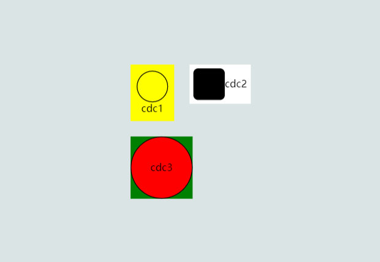

# gojs 插件使用介绍

## 一、插件简介

`gojs` 是前端的一个插件（插件名就叫 gojs，并不是 go + js），可以通过代码动态的生成和修改图表数据(组织架构图，执行流程图等等)。官方地址：[https://gojs.net/latest/index.html](https://gojs.net/latest/index.html)

官方文档中详细介绍了插件的具体用法，同时也提供了许多可参考的样例：

   

## 二、插件的简单使用

### 1. 插件下载安装

- 方式一：直接通过 `npm` 包管理工具进行下载安装

```powershell
npm install gojs --save
```

- 方式二：在官网下载全量压缩包

 

 

通过方式二下载的是整个官方网站的压缩包，在实际使用中，我们只需要用到以下三个 js 文件即可：

- go.js：是使用 gojs 插件时必须要导入的 js 文件；
- go-debug.js：可以帮你打印一些 bug 日志，正常线上不会使用；
- Figures.js：可以提高额外扩展的图标；

为方便使用，我们可以在解压后的文件夹中搜索出这三个 js 文件，单独提取出来放在一起。

### 2. 去除水印

由于 `gojs` 是需要付费使用的，当我们安装完插件后，如果没有购买，使用时绘制出的页面会带有官方的水印：

 

可以按照以下 步骤尝试去除水印：

- 在 `go.js` 文件中全局搜索 `7ca11abfd7330390` ，将该标识所在行的后段代码全部注释即可

 

- 如果搜索不到 `7ca11abfd7330390`，继续搜索 `7eba17a4ca3b1a8346`，将该标识所在代码端注释即可，或者多加一行代码

```javascript
// 方式一 直接注释这行代码
a.kr=b.V[Ra("7eba17a4ca3b1a8346")][Ra("78a118b7")](b.V,Jk,4,4);

// 方式二 在该行代码后多加一行
a.kr=b.V[Ra("7eba17a4ca3b1a8346")][Ra("78a118b7")](b.V,Jk,4,4);a.kr=function(){return false};
```

**注意**：如果是通过 `npm install` 方式安装的插件，除了修改 `go.js` 中的标识部分，`go.mjs` 和 `go-module.js` 文件中也要修改。

### 3. 插件的基本使用

```html
<!DOCTYPE html>
<html lang="en">

<head>
    <meta charset="UTF-8">
    <title>gojs插件的基本使用</title>

    <style>
        #myDiagramDiv {
            width: 500px;
            height: 350px;
            background-color: #DAE4E4;
        }
    </style>

</head>

<body>
    <div id="myDiagramDiv"></div>

    <script src="./js/go.js"></script>
    <script>
        // 第一步：初始化插件组件操作对象
        $ = go.GraphObject.make;
        // 第二步：创建图表，用于在页面上画图，通过id找到要画图的区域
        var myDiagram = $(go.Diagram, "myDiagramDiv"); 
        // 第三步：创建一个文本，文本内容为 cdc
        var text = $(go.TextBlock, { text: "cdc" })
        // 第四步：将文本对象添加至创建的节点中
        var node = $(go.Node, text);

        /*
            第三、四步可以合写成一句
            var node = $(go.Node, $(go.TextBlock, {text: "cdc"}));
        */

        // 第五步：将节点添加到图表中
        myDiagram.add(node)

    </script>
</body>

</html>
```

## 三、插件的主要组件介绍

### 1. TextBlock

`TextBlock` 用于创建一个文本对象，可以设置文本的内容，文字颜色及背景

```javascript
/*
	go.TextBlock 指定要创建的是一个文本
	text 文本内容
	stroke 字体颜色
	lightgreen 背景色
*/
go.GraphObject.make(go.TextBlock, { text: "cdc", stroke: "red", background: "lightgreen" })
```

文本无法直接在画布上显示，必须将文本添加到节点上才能使用

```html
<!DOCTYPE html>
<html lang="en">

<head>
    <meta charset="UTF-8">
    <title>gojs插件的基本使用</title>

    <style>
        #myDiagramDiv {
            width: 500px;
            height: 350px;
            background-color: #DAE4E4;
        }
    </style>

</head>

<body>
    <div id="myDiagramDiv"></div>

    <script src="./js/go.js"></script>
    <script>

        $ = go.GraphObject.make;
        var myDiagram = $(go.Diagram, "myDiagramDiv");

        var node1 = $(go.Node, $(go.TextBlock, { text: "cdc" }));
        myDiagram.add(node1)

        // 设置文本颜色
        var node2 = $(go.Node, $(go.TextBlock, { text: "cdc", stroke: "red" }))
        myDiagram.add(node2)

        // 设置文本背景色
        var node2 = $(go.Node, $(go.TextBlock, { text: "cdc", background: "lightgreen" }))
        myDiagram.add(node2)

    </script>
</body>

</html>
```

 

### 2. Shape

`Shape` 用于创建各类形状对象，和文本的用法类似，也必须依赖节点进行展示。`go.js` 自带的形状有限，可以通过 `Figures.js` 导入更多的形状

```html
<!DOCTYPE html>
<html lang="en">

<head>
    <meta charset="UTF-8">
    <title>gojs插件的基本使用</title>

    <style>
        #myDiagramDiv {
            width: 500px;
            height: 350px;
            background-color: #DAE4E4;
        }
    </style>

</head>

<body>
    <div id="myDiagramDiv"></div>

    <script src="./js/go.js"></script>
    <script src="./js/Figures.js"></script>
    <script>

        $ = go.GraphObject.make;
        var myDiagram = $(go.Diagram, "myDiagramDiv");

        /*
            go.Shape 指定要创建的是一个形状
            figure   指定形状
            width    形状的宽度
            height   形状的高度
            width    形状的宽度
            fill     形状内部的填充色
            stroke   形状的线条色
        */

        var node1 = $(go.Node, $(go.Shape, { figure: "Ellipse", width: 40, height: 40 }));
        myDiagram.add(node1);

        var node2 = $(go.Node,
            $(go.Shape, { figure: "RoundedRectangle", width: 40, height: 40, fill: 'green', stroke: 'red' })
        );
        myDiagram.add(node2);

        var node3 = $(go.Node,
            $(go.Shape, { figure: "Rectangle", width: 40, height: 40, fill: null })
        );
        myDiagram.add(node3);


        var node4 = $(go.Node,
            $(go.Shape, { figure: "Diamond", width: 40, height: 40, fill: '#ddd' })
        );
        myDiagram.add(node4);

        // 需要导入 Figures.js
        var node5 = $(go.Node,
            $(go.Shape, { figure: "Club", width: 40, height: 40, fill: 'red' })
        );
        myDiagram.add(node5);

    </script>
</body>

</html>
```

 

### 3. Node

`Node` 用于创建节点对象，内部可以嵌套文本和形状等对象。此外，节点也可以设置相关样式属性。

```html
<!DOCTYPE html>
<html lang="en">

<head>
    <meta charset="UTF-8">
    <title>gojs插件的基本使用</title>

    <style>
        #myDiagramDiv {
            width: 500px;
            height: 350px;
            background-color: #DAE4E4;
        }
    </style>

</head>

<body>
    <div id="myDiagramDiv"></div>

    <script src="./js/go.js"></script>
    <script>

        $ = go.GraphObject.make;
        var myDiagram = $(go.Diagram, "myDiagramDiv");

        var node1 = $(go.Node,
            // 设置节点内部元素排列方向
            // 设置为垂直排列
            "Vertical",  
            // 设置节点背景色和内部距离属性
            { background: 'yellow', padding: 8 },
            // 创建一个形状绑定到节点上
            $(go.Shape, { figure: "Ellipse", width: 40, height: 40, fill: null }),
            // 创建一个文本绑定在节点上
            $(go.TextBlock, { text: "cdc1" })
        );
        myDiagram.add(node1);

        var node2 = $(go.Node,
            // 设置节点内部元素水平排列
            "Horizontal",  
            { background: 'white', padding: 5 },
            $(go.Shape, { figure: "RoundedRectangle", width: 40, height: 40 }),
            $(go.TextBlock, { text: "cdc2" })
        );
        myDiagram.add(node2);

        var node3 = $(go.Node,
            // 设置节点内部元素居中排列，即可以实现文本嵌套在形状内部的效果
            "Auto",
            $(go.Shape, { figure: "Ellipse", width: 80, height: 80, background: 'green', fill: 'red' }),
            $(go.TextBlock, { text: "cdc3" })
        );
        myDiagram.add(node3);

    </script>
</body>

</html>
```

 

### 4. Links

`Links` 用于创建节点之间的指向关系

```html
<!DOCTYPE html>
<html lang="en">

<head>
    <meta charset="UTF-8">
    <title>gojs插件的基本使用</title>

    <style>
        #myDiagramDiv {
            width: 500px;
            height: 350px;
            background-color: #DAE4E4;
        }
    </style>

</head>

<body>
    <div id="myDiagramDiv"></div>

    <script src="./js/go.js"></script>
    <script>

        $ = go.GraphObject.make;
        var myDiagram = $(go.Diagram, "myDiagramDiv");

        // 创建一个节点
        var startNode = $(go.Node, 
            "Auto",
            $(go.Shape, {figure: "Ellipse", width: 40, height: 40, fill: '#79C900', stroke: '#79C900'}),
            $(go.TextBlock, {text: '开始', stroke: 'white'})
        );
        myDiagram.add(startNode);

        // 创建另一个节点
        var downloadNode = $(go.Node, 
            "Auto",
            $(go.Shape, {figure: "RoundedRectangle", height: 40, fill: 'red', stroke: '#79C900'}),
            $(go.TextBlock, {text: '完成', stroke: 'white'})
        );
        myDiagram.add(downloadNode);

        // 创建一个link用于两个节点之间的指向
        /*
            go.Link 指定创建一个关系对象
            fromNode 出发的节点
            toNode   要指向的节点
        */
        var startToDownloadLink = $(go.Link,
            { fromNode: startNode, toNode: downloadNode },
            // 绘制一个线条和箭头形状
            $(go.Shape, { strokeWidth: 1 }),
            $(go.Shape, { toArrow: "OpenTriangle", fill: null, strokeWidth: 1})
        );
        myDiagram.add(startToDownloadLink);

        
    </script>
</body>

</html>
```

 

`Links` 也可以支持更加复杂的指向关系

```html
<!DOCTYPE html>
<html lang="en">

<head>
    <meta charset="UTF-8">
    <title>gojs插件的基本使用</title>

    <style>
        #myDiagramDiv {
            width: 600px;
            height: 450px;
            background-color: #DAE4E4;
        }
    </style>

</head>

<body>
    <div id="myDiagramDiv"></div>

    <script src="./js/go.js"></script>
    <script>
        var $ = go.GraphObject.make;

        var myDiagram = $(go.Diagram,
            "myDiagramDiv",
            // go.TreeLayout  图标以树形结构展示
            // angle 展示的角度：0 为水平  90 为垂直
            { layout: $(go.TreeLayout, { angle: 90 }) }
        );

        // 创建一个节点
        var pubtNode = $(go.Node, 
            "Auto",
            $(go.Shape, {figure: "Ellipse", width: 40, height: 40, fill: '#79C900', stroke: '#79C900'}),
            $(go.TextBlock, {text: '发布代码', stroke: 'white'})
        );
        myDiagram.add(pubtNode);

        // 创建另一个节点
        var packNode = $(go.Node, 
            "Auto",
            $(go.Shape, {figure: "RoundedRectangle", height: 40, fill: 'red', stroke: '#79C900'}),
            $(go.TextBlock, {text: '代码打包', stroke: 'white'})
        );
        myDiagram.add(packNode);

        // 创建一个link用于两个节点之间的指向
        var pubToPackLink = $(go.Link,
            { fromNode: pubtNode, toNode: packNode },
            $(go.Shape, { strokeWidth: 1 }),
            $(go.Shape, { toArrow: "OpenTriangle", fill: null, strokeWidth: 1})
        );
        myDiagram.add(pubToPackLink);

        // 循环创建节点并添加指向关系
        for (let i = 1; i <= 6; i++) {
            let serviceNode = $(go.Node, 
                "Auto",
                $(go.Shape, {figure: "RoundedRectangle", width: 60, height: 40, fill: 'lightgray', stroke: 'lightgray'}),
                $(go.TextBlock, {text: '服务器' + i, stroke: 'white'})
            );
            myDiagram.add(serviceNode);

            let packToServiceLink = $(go.Link,
                // routing  设置指向的箭头角度样式
                { fromNode: packNode, toNode: serviceNode, routing: go.Link.Orthogonal },
                $(go.Shape, { strokeWidth: 1 }),
                $(go.Shape, { toArrow: "OpenTriangle", fill: null, strokeWidth: 1})
            );
            myDiagram.add(packToServiceLink);

        }

    </script>
</body>

</html>
```

 

## 四、数据动态绑定

在上述所有示例中，图表的内容、样式、形状、指向关系等都是直接写死的，这显然不符合我们实际的开发场景。图表展示的内容应该都是由后端返回，前端再根据内容进行绘制。`gojs` 插件给我们提供了数据动态绑定的方式，便于我们对图表内容进行实时的修改。

- 节点模板的使用

```html
<!DOCTYPE html>
<html lang="en">

<head>
    <meta charset="UTF-8">
    <title>gojs插件的基本使用</title>

    <style>
        #myDiagramDiv {
            width: 600px;
            height: 450px;
            background-color: #DAE4E4;
        }
    </style>

</head>

<body>
    <div id="myDiagramDiv"></div>

    <script src="./js/go.js"></script>
    <script>

        $ = go.GraphObject.make;
        var diagram = $(go.Diagram,
            "myDiagramDiv",
            { layout: $(go.TreeLayout, { angle: 0, nodeSpacing: 20, layerSpacing: 70 }) }
        );

        // 创建一个节点模板
        diagram.nodeTemplate = $(go.Node, "Auto",
            $(go.Shape,
                // 形状的默认样式
                { figure: "RoundedRectangle", fill: 'yellow', stroke: 'yellow' },
                // 接收传入的形状
                new go.Binding("figure", "figure"),
                // 接收传入的填充色
                new go.Binding("fill", "fill_color"),
                // 接收传入的边框色
                new go.Binding("stroke", "stroke_color")
            ),

            $(go.TextBlock,
                { margin: 8 },
                // 接收传入的内容
                new go.Binding("text", "text")
            )
        );


        // 根据模板创建节点
        // 这部分内容可以从后端请求获取
        var nodeDataArray = [
            // 传入的对象必须包含一个key且值唯一
            // 要赋值的字段名必须和模板中指定的要接收变量名一致
            { key: "start", text: '开始', figure: 'Ellipse', fill_color: "lightgreen" },
            { key: "download", text: '下载代码', stroke_color: "lightgreen"},
            { key: "compile", text: '本地编译', stroke_color: "lightgreen", fill_color: "lightgreen" },
        ];
        diagram.model = new go.TreeModel(nodeDataArray);


    </script>
</body>

</html>
```

- 关系指向模板的使用

```html
<!DOCTYPE html>
<html lang="en">

<head>
    <meta charset="UTF-8">
    <title>gojs插件的基本使用</title>

    <style>
        #myDiagramDiv {
            width: 100%;
            height: 450px;
            background-color: #DAE4E4;
        }
    </style>

</head>

<body>
    <div id="myDiagramDiv"></div>

    <script src="./js/go.js"></script>
    <script>

        $ = go.GraphObject.make;
        var diagram = $(go.Diagram,
            "myDiagramDiv",
            { layout: $(go.TreeLayout, { angle: 0, nodeSpacing: 20, layerSpacing: 70 }) }
        );

        // 创建一个节点模板
        diagram.nodeTemplate = $(go.Node, "Auto",
            $(go.Shape,
                // 形状的默认样式
                { figure: "RoundedRectangle", fill: 'yellow', stroke: 'yellow' },
                // 接收传入的形状
                new go.Binding("figure", "figure"),
                // 接收传入的填充色
                new go.Binding("fill", "color"),
                // 接收传入的边框色
                new go.Binding("stroke", "color")
            ),

            $(go.TextBlock,
                { margin: 8 },
                // 接收传入的内容
                new go.Binding("text", "text")
            )
        );


        // 创建一个关系模板
        diagram.linkTemplate = $(go.Link,
            { routing: go.Link.Orthogonal },
            $(go.Shape,
                { stroke: 'lightgray' },
                new go.Binding('stroke', 'link_color')),

            $(go.Shape,
                { toArrow: "OpenTriangle", stroke: 'lightgray' },
                new go.Binding('stroke', 'link_color')),

            // 设置箭头上的文字
            $(go.TextBlock,
                { font: "8pt serif", segmentOffset: new go.Point(0, -10) },
                new go.Binding("text", "link_text"))
        );


        // 根据模板创建节点
        // 这部分内容可以从后端请求获取
        var nodeDataArray = [
            // 传入的对象必须包含一个key且值唯一
            // 要赋值的字段名必须和模板中指定的要接收变量名一致
            // parent 字段指明当前节点的父节点，取值为其他节点的key的值
            { key: "start", text: '开始', figure: 'Ellipse', color: "lightgreen" },
            { key: "download", parent: 'start', text: '下载代码', color: "lightgreen", link_text: '执行中...' },
            { key: "compile", parent: 'download', text: '本地编译', color: "lightgreen" },
            { key: "zip", parent: 'compile', text: '打包', color: "red", link_color: 'red' },
            { key: "c1", text: '服务器1', parent: "zip" },
            { key: "c11", text: '服务重启', parent: "c1" },
            { key: "c2", text: '服务器2', parent: "zip" },
            { key: "c21", text: '服务重启', parent: "c2" },
            { key: "c3", text: '服务器3', parent: "zip" },
            { key: "c31", text: '服务重启', parent: "c3" }
        ];
        diagram.model = new go.TreeModel(nodeDataArray);


    </script>
</body>

</html>
```

关系模板数据还可以进一步拆分，将节点的样式内容设置和关系指向分别单独写

```javascript
// 可以将节点的指向关系进一步拆分出来
// 只写节点的样式和内容
var nodeDataArray = [
    { key: "start", text: '开始', figure: 'Ellipse', color: "lightgreen" },
    { key: "download", text: '下载代码', color: "lightgreen", link_text: '执行中...' },
    { key: "compile", text: '本地编译', color: "lightgreen" },
    { key: "zip", text: '打包', color: "red", link_color: 'red' },
    { key: "c1", text: '服务器1' },
    { key: "c11", text: '服务重启' },
    { key: "c2", text: '服务器2' },
    { key: "c21", text: '服务重启' },
    { key: "c3", text: '服务器3' },
    { key: "c31", text: '服务重启' }
];


// 将节点的指向关系单独摘出来
var linkArray = [
    { from: "start", to: "download" },
    { from: "download", to: "compile" },
    { from: "compile", to: "zip" },
    { from: "zip", to: "c1" },
    { from: "c1", to: "c11" },
    { from: "zip", to: "c2" },
    { from: "c2", to: "c21" },
    { from: "zip", to: "c3" },
    { from: "c3", to: "c31" },
]

diagram.model = new go.GraphLinksModel(nodeDataArray, linkArray);
```


 

使用模板还有一个好处就是可以根据 `key` 去找到对应的节点，动态的修改节点的样式和值

```javascript
// 查找节点
var node = diagram.model.findNodeDataForKey("zip");

// 修改节点
diagram.model.setDataProperty(node, "color", "lightgreen");
diagram.model.setDataProperty(node, "link_text", "执行中……");

// 还可以新增节点
diagram.model.addNodeData({key: "c4", parent: "zip", text: "服务器4", color: "yellow"})

// 单独指定指向关系也可以这么写
diagram.model.addLinkData({from: "zip", to: "c4"})
```

