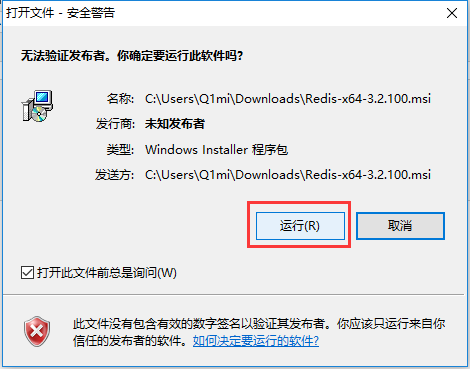

# Redis 简介和环境安装

## 一、redis 简介

### 1. 什么是 redis

Redis 是 NoSQL 中的一种存储工具，是一个高性能的 `key-value` 数据格式的内存数据库。redis的出现主要是为了替代早先的Memcache 缓存系统。Redis 默认有16个数据库，库名使用索引 0 到 15 来表示。

Redis 存储的数据类型包括 string（字符串）、list（链表）、set（集合）、zset（sorted set -- 有序集合）和 hash（哈希类型）。在此基础上，Redis 支持各种不同方式的排序。

与传统数据库不同，Redis 的数据是存在内存中的，读写速度非常快，因此 Redis 经常用来实现缓存、数据共享、购物车、消息队列、计数器、限流等功能。 Redis 为分布式缓存，在多客户端的情况下，共用一份缓存数据，缓存具有一致性。

Redis 支持数据的持久化（(基于RDB和AOF），会周期性的把更新的数据写入磁盘或者把修改操作写入追加的记录文件，每次启动redis之后会先将文件中数据加载到内存。在此基础上，Redis 支持 master-slave（主从）同步，提高了可靠性。

### 2. redis 的特点

- 性能极高：redis 读的速度是11 W次/s，写的速度是 81K次/s

- 支持数据的持久化：可以将内存中的数据保存在磁盘中，重启的时候可以再次加载进行使用。

- 支持丰富的数据类型：redis 不仅仅支持简单的 key-value 类型的数据，同时还提供 Strings、Lists、Hashes、Sets 及 Ordered Sets 等数据结构的存储。

- 支持数据的备份：支持 master-slave 模式的数据备份。

### 3. redis 的优缺点

**优点**：

- 对数据高并发读写
- 对海量数据的高效率存储和访问
- 对数据具有的可扩展性和高可用性

**缺点**：

- redis 数据库事物处理四要素（原子性、一致性、隔离性、持久性，即ACID）非常简单
- 无法做到太复杂的关系数据库模型

## 二、redis 下载和安装

### 1. Windows 环境下安装

redis 的官方只提供了 linux 版本的 redis，window 系统的 redis 是微软团队根据官方的 linux 版本高仿的。安装包下载地址：

https://github.com/redis/redis/releases

https://github.com/MicrosoftArchive/redis/releases

下载安装包后，直接傻瓜式安装即可：

  

 

 

 

 

 

 

 

### 2. Linux 环境下安装

以下使用的 linux 环境为 CentOS 系统

- 安装相关依赖

```shell
yum install gcc gcc+ -y
yum install tcl
```

- 下载安装包（也可以直接通过 linux 源直接下载安装，这里演示的是通过安装包方式安装）

```shell
wget http://download.redis.io/releases/redis-5.0.4.tar.gz
```

也可以直接访问 Redis 官网手动下载安装包

官网：https://redis.io/

中文官网：https://www.redis.net.cn/

- 对安装包进行解压

```shell
tar xf redis-5.0.4.tar.gz
```

- 进入安装目录，进行编译安装

```shell
cd redis-5.0.4/
make
```

注意：编译时可能会出现依赖问题，可以直接百度报错进行解决。

## 三、redis 的简单使用

### 1. Windows 下的使用

进入安装目录，找到 `redis-server.exe` 可执行文件，打开终端，执行启动命令（redis.windows.conf 为默认的配置文件，命令中需要指定该配置文件的存放位置）

```powershell
redis-server C:/tool/redis/redis.windows.conf
```

 

关闭上面这个终端窗口，redis 服务也会被关闭。可以执行以下命令，将 redis 作为 windows 服务启动

```powershell
redis-server --service-install redis.windows.conf

# 相关命令
# 启动服务：redis-server --service-start
# 停止服务：redis-server --service-stop
```

此时执行 `redis-cli` 命令，即可连接上 redis

 

### 2. Linux 下的使用

linux 下 redis 编译安装完成后的可执行文件都会存放在 src 目录下

```shell
[root@localhost redis-5.0.4]# ll src/ | grep redis-
-rwxr-xr-x. 1 root root 4366552 Jun 11 14:28 redis-benchmark
-rwxr-xr-x. 1 root root 8101232 Jun 11 14:28 redis-check-aof
-rwxr-xr-x. 1 root root 8101232 Jun 11 14:28 redis-check-rdb
-rwxr-xr-x. 1 root root 4806768 Jun 11 14:28 redis-cli
-rwxr-xr-x. 1 root root 8101232 Jun 11 14:28 redis-sentinel
-rwxr-xr-x. 1 root root 8101232 Jun 11 14:28 redis-server
```

调用 redis-server 可执行文件，启动 redis 服务

```shell
cd src/
./redis-server ../redis.conf
```

 

调用用户客户端可执行文件即可连接 redis 进行使用

```shell
cd src/
./redis-cli
```

如果关闭客户端，redis 服务也会被关闭。可以通过修改 redis 配置文件，使 redis 服务在后台执行

 

```shell
daemonize yes  # 从前台启动改后台启动
```

启动服务时指定配置文件

```shell
./src/redis-server ./redis.conf 
```

查询 redis 是否启动成功

```shell
ps -aux | grep redis
```

### 3. redis 可视化工具

- 下载可视化桌面软件

```shell
所有版本: https://github.com/lework/RedisDesktopManager-Windows
windows版本：https://github.com/lework/RedisDesktopManager-Windows
```

- 修改配置文件，配置 redis 允许远程连接

```shell
# 注释改行
# bind 127.0.0.1

# 关闭保护模式
protected-mode no
```

- 使用 GUI 软件操作 redis

  

## 四、redis 可执行文件

redis 编译安装完成后生成的可执行文件如下

```shell
redis-benchmark  # 性能测试
redis-check-aof  # 检查修复 aof 文件
redis-check-rdb  # 检查修复 rdb 文件
redis-cli        # redis 的客户端
redis-sentinel   # redis 的集群
redis-server     # redis 的服务端
redis-trib.rb    # redis 的集群管理
```

这里主要介绍常用的几个，剩下的可执行文件会在后续文章中逐一介绍。

### 1. redis-server

redis 的服务端可执行文件，用于启动 redis 服务，主要用法如下：

```shell
[root@localhost src]# ./redis-server --help
Usage: ./redis-server [/path/to/redis.conf] [options]  
       ./redis-server - (read config from stdin)
       ./redis-server -v or --version
       ./redis-server -h or --help
       ./redis-server --test-memory <megabytes>

Examples:
       ./redis-server (run the server with default conf)
       ./redis-server /etc/redis/6379.conf  # 指定配置文件启动服务
       ./redis-server --port 7777  # 指定启动服务的端口
       ./redis-server --port 7777 --replicaof 127.0.0.1 8888
       ./redis-server /etc/myredis.conf --loglevel verbose  # 指定服务日志级别

Sentinel mode:
       ./redis-server /etc/sentinel.conf --sentinel
```

redis 启动使用的端口默认是 **9379**，且通过 redis-server 启动服务会占用终端。

### 2. redis-benchmark

redis 性能测试可执行文件，主要用于对 redis 相关操作的性能压测，主要用法如下：

```shell
[root@localhost src]# ./redis-benchmark --help
Usage: redis-benchmark [-h <host>] [-p <port>] [-c <clients>] [-n <requests>] [-k <boolean>]

 -h <hostname>      Server hostname (default 127.0.0.1)
 -p <port>          Server port (default 6379)
 -s <socket>        Server socket (overrides host and port)
 -a <password>      Password for Redis Auth
 -c <clients>       Number of parallel connections (default 50)
 -n <requests>      Total number of requests (default 100000)
 -d <size>          Data size of SET/GET value in bytes (default 3)
 --dbnum <db>       SELECT the specified db number (default 0)
 -k <boolean>       1=keep alive 0=reconnect (default 1)
 -r <keyspacelen>   Use random keys for SET/GET/INCR, random values for SADD
  Using this option the benchmark will expand the string __rand_int__
  inside an argument with a 12 digits number in the specified range
  from 0 to keyspacelen-1. The substitution changes every time a command
  is executed. Default tests use this to hit random keys in the
  specified range.
 -P <numreq>        Pipeline <numreq> requests. Default 1 (no pipeline).
 -e                 If server replies with errors, show them on stdout.
                    (no more than 1 error per second is displayed)
 -q                 Quiet. Just show query/sec values
 --csv              Output in CSV format
 -l                 Loop. Run the tests forever
 -t <tests>         Only run the comma separated list of tests. The test
                    names are the same as the ones produced as output.
 -I                 Idle mode. Just open N idle connections and wait.

Examples:

 Run the benchmark with the default configuration against 127.0.0.1:6379:
   $ redis-benchmark

 Use 20 parallel clients, for a total of 100k requests, against 192.168.1.1:
   $ redis-benchmark -h 192.168.1.1 -p 6379 -n 100000 -c 20

 Fill 127.0.0.1:6379 with about 1 million keys only using the SET test:
   $ redis-benchmark -t set -n 1000000 -r 100000000

 Benchmark 127.0.0.1:6379 for a few commands producing CSV output:
   $ redis-benchmark -t ping,set,get -n 100000 --csv

 Benchmark a specific command line:
   $ redis-benchmark -r 10000 -n 10000 eval 'return redis.call("ping")' 0

 Fill a list with 10000 random elements:
   $ redis-benchmark -r 10000 -n 10000 lpush mylist __rand_int__

 On user specified command lines __rand_int__ is replaced with a random integer
 with a range of values selected by the -r option.
```

执行性能测试时，默认会使用 **50** 个客户端同时请求服务端，默认发送 **100000** 次请求。全量执行一次性能测试看下效果：

```shell
[root@localhost src]# ./redis-benchmark
====== PING_INLINE ======
  100000 requests completed in 1.08 seconds
  50 parallel clients
  3 bytes payload
  keep alive: 1

99.76% <= 1 milliseconds
99.91% <= 3 milliseconds
99.94% <= 7 milliseconds
99.94% <= 8 milliseconds
99.96% <= 10 milliseconds
99.96% <= 11 milliseconds
99.98% <= 18 milliseconds
100.00% <= 18 milliseconds
92250.92 requests per second

====== PING_BULK ======
  100000 requests completed in 1.09 seconds
  50 parallel clients
  3 bytes payload
  keep alive: 1

99.93% <= 1 milliseconds
100.00% <= 1 milliseconds
91743.12 requests per second

====== SET ======
  100000 requests completed in 1.05 seconds
  50 parallel clients
  3 bytes payload
  keep alive: 1

99.90% <= 1 milliseconds
99.95% <= 2 milliseconds
99.95% <= 3 milliseconds
100.00% <= 3 milliseconds
95057.03 requests per second

====== GET ======
  100000 requests completed in 1.08 seconds
  50 parallel clients
  3 bytes payload
  keep alive: 1

99.92% <= 1 milliseconds
99.95% <= 3 milliseconds
100.00% <= 3 milliseconds
92592.59 requests per second

====== INCR ======
  100000 requests completed in 1.02 seconds
  50 parallel clients
  3 bytes payload
  keep alive: 1

100.00% <= 1 milliseconds
100.00% <= 1 milliseconds
97751.71 requests per second

====== LPUSH ======
  100000 requests completed in 1.00 seconds
  50 parallel clients
  3 bytes payload
  keep alive: 1

100.00% <= 0 milliseconds
99800.40 requests per second

====== RPUSH ======
  100000 requests completed in 1.02 seconds
  50 parallel clients
  3 bytes payload
  keep alive: 1

99.87% <= 1 milliseconds
99.95% <= 3 milliseconds
100.00% <= 3 milliseconds
98039.22 requests per second

====== LPOP ======
  100000 requests completed in 1.03 seconds
  50 parallel clients
  3 bytes payload
  keep alive: 1

99.95% <= 1 milliseconds
100.00% <= 1 milliseconds
97465.88 requests per second

====== RPOP ======
  100000 requests completed in 1.20 seconds
  50 parallel clients
  3 bytes payload
  keep alive: 1

99.72% <= 1 milliseconds
99.78% <= 2 milliseconds
99.87% <= 3 milliseconds
99.91% <= 4 milliseconds
99.92% <= 5 milliseconds
99.94% <= 6 milliseconds
99.94% <= 7 milliseconds
99.98% <= 8 milliseconds
100.00% <= 8 milliseconds
83263.95 requests per second

====== SADD ======
  100000 requests completed in 1.28 seconds
  50 parallel clients
  3 bytes payload
  keep alive: 1

99.59% <= 1 milliseconds
99.92% <= 2 milliseconds
99.97% <= 3 milliseconds
100.00% <= 5 milliseconds
100.00% <= 5 milliseconds
78003.12 requests per second

====== HSET ======
  100000 requests completed in 1.02 seconds
  50 parallel clients
  3 bytes payload
  keep alive: 1

99.94% <= 1 milliseconds
100.00% <= 1 milliseconds
98039.22 requests per second

====== SPOP ======
  100000 requests completed in 1.04 seconds
  50 parallel clients
  3 bytes payload
  keep alive: 1

99.90% <= 1 milliseconds
99.98% <= 3 milliseconds
100.00% <= 3 milliseconds
96432.02 requests per second

====== LPUSH (needed to benchmark LRANGE) ======
  100000 requests completed in 1.03 seconds
  50 parallel clients
  3 bytes payload
  keep alive: 1

99.92% <= 1 milliseconds
99.97% <= 3 milliseconds
100.00% <= 3 milliseconds
97276.27 requests per second

====== LRANGE_100 (first 100 elements) ======
  100000 requests completed in 1.67 seconds
  50 parallel clients
  3 bytes payload
  keep alive: 1

99.60% <= 1 milliseconds
99.95% <= 3 milliseconds
100.00% <= 3 milliseconds
59808.61 requests per second

====== LRANGE_300 (first 300 elements) ======
  100000 requests completed in 3.60 seconds
  50 parallel clients
  3 bytes payload
  keep alive: 1

83.03% <= 1 milliseconds
99.71% <= 2 milliseconds
99.92% <= 3 milliseconds
99.96% <= 4 milliseconds
100.00% <= 4 milliseconds
27816.41 requests per second

====== LRANGE_500 (first 450 elements) ======
  100000 requests completed in 4.73 seconds
  50 parallel clients
  3 bytes payload
  keep alive: 1

5.73% <= 1 milliseconds
99.57% <= 2 milliseconds
99.92% <= 3 milliseconds
99.95% <= 4 milliseconds
100.00% <= 4 milliseconds
21128.25 requests per second

====== LRANGE_600 (first 600 elements) ======
  100000 requests completed in 5.88 seconds
  50 parallel clients
  3 bytes payload
  keep alive: 1

0.05% <= 1 milliseconds
98.72% <= 2 milliseconds
99.81% <= 3 milliseconds
99.93% <= 4 milliseconds
99.97% <= 5 milliseconds
99.99% <= 6 milliseconds
100.00% <= 6 milliseconds
17015.48 requests per second

====== MSET (10 keys) ======
  100000 requests completed in 1.00 seconds
  50 parallel clients
  3 bytes payload
  keep alive: 1

99.90% <= 1 milliseconds
100.00% <= 1 milliseconds
100300.91 requests per second
```

如果觉得打印的内容太多了，可以采用静默模式进行测试

```shell
[root@localhost src]# ./redis-benchmark -q
PING_INLINE: 96339.12 requests per second
PING_BULK: 94966.77 requests per second
SET: 97276.27 requests per second
GET: 96061.48 requests per second
INCR: 95969.28 requests per second
LPUSH: 97465.88 requests per second
RPUSH: 88417.33 requests per second
LPOP: 84674.01 requests per second
RPOP: 85543.20 requests per second
SADD: 87719.30 requests per second
HSET: 92678.41 requests per second
SPOP: 94966.77 requests per second
LPUSH (needed to benchmark LRANGE): 79051.38 requests per second
LRANGE_100 (first 100 elements): 55218.11 requests per second
LRANGE_300 (first 300 elements): 26983.27 requests per second
LRANGE_500 (first 450 elements): 20483.41 requests per second
LRANGE_600 (first 600 elements): 15915.96 requests per second
MSET (10 keys): 94428.70 requests per second
```

### 3. redis-cli

redis 的客户端可执行文件，通过 redis-cli 可以连接 redis 服务端，通过命令执行相关操作（命令不区分大小写）。主要用法如下：

```shell
[root@localhost src]# ./redis-cli -h 10.16.244.3 -p 6379

[root@localhost src]# ./redis-cli --help
redis-cli 5.0.4

Usage: redis-cli [OPTIONS] [cmd [arg [arg ...]]]
  -h <hostname>      Server hostname (default: 127.0.0.1).
  -p <port>          Server port (default: 6379).
  -s <socket>        Server socket (overrides hostname and port).
  -a <password>      Password to use when connecting to the server.
                     You can also use the REDISCLI_AUTH environment
                     variable to pass this password more safely
                     (if both are used, this argument takes predecence).
  -u <uri>           Server URI.
  -r <repeat>        Execute specified command N times.
  -i <interval>      When -r is used, waits <interval> seconds per command.
                     It is possible to specify sub-second times like -i 0.1.
  -n <db>            Database number.
  -x                 Read last argument from STDIN.
  -d <delimiter>     Multi-bulk delimiter in for raw formatting (default: \n).
  -c                 Enable cluster mode (follow -ASK and -MOVED redirections).
  --raw              Use raw formatting for replies (default when STDOUT is
                     not a tty).
  --no-raw           Force formatted output even when STDOUT is not a tty.
  --csv              Output in CSV format.
  --stat             Print rolling stats about server: mem, clients, ...
  --latency          Enter a special mode continuously sampling latency.
                     If you use this mode in an interactive session it runs
                     forever displaying real-time stats. Otherwise if --raw or
                     --csv is specified, or if you redirect the output to a non
                     TTY, it samples the latency for 1 second (you can use
                     -i to change the interval), then produces a single output
                     and exits.
  --latency-history  Like --latency but tracking latency changes over time.
                     Default time interval is 15 sec. Change it using -i.
  --latency-dist     Shows latency as a spectrum, requires xterm 256 colors.
                     Default time interval is 1 sec. Change it using -i.
  --lru-test <keys>  Simulate a cache workload with an 80-20 distribution.
  --replica          Simulate a replica showing commands received from the master.
  --rdb <filename>   Transfer an RDB dump from remote server to local file.
  --pipe             Transfer raw Redis protocol from stdin to server.
  --pipe-timeout <n> In --pipe mode, abort with error if after sending all data.
                     no reply is received within <n> seconds.
                     Default timeout: 30. Use 0 to wait forever.
  --bigkeys          Sample Redis keys looking for keys with many elements (complexity).
  --memkeys          Sample Redis keys looking for keys consuming a lot of memory.
  --memkeys-samples <n> Sample Redis keys looking for keys consuming a lot of memory.
                     And define number of key elements to sample
  --hotkeys          Sample Redis keys looking for hot keys.
                     only works when maxmemory-policy is *lfu.
  --scan             List all keys using the SCAN command.
  --pattern <pat>    Useful with --scan to specify a SCAN pattern.
  --intrinsic-latency <sec> Run a test to measure intrinsic system latency.
                     The test will run for the specified amount of seconds.
  --eval <file>      Send an EVAL command using the Lua script at <file>.
  --ldb              Used with --eval enable the Redis Lua debugger.
  --ldb-sync-mode    Like --ldb but uses the synchronous Lua debugger, in
                     this mode the server is blocked and script changes are
                     not rolled back from the server memory.
  --cluster <command> [args...] [opts...]
                     Cluster Manager command and arguments (see below).
  --verbose          Verbose mode.
  --no-auth-warning  Don't show warning message when using password on command
                     line interface.
  --help             Output this help and exit.
  --version          Output version and exit.

Cluster Manager Commands:
  Use --cluster help to list all available cluster manager commands.

Examples:
  cat /etc/passwd | redis-cli -x set mypasswd
  redis-cli get mypasswd
  redis-cli -r 100 lpush mylist x
  redis-cli -r 100 -i 1 info | grep used_memory_human:
  redis-cli --eval myscript.lua key1 key2 , arg1 arg2 arg3
  redis-cli --scan --pattern '*:12345*'

  (Note: when using --eval the comma separates KEYS[] from ARGV[] items)

When no command is given, redis-cli starts in interactive mode.
Type "help" in interactive mode for information on available commands
and settings.
```

常用参数：

- -h：IP地址
- -p：端口
- -s：套接字
- -a：密码
- -n：数据库的数量

通过修改配置文件，可以为 redis 设置连接密码。放开 `requirepass yourpassword` 该行注释，并将 `yourpassword` 修改为实际的密码

 

修改完成后重新启动服务，重新连接服务，虽然还是可以连接，但是要对 redis 进行相关操作时，必须先进行身份验证

```shell
[root@localhost src]# ./redis-cli
127.0.0.1:6379> set name cdc
(error) NOAUTH Authentication required.  # 未登录，操作失败
127.0.0.1:6379> auth 123456  # 使用密码进行登录
OK
127.0.0.1:6379> set name cdc  # 登录后，操作成功
OK
```

## 五、redis 配置

### 1. 配置操作

可以通过以下两种方式来查询和修改 redis 的所有配置

- 通过配置文件：修改过配置文件后，必须重启 redis ，新的配置才能生效
- 通过 config 指令：通过指令修改配置，可以直接生效，但是修改的配置效果都是暂时的，一旦 redis 重启服务，配置就失效了，会默认使用配置文件中的值。

通过指令修改 redis 操作如下：

- config get 查询配置项信息

```shell
# config get *   --查看所有配置
127.0.0.1:6379> config get *
  1) "dbfilename"
  2) "dump.rdb"
  3) "requirepass"
  4) ""
  5) "masterauth"
  6) ""

# config get 配置项  --查看指定的配置项
127.0.0.1:6379> config get save
1) "save"
2) "900 1 300 10 60 10000"
```

- config set 修改配置项的值

```shell
# config set 配置项 值
127.0.0.1:6379> config set save "10 1"
OK
127.0.0.1:6379> config get save
1) "save"
2) "10 1"
```

- 此时重启 redis 服务，再次查看通过指令修改的配置项，发现配置项恢复原来的值

```shell
127.0.0.1:6379> config get save
1) "save"
2) "900 1 300 10 60 10000"
```

### 2. 配置项详解

redis 服务端可以按照指定的配置文件进行启动，主要常用配置项功能如下：

- 绑定IP：使用该配置时，只能本机访问 redis 服务。如果想服务被远程访问，需要将白名单 IP 进行配置，或者直接将该行注释，允许所有客户端远程访问。

```shell
# bind 192.168.1.100 10.0.0.1
# bind 127.0.0.1 ::1

bind 127.0.0.1
```

- 启动端口：默认启动的端口是 3679

```shell
port 6379
```

- 以守护进程运行：如果以守护进程运行，则不会在命令阻塞，否则终端关闭后，服务端也会被关闭

```shell
daemonize yes
```

- 数据库设置：默认有16个，数据名是不能自定义的，只能是0-15之间

```shell
database 16
```

- 密码设置：生产阶段打开，开发阶段避免麻烦，一般都是注释的。

```shell
# requirepass foobared
```

- 日志等级和日志文件所在目录，日志级别从高到低分别是：warning、notice、verbose、debug

```shell
loglevel notice
logfile /var/log/redis/redis-server.log
```

- 进程ID文件存放目录

```shell
pidfile /var/run/redis/redis-server.pid
```

- RDB 持久化相关

```shell
# RDB 持久化备份文件名，文件类型是二进制的，方便系统读写
dbfilename dump.rdb

# RDB 持久化备份文件存放路径
dir /var/lib/redis

# RDB 持久化频率
save 900 1     # 900秒内至少有一个键发生改变，则触发备份
save 300 10    # 300秒内至少有10个键发生了改变，则触发备份
save 60 10000  # 60秒内至少有10000个键发生了改变，则触发备份
```

- AOF 持久化相关

```shell
# 是否采用 aof 持久化策略，默认是 no， 关闭的
appendonly no

# AOF 持久化的备份文件，文件类型为文本文件
appendfilename "appendonly.aof"

# AOF 持久化备份文件存放路径
dir /var/lib/redis

# AOF 持久化频率
# appendfsync always   # 每次修改键对应数据时都会触发一次 AOF
appendfsync everysec   # 每秒备份，工作中最常用。
# appendfsync no       # 交由操作系统来处理什么时候写入
```

- 其他配置项和相关说明

| 序号 | 配置项                                                 | 说明                                                         |
| :--- | :----------------------------------------------------- | :----------------------------------------------------------- |
| 1    | `timeout 300`                                          | 当客户端闲置多长秒后关闭连接，如果指定为 0 ，表示关闭该功能  |
| 2    | `logfile stdout`                                       | 日志记录方式，默认为标准输出，如果配置 Redis 为守护进程方式运行，而这里又配置为日志记录方式为标准输出，则日志将会发送给 /dev/null |
| 3    | `rdbcompression yes`                                   | 指定存储至本地数据库时是否压缩数据，默认为 yes，Redis 采用 LZF 压缩，如果为了节省 CPU 时间，可以关闭该选项，但会导致数据库文件变的巨大 |
| 4    | `dbfilename dump.rdb`                                  | 指定本地数据库文件名，默认值为 dump.rdb                      |
| 5    | `slaveof`                                              | 设置当本机为 slave 服务时，设置 master 服务的 IP 地址及端口，在 Redis 启动时，它会自动从 master 进行数据同步 |
| 6    | `masterauth`                                           | 当 master 服务设置了密码保护时，slave 服务连接 master 的密码 |
| 7    | `maxclients 128`                                       | 设置同一时间最大客户端连接数，默认无限制，Redis 可以同时打开的客户端连接数为 Redis 进程可以打开的最大文件描述符数，如果设置 maxclients 0，表示不作限制。当客户端连接数到达限制时，Redis 会关闭新的连接并向客户端返回 max number of clients reached 错误信息 |
| 8    | `maxmemory`                                            | 指定 Redis 最大内存限制，Redis 在启动时会把数据加载到内存中，达到最大内存后，Redis 会先尝试清除已到期或即将到期的 Key，当此方法处理 后，仍然到达最大内存设置，将无法再进行写入操作，但仍然可以进行读取操作。Redis 新的 vm 机制，会把 Key 存放内存，Value 会存放在 swap 区 |
| 9    | `vm-enabled no`                                        | 指定是否启用虚拟内存机制，默认值为 no，简单的介绍一下，VM 机制将数据分页存放，由 Redis 将访问量较少的页即冷数据 swap 到磁盘上，访问多的页面由磁盘自动换出到内存中（在后面的文章我会仔细分析 Redis 的 VM 机制） |
| 10   | `vm-swap-file /tmp/redis.swap`                         | 虚拟内存文件路径，默认值为 /tmp/redis.swap，不可多个 Redis 实例共享 |
| 11   | `vm-max-memory 0`                                      | 将所有大于 vm-max-memory 的数据存入虚拟内存，无论 vm-max-memory 设置多小，所有索引数据都是内存存储的(Redis 的索引数据 就是 keys)，也就是说，当 vm-max-memory 设置为 0 的时候，其实是所有 value 都存在于磁盘。默认值为 0 |
| 12   | `vm-page-size 32`                                      | Redis swap 文件分成了很多的 page，一个对象可以保存在多个 page 上面，但一个 page 上不能被多个对象共享，vm-page-size 是要根据存储的 数据大小来设定的，作者建议如果存储很多小对象，page 大小最好设置为 32 或者 64bytes；如果存储很大大对象，则可以使用更大的 page，如果不确定，就使用默认值 |
| 13   | `vm-pages 134217728`                                   | 设置 swap 文件中的 page 数量，由于页表（一种表示页面空闲或使用的 bitmap）是在放在内存中的，，在磁盘上每 8 个 pages 将消耗 1byte 的内存。 |
| 14   | `vm-max-threads 4`                                     | 设置访问swap文件的线程数,最好不要超过机器的核数,如果设置为0,那么所有对swap文件的操作都是串行的，可能会造成比较长时间的延迟。默认值为4 |
| 15   | `glueoutputbuf yes`                                    | 设置在向客户端应答时，是否把较小的包合并为一个包发送，默认为开启 |
| 16   | `hash-max-zipmap-entries 64 hash-max-zipmap-value 512` | 指定在超过一定的数量或者最大的元素超过某一临界值时，采用一种特殊的哈希算法 |
| 17   | `activerehashing yes`                                  | 指定是否激活重置哈希，默认为开启（后面在介绍 Redis 的哈希算法时具体介绍） |
| 18   | `include /path/to/local.conf`                          | 指定包含其它的配置文件，可以在同一主机上多个Redis实例之间使用同一份配置文件，而同时各个实例又拥有自己的特定配置文件 |

