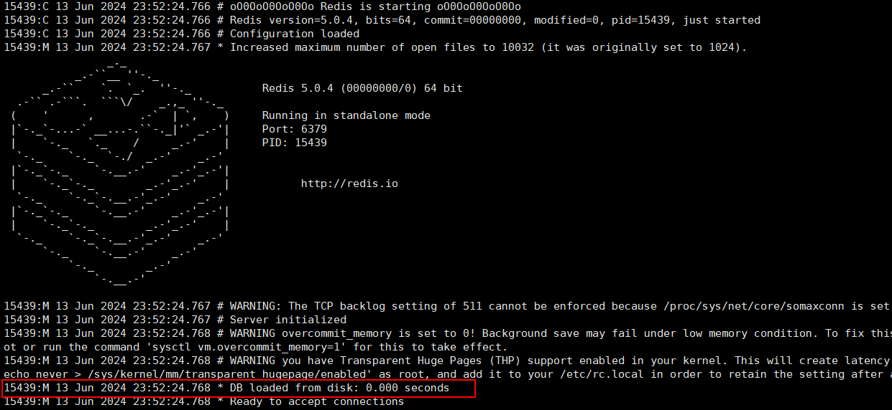
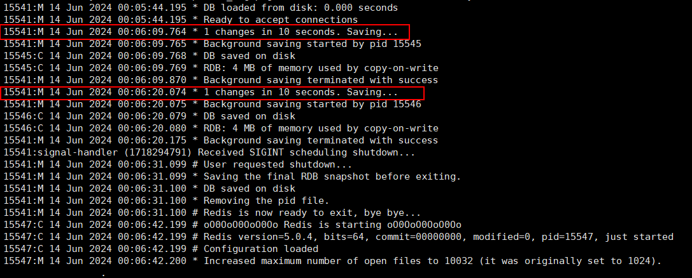
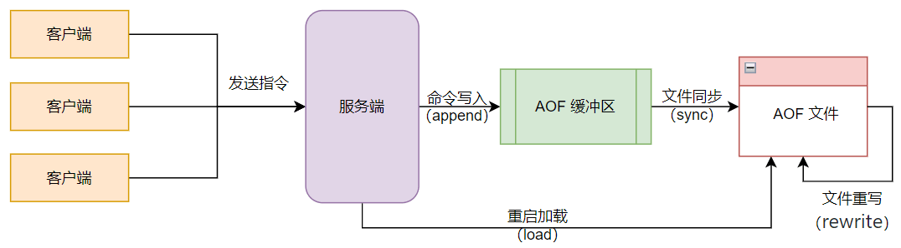
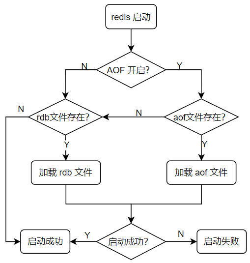
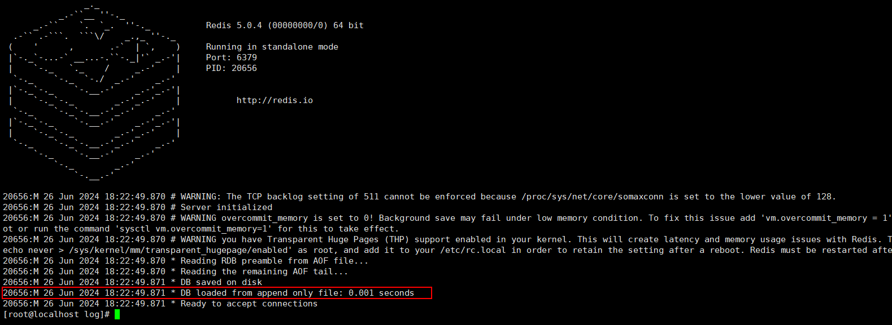
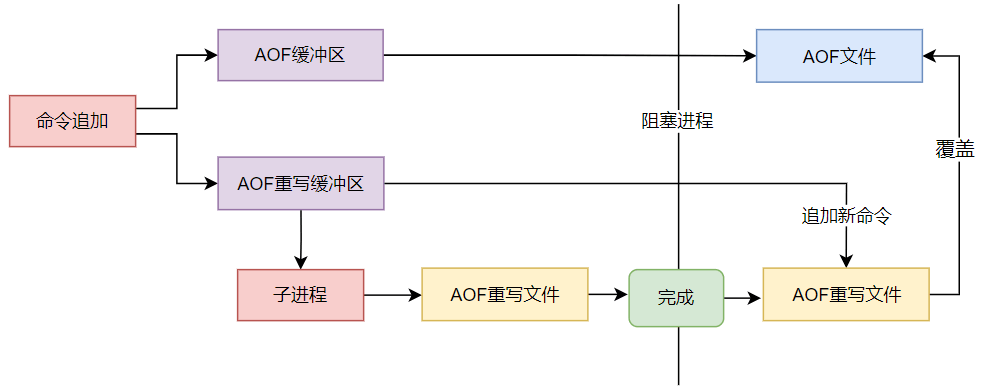

# Redis 数据持久化

## 一、数据持久化概述

### 1. 数据持久化简介

之所以 redis 的速度快，是因为 redis 将数据都存储在缓存中。那么当我们重启服务器或者服务器宕机以后，内存中的数据就全部丢失了，这显然是极不安全的。为了避免此类情况发生，redis 提供了数据持久化的机制，通过某种条件触发固化操作，将内存中的数据固化到硬盘，方便数据的找回。

### 2. 持久化方式介绍

redis 一共支持两种持久化方式，每种方式都有各自的优缺点。在日常使用中，我们不会只单一的使用某一种方式，常常将两种方式结合使用。

#### 2.1 RDB 持久化

RDB 方式是一种快照式的持久化方法，将某一时刻的数据持久化到磁盘中。可以通过配置文件或者手动执行的方式来触发 RDB 机制，该机制会在本地磁盘中生成一个后缀名是 `.rdb`  的二进制文件，用于存储当前 redis 中的所有数据。系统读写二进制文件速度较快，因此 RDB 方式常用于数据备份及灾难恢复。

RDB 机制也有缺陷，例如服务器突然宕机，可能会造成数据的丢失（rdb 的触发取决于配置的时间点，不到条件不会触发），且 RDB 保存的是整个的数据集，数据量庞大时对系统消耗较大。 

#### 2.2 AOF 持久化

AOF 方式是将执行过的写指令记录下来，在数据恢复时按照从前到后的顺序再将指令执行一遍。这种方式下， redis 会将每一个收到的写命令都通过 write 函数追加到文件中，文件后缀名是 `.aof`。

该机制具有以下优点：

- 数据持久化更好，它支持三种 fsync 策略，在默认策略（everysec）下，只会丢失一秒内的数据
- AOF 日志是一种仅支持追加写入的日志文件，即使发生断电，已经写入的日志内容也不会受到影响。如果由于磁盘写满等其他原因导致某个命令只写了一半，也可以使用 `redis-check-aof` 工具进行修复
- 当 AOF 文件变得太大时，可以自动在后台进行 AOF 重写。重写会剔除掉冗余的日志内容，在能够生成相同数据集的前提下缩小日志大小。重写过程是安全的，重写时 redis 依然会把新的写命令写入旧的 AOF 文件，等到重写的新 AOF 文件就绪时，redis 通过日志切换将后续发生的写命令都写入新的件
- AOF 文件以易于理解和解析的方式按先后顺序依次包含所有写命令，且文件可以轻松地导出

该机制具有以下缺点：

- 对于同一个数据集而言，它对应的 AOF 文件通常要比 RDB 文件更大，且随着后续数据量增多，文件会越来越大
- 取决于具体的 fsync 策略，AOF 可能会比 RDB 更慢

## 二、持久化的使用

### 1. RDB 持久化的使用

#### 1.1 手动触发

##### 1.1.1 通过 save 命令触发

在客户端中执行 `save` 命令就会触发 redis 的持久化，但同时也使 redis 处于阻塞状态，直到 RDB 持久化过程完成。该操作会响应服务端处理其他客户端发来的命令。

- 查看当前 rdb 文件的保存时间

```shell
[root@localhost redis_6379]# ls -l
-rw-r--r--. 1 root root 199 Jun 13 13:58 dump.rdb
```

- 客户端连接 redis ，执行命令，触发持久化

```shell
127.0.0.1:6379> hmset userInfo name cdc age 18 address nanjing
OK 
127.0.0.1:6379> hgetall userInfo
1) "name"
2) "cdc"
3) "age"
4) "18"
5) "address"
6) "nanjing"
127.0.0.1:6379> save
OK
127.0.0.1:6379> quit

# 重新查询文件时间，发现已经改变
[root@localhost src]# cd ../
[root@localhost redis-5.0.4]# cd ./data/redis_6379/
[root@localhost redis_6379]# ls -l
total 4
-rw-r--r--. 1 root root 259 Jun 13 18:45 dump.rdb
```

##### 1.1.2 通过 bgsave 命令触发

bgsave（background save）既后台保存， 它和 save 命令最大的区别就是 bgsave 会 fork() 一个子进程来执行持久化，整个过程中只有在 fork() 子进程时有短暂的阻塞。当子进程被创建之后，redis 的主进程就可以响应其他客户端的请求了。

- 查看当前 rdb 文件的保存时间

```shell
[root@localhost redis_6379]# ls -l
total 4
-rw-r--r--. 1 root root 259 Jun 13 18:45 dump.rdb
```

- 客户端连接 redis ，执行命令，触发持久化

```shell
127.0.0.1:6379> rpush hobby sing dance rap basketball
(integer) 4
127.0.0.1:6379> bgsave
Background saving started
127.0.0.1:6379> quit

# 重新查询文件时间，发现已经改变
[root@localhost src]# cd ../data/redis_6379/
[root@localhost redis_6379]# ls -l
total 4
-rw-r--r--. 1 root root 309 Jun 13 18:49 dump.rdb
```

#### 1.2 自动触发

通过修改配置文件，可以实现到达某个条件时，自动触发 RDB 持久化

```shell
# 配置文件中 RDB 持久化相关配置

#RDB持久化自动触发条件
# save m n 表示的是在 m 秒内，如果有 n 个键发生改变，则自动触发持久化
# 当设置多个 save m n 命令时，满足任意一个条件都会触发持久化
save 900 1
save 300 10
save 60 10000

# bgsave 持久化失败，是否停止持久化数据到磁盘，yes 表示停止持久化，no 表示忽略错误继续写文件
stop-writes-on-bgsave-error yes

# rdb文件是否压缩
# 文件压缩要是开启的话：Redis 会采用 LZF 算法进行压缩。
# 如果不想消耗 CPU 性能来进行文件压缩的话，可以设置为关闭此功能，这样的缺点是需要更多的磁盘空间来保存文件。
rdbcompression yes

# 写入文件和读取文件时是否开启 RDB 文件检查，检查有无损坏，如果启动检查发现损坏，则停止操作。
rdbchecksum yes

# rdb 持久化后存放的文件名
dbfilename dump.rdb

# rdb 持久化后文件的存放路径
dir ./
```

修改配置文件后，需要重启 redis 服务才能生效。我们也可以在通过 `config` 命令，在不重启服务的前提下修改配置并生效，但通过该方式修改的配置都是临时的，一旦重启都会失效。

```shell
# config get 查询配置项信息
127.0.0.1:6379> config get dir
1) "dir"
2) "/opt/redis-5.0.4/data/redis_6379"
127.0.0.1:6379> config get save
1) "save"
2) "900 1 300 10 60 10000"
127.0.0.1:6379> config get dbfilename
1) "dbfilename"
2) "dump.rdb"

# config set 设置配置项
# 只在当前生效，一旦重启 redis 就失效
127.0.0.1:6379> config set save "10 1"
OK
127.0.0.1:6379> config get save
1) "save"
2) "10 1"
```

#### 1.3 通过 RDB 文件恢复数据

当 redis 服务器启动时，redis 就会自动加载 RDB 文件，恢复持久化数据。

##### 1.3.1 手动触发下恢复

- 关闭自动持久化配置，手动触发持久化

```shell
# 先将持久化配置设置为空，避免自动持久化
# 设置完后，持久化只能手动触发
127.0.0.1:6379> config set save ""
OK

# 新增键值对
127.0.0.1:6379> set name cdc
OK
127.0.0.1:6379> set age 18
OK

# 手动触发 RDB 持久化
127.0.0.1:6379> save
OK

# 再次新增值，此时不进行持久化操作
127.0.0.1:6379> set address nanjing
OK
```

- 关闭 redis 服务端，模拟服务器宕机情形

- 重新启动服务端，此时 redis 会自动根据 `.rdb` 文件恢复原始数据

 

- 再次使用终端连接，发现手动持久化的数据被恢复了

```shell
127.0.0.1:6379> keys *
1) "age"
2) "name"
```

##### 1.3.2 自动触发下恢复

- 将自动触发频率设置短一点，10秒内有1个键发生改变就触发持久化

```shell
127.0.0.1:6379> config set save "10 1"
OK

# 新增键值
127.0.0.1:6379> set name cdc
OK
127.0.0.1:6379> set age 18
OK
127.0.0.1:6379> set address nanjing
OK
```

- 查看日志，发现已自动触发持久化

 

- 关闭 redis 服务端，模拟服务器宕机情形

- 重新启动服务端，此时 redis 会自动根据 `.rdb` 文件恢复原始数据

- 再次使用终端连接，发现自动持久化的数据被恢复了

```shell
[root@localhost redis-5.0.4]# ./src/redis-cli 
127.0.0.1:6379> keys *
1) "address"
2) "name"
3) "age"
```

### 2. AOF 持久化的使用

在使用 redis 存储非临时数据时，一般都需要打开 AOF 持久化来减少服务异常终止时丢失的数据。AOF 可以将 redis 执行的每一条**写命令**追加到硬盘文件中，这一过程会降低 redis 的性能，但大部分情况下，比起数据的丢失，这个影响是可以接受的。另外，使用较快的硬盘能提高 AOF 的性能。

#### 2.1 AOF 的工作流

主要分为四个步骤：命令写入 （append）、文件同步（sync）、文件重写（rewrite）、重启加载 （load）

 

整个流程中，AOF 每次都会保存写命令，保证数据实时性。AOF 根据不同的**缓冲区同步策略**，将我们缓冲区中写入的命令同步到磁盘文件中。 此外 AOF 还需要使用**重写机制**来优化，减小文件大小。

**缓冲区同步策略** 一共有3种：

- always：客户端的每一个写操作都保存到 aof 文件中，这种策略很安全，但是每个写都会有IO操作，所以也很慢

- everysec：每秒写入一次 aof 文件，因此最多可能会丢失1秒的数据， 推荐使用这种方式（也是默认方式）

- no：交由操作系统来处理什么时候写入 aof 文件。更快，但也是最不安全的选择，不推荐使用。

#### 2.2 AOF 文件恢复数据

当 redis 服务器启动时，redis 会自动加载 AOF 和 RDB 文件，按照以下逻辑恢复持久化数据。

 

通过以下步骤，实现 AOF 持久化过程：

- 修改配置文件，开启 AOF 持久化方式，重启 redis 服务器

```shell
# 表示开启AOF持久化，默认是no表示关闭
appendonly yes
# AOF持久化文件名
appendfilename "appendonly.aof"
# 缓冲同步策略，推荐使用 everysec
appendfsync everysec
# 是否重写 aof 文件，默认不重写
no-appendfsync-on-rewrite no
```

- 关闭 RDB 持久化方式，确保只使用 AOF 持久化方式

```shell
127.0.0.1:6379> config set save ""
OK
127.0.0.1:6379> config get save
1) "save"
2) ""
```

- 每执行一些写命令

```shell
127.0.0.1:6379> set name cdc
OK
127.0.0.1:6379> hmset info age 18 address nanjing gender male
OK
127.0.0.1:6379> rpush hobby sing dance rap basketball
(integer) 4
```

- 直接查看 AOF 文件内容，检查 redis 是否将写命令写入硬盘中的文件中

```shell
[root@localhost redis_6379]# pwd
/opt/redis-5.0.4/data/redis_6379
[root@localhost redis_6379]# ll
total 8
-rw-r--r--. 1 root root 413 Jun 26 18:18 appendonly.aof
-rw-r--r--. 1 root root 132 Jun 26 18:11 dump.rdb
[root@localhost redis_6379]# cat appendonly.aof 
REDIS0009	redis-ver5.0.4
redis-bits￀㨭e§ϻused-mem 
usernamecdcageþÿnamecdchobbydancesingÿÿ.ي澪2
....
set
$4
name
$3
cdc
*8
$5
hmset
$4
info
$3
age
$2
18
$7
address
$7
nanjing
$6
gender
$4
male
*6
$5
rpush
$5
hobby
$4
sing
$5
dance
$3
rap
$10
basketball
```

- 手动杀死 redis 服务进程，模拟服务器宕机情形
- 重启服务器，观察日志，发现 redis 从本地的 AOF 文件中加载数据并进行恢复

 

- 连接 redis 服务器，检查数据是否恢复

```shell
[root@localhost redis-5.0.4]# ./src/redis-cli 
127.0.0.1:6379> keys *
1) "hobby"
2) "name"
3) "info"
```

#### 2.3 AOF 文件重写

##### 2.3.1 文件重写介绍

随着 AOF 文件追加的内容越来越多，文件也越来越大，需要定期对 AOF 文件进行重写，压缩文件大小，降低文件占用空间。对于 redis 服务而言，启动时，更小的 AOF 文件加载的更快。

重写文件时，主要遵循以下规则：

- 进程内已经超时的数据不再写入文件
- 旧的 AOF 有无效命令（如：set k1 hello ex 10000），新的 AOF 文件只保留最终数据的写入命令
- 多条写命令可以合并为一个（如：lpush list a、lpush list b、lpush list c 可以转化为：lpush list a b c），但也不能将整个 lpush 生成的元素全部写在一起。所以对于 list、set、hash、zset 等类型操作，以 64 个元素为界拆分为多条，来防止客户端缓冲区溢出

重写 AOF 文件时，主进程会 fork 一个子进程完成重写过程。在此期间，redis 还会创建一个 AOF 重写缓冲区，该缓冲区会在子进程创建新 AOF 文件期间，记录服务器执行的所有写命令。当子进程完成创建新 AOF 文件的工作之后，服务器会将重写缓冲区中的所有内容追加到新 AOF 文件的末尾，使得新的 AOF 文件保存的数据库状态与现有的数据库状态一致。最后，服务器用新的 AOF 文件替换旧的 AOF 文件，以此来完成 AOF 文件重写操作。整体流程如下：

 

**为什么需要多创建一个重写缓冲区**：子进程在进行 AOF 重写期间，服务器进程还需要继续处理命令请求。而新的命令可能会对现有的数据库状态进行修改，从而使得服务器当前的数据库状态和重写后的 AOF 文件所保存的数据库状态不一致。reids 服务器设置了一个 AOF 重写缓冲区，这个缓冲区在服务器创建子进程之后开始使用，当 redis 服务器执行完一个写命令之后，它会同时将这个写命令发送给 AOF缓冲区和 AOF 重写缓冲区。这保证了新 AOF 文件所保存的数据库状态将和服务器当前的数据库状态一致。

在追加新命令和新 AOF 文件覆盖旧文件时，还是会阻塞主进程，但比起直接阻塞主进程进行重写，阻塞时间要短很多，可以忽略不计。

##### 2.3.2 文件重写的方式

- **手动触发**：调用 bgrewriteaof 命令进行重写

```shell
127.0.0.1:6379> bgrewriteaof
Background append only file rewriting started
```

- **自动触发**：修改配置文件，redis 会根据配置的条件进行触发

```shell
# redis.conf

# AOF文件增长率(当前AOF文件大小超过上一次重写的AOF文件大小的百分之多少才会重写)
auto-aof-rewrite-percentage 100 
# 表示运行 AOF 重写时文件最小体积，默认为64MB
auto-aof-rewrite-min-size 64mb 
```

当前 AOF 文件大小超过配置的最小文件体积，且文件大小超过指定的上次重写的 AOF 文件大小的百分比，才会触发重写机制（两个条件必须同时满足），即：`aof_current_size > auto-aof-rewrite-min-size && (aof_current_size - aof_base_size) / aof_base_size >= auto-aof-rewrite-percentage`

对于 AOF 文件当前的大小（aof_current_size） 以及上次启动和重写文件的大小（aof_base_size），可以通过 info 指令查询，数据单位是字节：

```shell
127.0.0.1:6379> info persistence
# Persistence
loading:0
rdb_changes_since_last_save:1
rdb_bgsave_in_progress:0
rdb_last_save_time:1583254417
rdb_last_bgsave_status:ok
rdb_last_bgsave_time_sec:0
rdb_current_bgsave_time_sec:-1
rdb_last_cow_size:188416
aof_enabled:1
aof_rewrite_in_progress:0
aof_rewrite_scheduled:0
aof_last_rewrite_time_sec:0
aof_current_rewrite_time_sec:-1
aof_last_bgrewrite_status:ok
aof_last_write_status:ok
aof_last_cow_size:2330624
aof_current_size:295
aof_base_size:211
aof_pending_rewrite:0
aof_buffer_length:0
aof_rewrite_buffer_length:0
aof_pending_bio_fsync:0
aof_delayed_fsync:0
```

#### 2.4 AOF 文件修复

在写入 AOF 文件时，如果 redis 服务器宕机，可能会导致文件格式错误，在重启服务时，redis 服务会拒绝载入这个 AOF 文件，可以使用以下命令恢复文件：

```shell
$ redis-check-aof -fix file.aof
```

- 首先可以尝试使用不带 `--fix` 选项的命令检查 AOF 文件，在详细了解问题后，跳转到文件中指定的偏移量位置，看看是否可以手动修复文件
- 如果不能手动修复，使用带 `--fix` 选项的 `redis-check-aof` 工具修复 AOF 文件。但是这种情况下，从文件中无效的字节开始到文件末尾之间所有的记录都有可能被丢弃，如果文件损坏发生在文件中比较靠前的部分，就可能导致大量数据的丢失