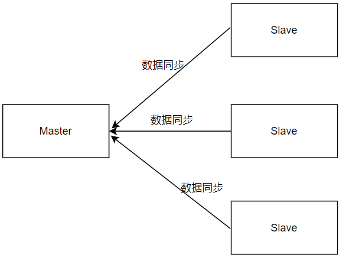

# Redis 主从复制

## 一、主从复制概述

### 1. 什么是主从复制

顾名思义，主从指的是多台 redis 服务之间的一种从属关系模式，往往会挑选一台作为主服务，多台作为从服务（从服务也可以有自己的从服务）。主从复制的过程是异步的，不会阻塞主服务，在主从复制过程中，仍然可以处理请求。

### 2. 为什么需要主从复制

主从复制机制主要是为了应对以下问题场景：

- **单机宕机**。虽然 redis 会对数据进行持久化操作，但是持久化后的数据仍然只在一台机器上，因此当硬件发生故障时，比如主板或CPU坏了，这时候无法重启服务器，短时间内我们也无法修复，此时就会造成数据的丢失。
- **容器瓶颈**。假设一台机器内存是 16 G，redis 使用 12 个G内存，除了 redis 还要使用其他的应用，此时服务器的性能就会变得特别差。
- **QPS 瓶颈**。redis 官方数据显示 redis 可以处理达到 10w 的 QPS（每秒请求数），但是实际业务需要可能要支持 50w、100w 甚至更高。

主从模式不仅提高了数据的安全性，且可以指定主服务只负责数据的写入，从服务只负责数据的读取，实现读写分离，这样就可以缓解服务器和高并发请求的压力。

### 3. 主从机制的形式

#### 3.1 一主一从

 

左边是 Master 节点，右边是 Slave 节点，即主节点和从节点。主节点负责数据写入，从节点可以通过复制操作将主节点的数据同步过来，并且随着主节点数据不断写入，从节点数据也会做同步的更新。

#### 3.2 一主多从

  

一个 Master 可以有多个 Slave，也就相当于有了多份的数据副本。这样可以做一个更加高可用的选择，例如一个 Master 和一个 Slave 挂掉了，还能有其他的 Slave 数据备份，推荐使用该模式。需要注意的是，当 Master 宕机后，不会去自动选择一台 Slave 作为 Master，需要我们手动指定。要想自动实现提升，就需要使用哨兵模式。

## 二、主从复制实现

### 1. 单机主从

在同一台设备下实现主从同步，配置一主二从。

- 将配置文件拷贝三份，分别命名为 redis-8000.conf、redis-8001.conf、redis-8002.conf

```shell
[root@localhost redis-5.0.4]# cp redis.conf redis-8000.conf 
[root@localhost redis-5.0.4]# cp redis.conf redis-8001.conf 
[root@localhost redis-5.0.4]# cp redis.conf redis-8002.conf
```

- 以 redis-8000 为主机，修改该配置文件相关内容

```shell
# 将该行注释掉或改成 bind 0.0.0.0
# bind 127.0.0.1 

# 改变其服务端口
port 8000

# 修改服务为后台运行
daemonize yes

# 指定不同的pid文件，注意三份配置文件不同。
pidfile /var/run/redis_8000.pid

# 指定log日志路径，自己配，要求不同。
logfile "/opt/redis-5.0.4/log/redis_8000.log"  

# 指定rdb文件和aof文件的路径配置，要求改成不同。
dir ./data/redis_8000 

# 设置密码
requirepass 123456
```

- 以redis-8001，redis-8002为从机，修改配置文件内容

```shell
# bind 127.0.0.1
port 8001  
daemonize yes   
pidfile /var/run/redis_8001.pid   
logfile "/opt/redis-5.0.4/log/redis_8001.log"
dir ./data/redis_8001
requirepass 123456

# 配置主服务的ip和port，这个配置表示将自己作为指定设备的从服务
replicaof 127.0.0.1 8000
# 主服务的登录密码
masterauth 123456 
```

```shell
# bind 127.0.0.1
port 8002  
daemonize yes   
pidfile /var/run/redis_8002.pid   
logfile "/opt/redis-5.0.4/log/redis_8002.log"
dir ./data/redis_8002
requirepass 123456

# 配置主服务的ip和port，这个配置表示将自己作为指定设备的从服务
replicaof 127.0.0.1 8000
# 主服务的登录密码
masterauth 123456 
```

**注意**：`replicaof 127.0.0.1 8000`  在老的版本中用的是 `slaveof 127.0.0.1 8000`，两者的效果是一致的。

- 启动服务，并确认三个服务是否能正常启动

```shell
[root@localhost redis-5.0.4]# ./src/redis-server redis-8000.conf 
[root@localhost redis-5.0.4]# ./src/redis-server redis-8001.conf 
[root@localhost redis-5.0.4]# ./src/redis-server redis-8002.conf
```

```shell
[root@localhost redis-5.0.4]# ps -ef|grep redis
root      89835      1  0 11:38 ?        00:00:00 ./src/redis-server *:8000
root      89850      1  0 11:38 ?        00:00:00 ./src/redis-server *:8001
root      89856      1  0 11:38 ?        00:00:00 ./src/redis-server *:8002
root      89862  89182  0 11:38 pts/2    00:00:00 grep --color=auto redis
```

- 开启三个客户端并登录

```shell
[root@localhost src]# ./redis-cli -h 127.0.0.1 -p 8000
127.0.0.1:8000> auth 123456
OK

[root@localhost src]# ./redis-cli -h 127.0.0.1 -p 8001
127.0.0.1:8000> auth 123456
OK

[root@localhost src]# ./redis-cli -h 127.0.0.1 -p 8002
127.0.0.1:8000> auth 123456
OK
```

- 查看主从配置信息

```shell
127.0.0.1:8000> info replication
# Replication
role:master
connected_slaves:2
slave0:ip=127.0.0.1,port=8001,state=online,offset=266,lag=1
slave1:ip=127.0.0.1,port=8002,state=online,offset=266,lag=1
master_replid:c806662f97205d8bf1c639dfd26fdbafe7d75157
master_replid2:0000000000000000000000000000000000000000
master_repl_offset:266
second_repl_offset:-1
repl_backlog_active:1
repl_backlog_size:1048576
repl_backlog_first_byte_offset:1
repl_backlog_histlen:266
```

```shell
127.0.0.1:8001> info replication
# Replication
role:slave
master_host:127.0.0.1
master_port:8000
master_link_status:up
master_last_io_seconds_ago:10
master_sync_in_progress:0
slave_repl_offset:294
slave_priority:100
slave_read_only:1
connected_slaves:0
master_replid:c806662f97205d8bf1c639dfd26fdbafe7d75157
master_replid2:0000000000000000000000000000000000000000
master_repl_offset:294
second_repl_offset:-1
repl_backlog_active:1
repl_backlog_size:1048576
repl_backlog_first_byte_offset:1
repl_backlog_histlen:294
```

```shell
127.0.0.1:8002> info replication
# Replication
role:slave
master_host:127.0.0.1
master_port:8000
master_link_status:up
master_last_io_seconds_ago:4
master_sync_in_progress:0
slave_repl_offset:322
slave_priority:100
slave_read_only:1
connected_slaves:0
master_replid:c806662f97205d8bf1c639dfd26fdbafe7d75157
master_replid2:0000000000000000000000000000000000000000
master_repl_offset:322
second_repl_offset:-1
repl_backlog_active:1
repl_backlog_size:1048576
repl_backlog_first_byte_offset:1
repl_backlog_histlen:322
```

- 读写分离测试，主机写入数据

```shell
127.0.0.1:8000> hmset userInfo name cdc age 18 address nanjing hobby sleep
OK
127.0.0.1:8000> hgetall userInfo
1) "name"
2) "cdc"
3) "age"
4) "18"
5) "address"
6) "nanjing"
7) "hobby"
8) "sleep"
```

- 读写分离测试，从机查询数据是否同步

```shell
127.0.0.1:8001> keys *
1) "userInfo"
127.0.0.1:8001> hgetall userInfo
1) "name"
2) "cdc"
3) "age"
4) "18"
5) "address"
6) "nanjing"
7) "hobby"
8) "sleep"
```

```shell
127.0.0.1:8002> keys *
1) "userInfo"
127.0.0.1:8002> hgetall userInfo
1) "name"
2) "cdc"
3) "age"
4) "18"
5) "address"
6) "nanjing"
7) "hobby"
8) "sleep"
```

### 2. 多机主从

- 在不同的物理设备下实现主从，配置一主二从。开启三台虚拟主机，我本地的分别是 128、129、130，分别安装 redis，且关闭主机防火墙

```shell
firewall-cmd --state  #查看防火墙状态
service firewalld stop  #关闭防火墙
```

- 以 128 为主服务，修改配置文件 redis.conf

```shell
# bind 127.0.0.1
port 6379 
daemonize yes   
pidfile /var/run/redis_6379.pid
logfile "/opt/redis-5.0.4/log/redis.log"
dir ./data/redis_6379
requirepass 123456
```

- 以 129、130 为从服务，修改配置文件 redis.conf

```shell
# bind 127.0.0.1
port 6379
daemonize yes
pidfile /var/run/redis_6379.pid
logfile "/opt/redis-5.0.4/log/redis.log"
dir ./data/redis_6379
masterauth 123456 
requirepass 123456 
replicaof 192.168.121.128 6379  # 根据自己本地的虚拟机IP进行修改
```

- 分别启动三台主机的 redis 服务器端服务

```shell
[root@localhost redis-5.0.4]# ./src/redis-server ./redis.conf
[root@localhost redis-5.0.4]# ps -ef | grep redis
root      41408      1  1 12:18 ?        00:00:00 ./src/redis-server *:6379
root      49264  10881  0 12:18 pts/0    00:00:00 grep --color=auto redis
```

- 分别启动三台 redis 的客户端，查看主从信息

```shell
[root@localhost src]# ./redis-cli
127.0.0.1:6379> auth 123456
OK
127.0.0.1:6379> info replication
# Replication
role:master
connected_slaves:2
slave0:ip=192.168.121.129,port=6379,state=online,offset=182,lag=0
slave1:ip=192.168.121.130,port=6379,state=online,offset=182,lag=1
master_replid:9f96cefcea5b36d0f949c150e158e51eb44e4910
master_replid2:0000000000000000000000000000000000000000
master_repl_offset:182
second_repl_offset:-1
repl_backlog_active:1
repl_backlog_size:1048576
repl_backlog_first_byte_offset:1
repl_backlog_histlen:182
```

```shell
[root@localhost src]# ./redis-cli
127.0.0.1:6379> auth 123456
OK
127.0.0.1:6379> info replication
# Replication
role:slave
master_host:192.168.121.128
master_port:6379
master_link_status:up
master_last_io_seconds_ago:1
master_sync_in_progress:0
slave_repl_offset:252
slave_priority:100
slave_read_only:1
connected_slaves:0
master_replid:9f96cefcea5b36d0f949c150e158e51eb44e4910
master_replid2:0000000000000000000000000000000000000000
master_repl_offset:252
second_repl_offset:-1
repl_backlog_active:1
repl_backlog_size:1048576
repl_backlog_first_byte_offset:1
repl_backlog_histlen:252
```

```shell
[root@localhost src]# ./redis-cli
127.0.0.1:6379> auth 123456
OK
127.0.0.1:6379> info replication
# Replication
role:slave
master_host:192.168.121.128
master_port:6379
master_link_status:up
master_last_io_seconds_ago:7
master_sync_in_progress:0
slave_repl_offset:280
slave_priority:100
slave_read_only:1
connected_slaves:0
master_replid:9f96cefcea5b36d0f949c150e158e51eb44e4910
master_replid2:0000000000000000000000000000000000000000
master_repl_offset:280
second_repl_offset:-1
repl_backlog_active:1
repl_backlog_size:1048576
repl_backlog_first_byte_offset:29
repl_backlog_histlen:252
```

- 读写分离测试，主服务写入数据

```shell
127.0.0.1:6379> rpush hobby sing dance rap basketball
(integer) 4
127.0.0.1:6379> lrange hobby 0 -1
1) "sing"
2) "dance"
3) "rap"
4) "basketball"
```

- 读写分离测试，从服务读取数据

```shell
127.0.0.1:6379> keys *
1) "hobby"
127.0.0.1:6379> lrange hobby 0 -1
1) "sing"
2) "dance"
3) "rap"
4) "basketball"
```

## 三、手动设置主从

假设服务器 128 宕机了，即 redis 的主服务挂了，我们需要手动重新设置主从服务

- 关闭 128 这台虚拟机，模拟主机宕机情形

```shell
[root@localhost src]# ping 192.168.121.128
PING 192.168.121.128 (192.168.121.128) 56(84) bytes of data.
From 192.168.121.129 icmp_seq=1 Destination Host Unreachable
From 192.168.121.129 icmp_seq=2 Destination Host Unreachable
From 192.168.121.129 icmp_seq=3 Destination Host Unreachable
From 192.168.121.129 icmp_seq=4 Destination Host Unreachable
```

- 将 129 升级为主服务。执行命令 `SLAVEOF NO ONE` 将使得这个从属服务器关闭复制功能，并从从属服务器转变回主服务器，原来同步所得的数据集不会被丢弃。

```shell
127.0.0.1:6379> slaveof no one
OK
127.0.0.1:6379> info replication
# Replication
role:master
connected_slaves:0  # 此时未绑定从服务，从服务数量为0
master_replid:a8fbff2fca7154c2c86f4e5da3b80ccac422a1c1
master_replid2:9e66d8689a1b87d4013ce1abba30ddcabb0546bf
master_repl_offset:0
second_repl_offset:1
repl_backlog_active:0
repl_backlog_size:1048576
repl_backlog_first_byte_offset:0
repl_backlog_histlen:0
```

- 将 130 变更成 129 的从服务器。执行 `SLAVEOF host port`  将使当前服务器停止对旧主服务器的同步，丢弃旧数据集，转而开始对新主服务器进行同步。

```shell
127.0.0.1:6379> slaveof 192.168.121.129 6379
OK
127.0.0.1:6379> info replication
# Replication
role:slave
master_host:192.168.121.129
master_port:6379
master_link_status:down
master_last_io_seconds_ago:-1
master_sync_in_progress:0
slave_repl_offset:1
master_link_down_since_seconds:1718258035
slave_priority:100
slave_read_only:1
connected_slaves:0
master_replid:9ea5863e940f4dc3e80c991d090646a663b25bc9
master_replid2:0000000000000000000000000000000000000000
master_repl_offset:0
second_repl_offset:-1
repl_backlog_active:0
repl_backlog_size:1048576
repl_backlog_first_byte_offset:0
repl_backlog_histlen:0
```

设置完从从属关系后，再去查看 129 服务器，发现多了一个从服务

```shell
127.0.0.1:6379> info replication
# Replication
role:master
connected_slaves:1  # 从属关系绑定后，多了一个从服务
slave0:ip=192.168.121.130,port=6379,state=online,offset=28,lag=0
master_replid:96b0573f129fbdb470aef2b7171008daef3b1ef6
master_replid2:0000000000000000000000000000000000000000
master_repl_offset:28
second_repl_offset:-1
repl_backlog_active:1
repl_backlog_size:1048576
repl_backlog_first_byte_offset:1
repl_backlog_histlen:28
```

- 测试读写分离，从 129 写入数据，从 130 读取数据

```shell
# 192.168.121.129 
127.0.0.1:6379> set word "hello, redis"
OK

# 192.168.121.130
127.0.0.1:6379> keys *
1) "word"
127.0.0.1:6379> get word
"hello, redis"
```

