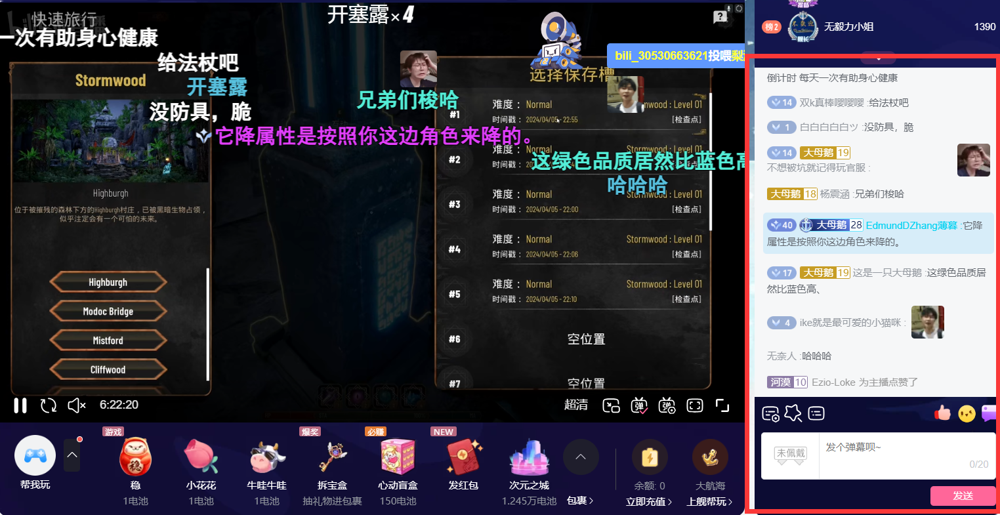
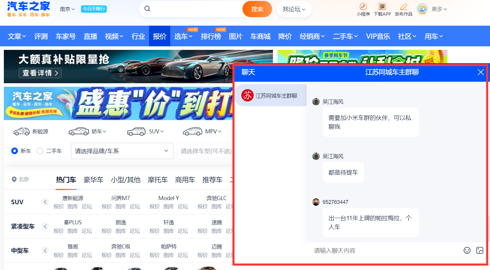
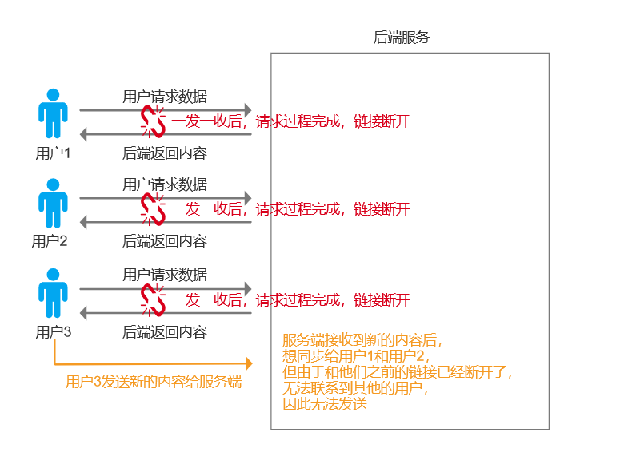
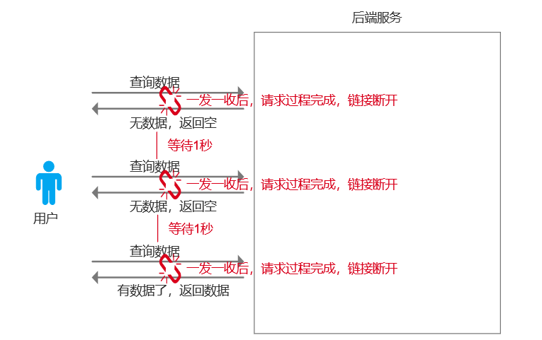
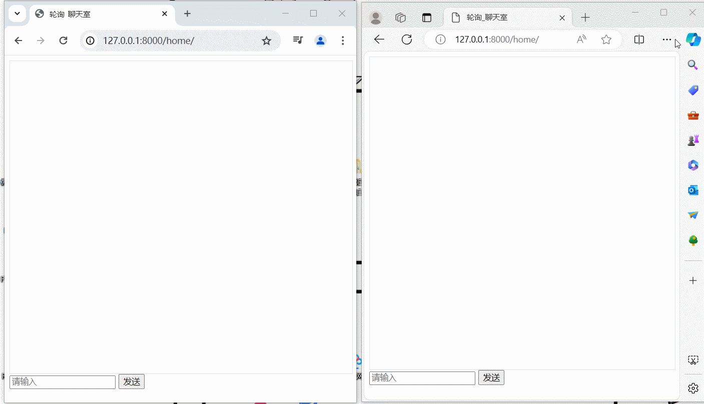
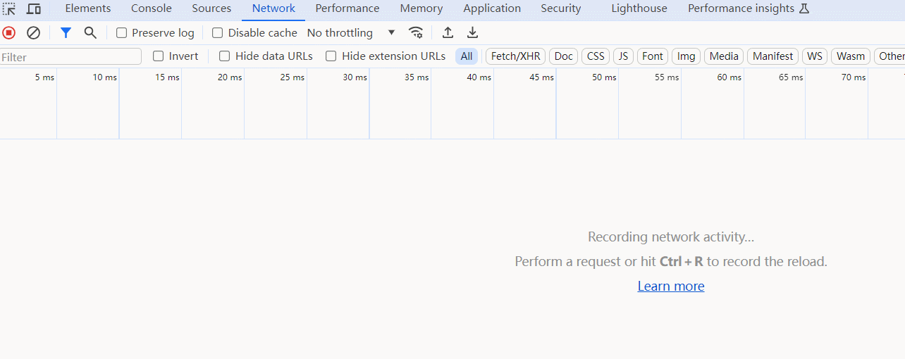
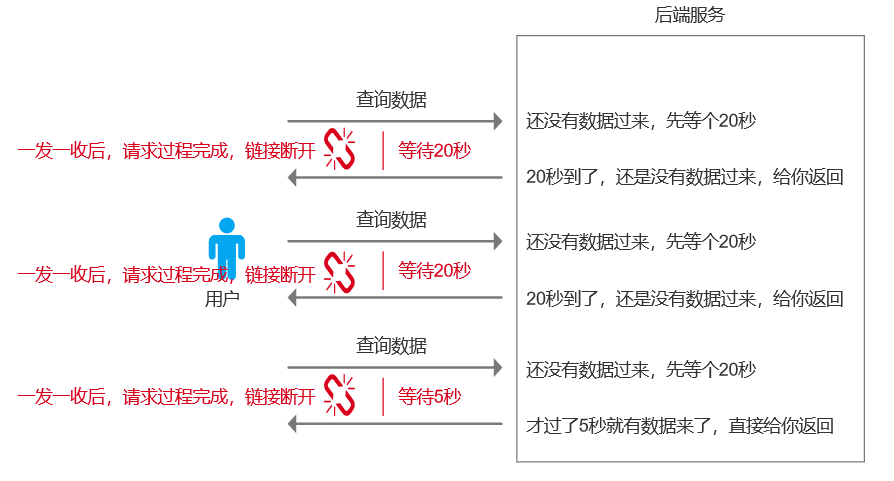
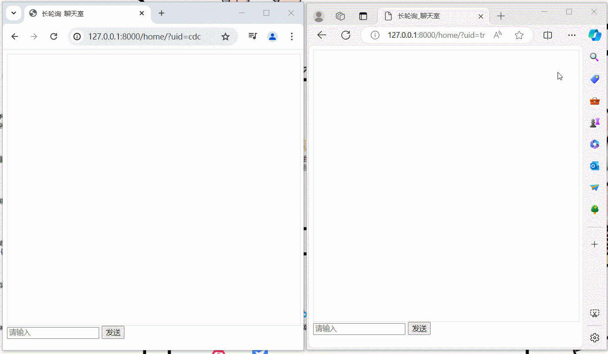
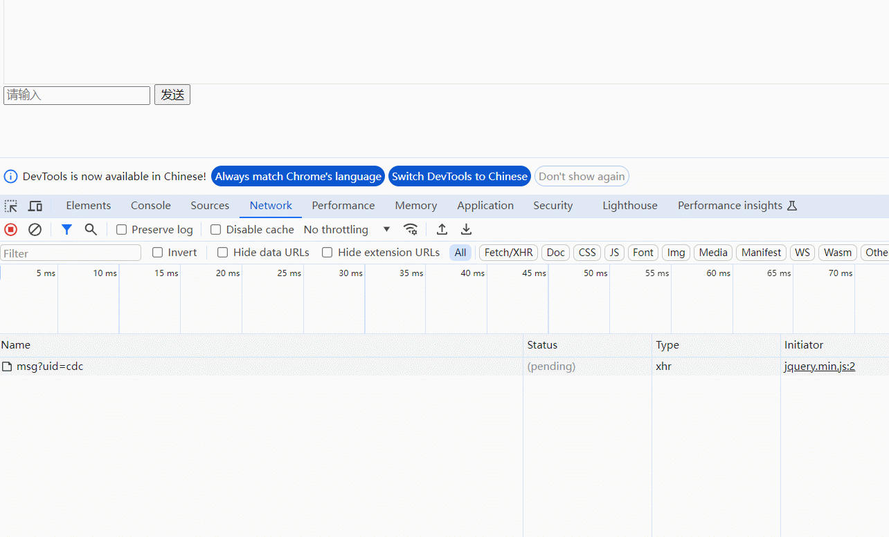
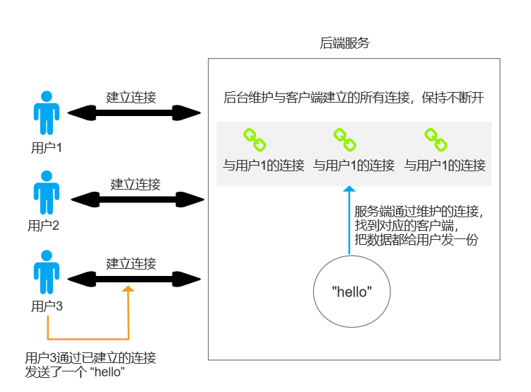

# webSocket 概念引入

## 一、HTTP协议的缺陷

在传统的 `WEB` 开发中，我们默认使用的是 `HTTP` 协议。但由于 `HTTP` 协议具有**无状态**和**短连接**的特点，因此，对于某些特殊的 `WEB` 场景，只基于常规的 `HTTP` 协议请求方式是无法实现的，例如：

- 网页直播时的实时弹幕场景。当服务端数据库弹幕数据有更新以后，需要实时的将最新内容同步给直播间内的所有用户。

   

- 网页聊天室场景。类似网页版QQ/微信的群聊，当某个群成员发送一条消息，服务端需要将该消息发送给群内其他所有的成员。

  

上述类似的场景，如果是基于传统的 `HTTP` 协议实现，当用户（客户端）与服务端建立连接，客户端通过请求获取到服务端数据后，对应的连接就会断开。而当服务端侧有获取到新的内容时，无法主动和客户端建立连接，将最新的内容发送给用户。 

 

##  二、实时响应场景实现方案

### 1. 轮询

#### 1.1 轮询机制简介

轮询方式是基于 `HTTP` 协议实现的，其过程就是客户端不停的每隔一段时间发送请求去服务端获取一次数据。

 

虽然可以实现接近实时响应的效果，但是轮询存在以下两个致命缺陷：

- 有延时性。例如，当用户本次请求过程刚结束，服务端就接收到其他用户发来的新内容了，但是用户要间隔一段时间后才会再次发送查询请求拿到数据，因此消息会存在延时。
- 请求过多，服务端压力过大。轮询的本质就是客户端不断的请求服务端，当客户端数量过多，查询的间隔时长过短，都会给服务端造成极大的压力，致使整个后台卡顿或崩溃。

#### 1.2 轮询机制实现聊天室

本示例采用 `Django` 框架实现，主要流程为：

- 访问 /home 显示聊天室界面
- 输入消息，点击发送，数据将发送到后台进行存储
- 前端定时发送查询请求，获取到新的消息并在页面展示

主要相关代码如下：

- 前端代码

```html
<!--home.html-->

<!DOCTYPE html>
<html lang="en">
<head>
    <meta charset="UTF-8">
    <title>轮询_聊天室</title>
    <style>
        .message {
            border: 1px solid #dddddd;
            width: 100%;
            height: 500px;
        }
    </style>
</head>
<body>
<div class="message" id="message"></div>
<div>
    <input type="text" placeholder="请输入" id="txt">
    <input type="button" value="发送" onclick="sendMessage()">
</div>

<script src="https://cdn.bootcdn.net/ajax/libs/jquery/3.7.1/jquery.min.js"></script>
<script>

    function sendMessage() {
        let text = $("#txt").val();
        console.log(text);

        $.ajax({
            url: "/send/msg",
            method: "GET",
            data: {
                text: text
            },
            success: function (res) {
                console.log("数据发送成功：", res)
            }

        })
    }

    // 定义一个全局索引变量，控制每次向后台请求取值的范围
    max_index = 0;

    // 每隔两秒发送一个请求去获取数据，并展示在页面上
    setInterval(function () {

        $.ajax({
            url: "/get/msg",
            method: "GET",
            data: {
                index: max_index
            },
            success: function (res) {
                console.log("接收到数据--->", res);

                // 更新后台返回的数据列表索引最大值
                max_index = res.max_index;

                // 将后台返回的内容渲染到页面上
                $.each(res.data, function (index, item) {
                    // 将内容拼接成div标签并添加到message区域中
                    let tag = $("<div>");
                    tag.text(item);
                    $("#message").append(tag)
                })
            }
        })

    }, 2000)

</script>

</body>
</html>
```

- 后端代码

```python
# urls.py
from django.contrib import admin
from django.urls import path
from app01 import views

urlpatterns = [
    path('admin/', admin.site.urls),
    path('home/', views.home),
    path('send/msg', views.send_msg),
    path('get/msg', views.get_msg),

]
```

```python
# views.py
from django.shortcuts import render, HttpResponse
from django.http import JsonResponse

# 模拟数据库
# 一旦接收到新消息，就把新消息放在数据库中
DB = []


def home(request):
    return render(request, "home.html")


def send_msg(request):
    print("接收到客户端请求：", request.GET)
    text = request.GET.get("text")
    DB.append(text)

    return HttpResponse("ok")


def get_msg(request):
    max_index = int(request.GET.get("index"))

    context = {
        "max_index": len(DB),
        "data": DB[max_index:]
    }

    return JsonResponse(context)
```

效果演示如下：

  

 

可以看到轮询机制下，消息的延时还是比较大的，且客户端在不停的给服务端发送查询请求。

### 2. 长轮询

#### 2.1 长轮询机制简介

长轮询方式，实际上是在轮询机制的基础上进行了优化，其过程也是客户端不断的去请求服务端获取数据。与轮询机制不同的是，长轮询方式下，服务端侧会把客户端的请求连接夯住，直到满足以下任意一个情况时才会返回：

- 连接被夯住的时间达到指定的时长
- 服务端接收到了新的数据

一次请求过程结束后，客户端也不需要进行等待，直接发送下一次请求即可。

 

和轮询机制相比，长轮询的好处就在于数据的延时性得到了保证，且客户端发送的请求次数大大减少，缓解了服务端的压力。长轮询方式现在也还在被一些大平台使用，例如web版本QQ，汽车之家网页等等。（现在主流的实现方式都是通过 websocket 协议，之所以长轮询的方式还在被使用，主要是为了兼容浏览器，一些老旧版本的浏览器暂时不支持 websocket 协议）。

#### 2.2 长轮询机制实现聊天室

本示例采用 `Django` 框架，基于 `Python` 的队列功能实现，主要流程为：

- 访问 /home?uid=xxxxx 显示聊天室界面，后台为每个用户（uid）创建一个队列
- 输入消息，点击发送，后台将接收到的数据在每个队列中存放一份
- 前端递归请求，去自己的队列中获取到新的消息，并在页面展示

主要相关代码如下：

- 前端代码

```html
<!--home.html-->

<!DOCTYPE html>
<html lang="en">
<head>
    <meta charset="UTF-8">
    <title>长轮询_聊天室</title>
    <style>
        .message {
            border: 1px solid #dddddd;
            width: 100%;
            height: 500px;
        }
    </style>
</head>
<body>
<div class="message" id="message"></div>
<div>
    <input type="text" placeholder="请输入" id="txt">
    <input type="button" value="发送" onclick="sendMessage()">
</div>

<script src="https://cdn.bootcdn.net/ajax/libs/jquery/3.7.1/jquery.min.js"></script>
<script>

    USER_UID = "{{ uid }}";

    function sendMessage() {
        let text = $("#txt").val();
        console.log(text);

        $.ajax({
            url: "/send/msg",
            method: "GET",
            data: {
                text: text
            },
            success: function (res) {
                console.log("数据发送成功：", res)
            }

        })
    }

    function getMessage() {
        $.ajax({
            url: "/get/msg",
            type: "GET",
            data: {
                uid: USER_UID
            },
            success: function (res) {
                console.log("接收到数据--->", res);

                // 超时，没有数据
                // 接收到新数据，在页面展示
                if (res.status) {
                    // 将内容拼接成div标签并添加到message区域中
                    let tag = $("<div>");
                    tag.text(res.data);
                    $("#message").append(tag)
                }

                // 在JS中，在函数内调用自己，并不是以传统的递归机制去实现，因此不会出现调用栈溢出的问题
                getMessage()
            }
        })
    }

    $(function () {
        getMessage()
    })

</script>

</body>
</html>
```

- 后端代码

```python
# views.py

import queue
from django.shortcuts import render, HttpResponse
from django.http import JsonResponse

# 存放用户uid及对应的队列
USER_QUEUE = dict()


def home(request):
    uid = request.GET.get("uid")

    # 为每个新访问的用户新建一个队列
    USER_QUEUE[uid] = queue.Queue()

    return render(request, "home.html", {"uid": uid})


def send_msg(request):
    print("接收到客户端请求：", request.GET)
    text = request.GET.get("text")

    # 将数据在所有维护的队列中都放置一份
    for uid, q in USER_QUEUE.items():
        q.put(text)

    return HttpResponse("ok")


def get_msg(request):
    uid = request.GET.get("uid")

    # 获取到自己的队列
    q = USER_QUEUE[uid]

    context = {"status": True, "data": None}

    try:
        data = q.get(timeout=10)
        context["data"] = data
    except queue.Empty as e:
        context["status"] = False

    return JsonResponse(context)

```

效果演示如下：

  

 

长轮询方式下，数据接收几乎没有延迟，且客户端请求服务端的次数也大大减少。观察请求的过程可以发现，当服务端没有新数据时，请求都是阻塞（pending）一段时间后结束，当服务端有新数据时，请求立即结束，不会继续阻塞。

### 3. websocket

基于 `websocket` 方式，客户端在和服务端建立了连接后，默认是不会断开的。因此，客户端与服务端之间就可以实现双向通信（双工通道），即客户端可以主动给服务端发请求，服务端也可以主动给客户端发请求。

 
