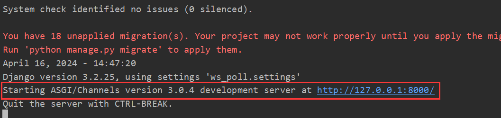
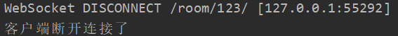
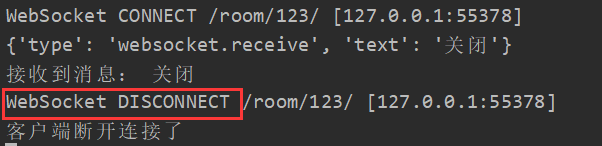

# WebSocket案例之构建聊天室

## 一、WebSocket的使用

### 1. Django中使用WebSocket

- 第一步，下载三方库 `channels`

`Django` 本身不支持 `websocket` 协议，需要借助三方库来实现：

```shell
pip install channels
```

- 第二步，修改配置文件

`django` 默认是通过 `wsgi` 方式启动的，只能支持处理 `http` 请求和同步请求。因此需要更改 `django` 的启动方式为 `asgi` 。`asgi` 不仅兼容 `wsgi` 处理的请求类型，同时还支持处理异步请求和 `websocket` 。

```python
# settings.py

# 在APPS中注册channels
INSTALLED_APPS = [
    'django.contrib.admin',
    'django.contrib.auth',
    'django.contrib.contenttypes',
    'django.contrib.sessions',
    'django.contrib.messages',
    'django.contrib.staticfiles',
    'app01.apps.App01Config',
    'channels'
]

# 在文件最后配置ASGI启动方式，目标application路径要和工程保持一致，以我本地的工程为例：ws_poll/asgi.py文件下的application
# 如果是低版本的django，创建项目后，需要手动新建 /asgi.py文件
ASGI_APPLICATION = "ws_poll.asgi.application"
```

配置完成后，启动项目，可以观察到 `Django` 现在已经是以 `ASGI` 的方式启动了：

 

- 第三步，修改 `asgi.py` 文件

```python
import os

from django.core.asgi import get_asgi_application
from channels.routing import ProtocolTypeRouter, URLRouter

# routings.py 需要手动创建，用于存放 websocket 请求相关的路由
from ws_poll.routings import websocket_urlpatterns

os.environ.setdefault('DJANGO_SETTINGS_MODULE', 'ws_poll.settings')

# 当前只支持http请求
# application = get_asgi_application()

application = ProtocolTypeRouter({
    "http": get_asgi_application(),  # http请求会走urls.py
    "websocket": URLRouter(websocket_urlpatterns)  # websocket 请求会走 routings.py
})
```

- 第四步，在 `settings.py` 同级新建 `routings.py`

```python
from django.urls import re_path
# consumers.py 文件需要手动新建，用于存放处理 websocket 请求的视图函数
from app01 import consumers

websocket_urlpatterns = [
    re_path(r"room/(?P<group>\w+)/$", consumers.ChatConsumer.as_asgi()),
]
```

- 第五步，在 app01 模块中新建 `consumers.py` ，处理 `websocket` 相关的业务逻辑。

```python
from channels.generic.websocket import WebsocketConsumer
from channels.exceptions import StopConsumer

# 视图类必须继承 WebsocketConsumer
class ChatConsumer(WebsocketConsumer):

    # 客户端连接时会触发
    def websocket_connect(self, message):
        # 表示服务器允许和客户端建立连接
        self.accept()

    # 客户端向服务端发送消息时会触发，用于接收消息
    def websocket_receive(self, message):
        print('接收到消息', message)
        self.send(text_data='收到了')

        # 服务端可以主动和客户端断开连接
        # self.close()

    # 断开连接时触发
    def websocket_disconnect(self, message):
        print('客户端断开连接了')
        raise StopConsumer()
```

### 2. JavaScript中使用WebSocket

```html
<script>

    // 创建一个websocket对象
    socket = new WebSocket("ws://127.0.0.1:8000/room/123/");

    // 当客户端和服务端握手成功以后自动触发（即服务端 self.accept()执行以后）
    socket.onopen = function (event) {
        console.log("握手完成了，允许我和服务端建立连接了");
    };

    // 当服务端主动断开连接时，会自动触发该回调函数
    socket.onclose = function (event) {
        console.log("服务端主动和我断开连接了……");
    };

    // 当客户端接收到服务端发送的消息时，自动触发该回调函数
    socket.onmessage = function (event) {
        console.log(event.data);
    };

    // 客户端主动给服务端发消息
    function sendMessage() {
        socket.send("hello")
    }

    // 客户端主动关闭连接
    function closeConn() {
        socket.close() // 主动给服务端发送关闭连接的请求
    }

</script>
```

### 3. WebSocket前后端简单交互

#### 3.1 建立连接

- 客户端

```html
<script>
    // 创建一个websocket对象，请求与服务端建立连接
    socket = new WebSocket("ws://127.0.0.1:8000/room/123");
</script>
```

- 服务端

```python
from channels.generic.websocket import WebsocketConsumer
from channels.exceptions import StopConsumer


class ChatConsumer(WebsocketConsumer):

    # 客户端请求连接时会触发
    def websocket_connect(self, message):
        print("有人来连接了……")
        # 表示服务器允许和客户端建立连接（握手）
        self.accept()
```

#### 3.2 握手

- 客户端

```html
<script>

    // 创建一个websocket对象
    socket = new WebSocket("ws://127.0.0.1:8000/room/123/");

    // 当客户端和服务端握手成功以后自动触发（即服务端 self.accept()执行以后）
    socket.onopen = function (event) {
        console.log("握手完成了，允许我和服务端建立连接了")
    };
</script>
```

- 服务端

```python
from channels.generic.websocket import WebsocketConsumer
from channels.exceptions import StopConsumer


class ChatConsumer(WebsocketConsumer):

    # 客户端连接时会触发
    def websocket_connect(self, message):
        print("有人来连接了……")
        # 表示服务器允许和客户端建立连接（握手），执行完成后会触发前端 socket.onopen 回调函数
        self.accept()
```

#### 3.3 收发消息（客户端主动发送给服务端）

- 客户端

```html
<!DOCTYPE html>
<html lang="en">
<head>
    <meta charset="UTF-8">
    <title>ws_聊天室</title>
    <style>
        .message {
            border: 1px solid #dddddd;
            width: 100%;
            height: 500px;
        }
    </style>
</head>
<body>
<div class="message" id="message"></div>
<div>
    <input type="text" placeholder="请输入" id="txt">
    <input type="button" value="发送" onclick="sendMessage()">
</div>

<script>

    // 创建一个websocket对象
    socket = new WebSocket("ws://127.0.0.1:8000/room/123/");

    // 客户端主动给服务端发消息
    function sendMessage() {
        let tag = document.getElementById("txt");
        socket.send(tag.value)
    }
</script>

</body>
</html>
```

- 服务端

```python
from channels.generic.websocket import WebsocketConsumer
from channels.exceptions import StopConsumer


class ChatConsumer(WebsocketConsumer):

    # 客户端连接时会触发
    def websocket_connect(self, message):
        print("有人来连接了……")
        # 表示服务器允许和客户端建立连接（握手）
        self.accept()

    # 客户端向服务端发送消息时会触发，用于接收消息
    def websocket_receive(self, message):
        # message的格式为  {'type': 'websocket.receive', 'text': '你好啊'}，这是django底层进行的封装
        print(message)

        data = message["text"]
        print("接收到消息：", data)
```

#### 3.4 收发消息（服务端主动给客户端发消息）

- 客户端

```html
<script>
    // 创建一个websocket对象
    socket = new WebSocket("ws://127.0.0.1:8000/room/123/");

    // 当客户端接收到服务端发送的消息时，自动触发该回调函数
    socket.onmessage = function (event) {
        console.log(event.data)
    };

</script>
```

- 服务端

```python
from channels.generic.websocket import WebsocketConsumer
from channels.exceptions import StopConsumer


class ChatConsumer(WebsocketConsumer):

    # 客户端连接时会触发
    def websocket_connect(self, message):
        print("有人来连接了……")
        # 表示服务器允许和客户端建立连接（握手）
        self.accept()
		
        # 可以使用 send 方法主动给客户端发消息
        # 例如：连接建立完成后，立即给客户端发送一个消息
        self.send("我允许你跟我连接……")
```

#### 3.5 关闭连接（客户端主动关闭）

- 客户端

```html
<!DOCTYPE html>
<html lang="en">
<head>
    <meta charset="UTF-8">
    <title>ws_聊天室</title>
    <style>
        .message {
            border: 1px solid #dddddd;
            width: 100%;
            height: 300px;
        }
    </style>
</head>
<body>
<div class="message" id="message"></div>
<div>
    <input type="text" placeholder="请输入" id="txt">
    <input type="button" value="发送" onclick="sendMessage()">
    <input type="button" value="关闭连接" onclick="closeConn()">
</div>

<script>

    // 创建一个websocket对象
    socket = new WebSocket("ws://127.0.0.1:8000/room/123/");

    // 客户端主动关闭连接
    function closeConn() {
        socket.close() // 主动给服务端发送关闭连接的请求
    }
</script>

</body>
</html>
```

- 服务端

```python
from channels.generic.websocket import WebsocketConsumer
from channels.exceptions import StopConsumer
import time


class ChatConsumer(WebsocketConsumer):
    
    # 断开连接时触发
    def websocket_disconnect(self, message):
        print('客户端断开连接了')
        raise StopConsumer() # 服务端允许内部断开连接

```

  

#### 3.6 关闭连接（服务端主动关闭）

- 客户端

```html
<!DOCTYPE html>
<html lang="en">
<head>
    <meta charset="UTF-8">
    <title>ws_聊天室</title>
    <style>
        .message {
            border: 1px solid #dddddd;
            width: 100%;
            height: 300px;
        }
    </style>
</head>
<body>
<div class="message" id="message"></div>
<div>
    <input type="text" placeholder="请输入" id="txt">
    <input type="button" value="发送" onclick="sendMessage()">
    <input type="button" value="关闭连接" onclick="closeConn()">
</div>

<script>

    // 创建一个websocket对象
    socket = new WebSocket("ws://127.0.0.1:8000/room/123/");

    // 当服务端主动断开连接时，会自动触发该回调函数
    socket.onclose = function (event) {
        console.log("服务端主动和我断开连接了……")
    };

    // 客户端主动给服务端发消息
    function sendMessage() {
        let tag = document.getElementById("txt");
        socket.send(tag.value)
    }

</script>

</body>
</html>
```

- 服务端

```python
from channels.generic.websocket import WebsocketConsumer
from channels.exceptions import StopConsumer
import time


class ChatConsumer(WebsocketConsumer):

    # 客户端向服务端发送消息时会触发，用于接收消息
    def websocket_receive(self, message):
        # message的格式为  {'type': 'websocket.receive', 'text': '你好啊'}，这是django底层进行的封装
        print(message)

        data = message["text"]
        print("接收到消息：", data)
		
        # 判断接收到的消息内容是否为关闭
        if data == "关闭":
            # 服务端主动断开连接
            self.close()
            return

        response = f"{time.strftime('%Y-%m-%d %H:%M:%S')} {data}"
        self.send(response)

    # 断开连接时触发
    def websocket_disconnect(self, message):
        print('客户端断开连接了')
        raise StopConsumer()  # 服务端允许内部断开连接

```

 

**注意：** 当 **客户端** 主动断开连接时，会触发服务端侧 `websocket_disconnect` 方法，而当 **服务端** 主动断开连接时，也会触发该方法。如果想让 `websocket_disconnect` 保持纯净，即只有当 **客户端** 主动断开连接时才会触发而**服务端** 主动断开连接时不触发，只需要在 **服务端** 主动关闭后引发一次 `StopConsumer` 异常即可：

```python
from channels.generic.websocket import WebsocketConsumer
from channels.exceptions import StopConsumer
import time


class ChatConsumer(WebsocketConsumer):

    def websocket_receive(self, message):
        data = message["text"]
        print("接收到消息：", data)

        if data == "关闭":
            self.close()
            # 如果服务端断开连接时，引发异常，则 websocket_disconnect 将不再执行
            raise StopConsumer

        response = f"{time.strftime('%Y-%m-%d %H:%M:%S')} {data}"
        self.send(response)

    # 断开连接时触发
    def websocket_disconnect(self, message):
        print('客户端断开连接了')
        raise StopConsumer()  # 服务端允许内部断开连接

```

## 二、聊天室功能实现

### 1. 手动维护连接方式

- 客户端

```html
<!DOCTYPE html>
<html lang="en">
<head>
    <meta charset="UTF-8">
    <title>ws_聊天室</title>
    <style>
        .message {
            border: 1px solid #dddddd;
            width: 100%;
            height: 300px;
        }
    </style>
</head>
<body>
<div class="message" id="message"></div>
<div>
    <input type="text" placeholder="请输入" id="txt">
    <input type="button" value="发送" onclick="sendMessage()">
    <input type="button" value="关闭连接" onclick="closeConn()">
</div>

<script>

    // 创建一个websocket对象
    socket = new WebSocket("ws://127.0.0.1:8000/room/123/");

    // 当客户端和服务端握手成功以后自动触发（即服务端 self.accept()执行以后）
    socket.onopen = function (event) {
        console.log("握手完成了，允许我和服务端建立连接了");
        let tag = document.createElement("div");
        tag.innerText = "【连接成功】";
        document.getElementById("message").appendChild(tag)
    };

    // 当服务端主动断开连接时，会自动触发该回调函数
    socket.onclose = function (event) {
        console.log("服务端主动和我断开连接了……");
         let tag = document.createElement("div");
        tag.innerText = "【断开连接】";
        document.getElementById("message").appendChild(tag)
    };

    // 当客户端接收到服务端发送的消息时，自动触发该回调函数
    socket.onmessage = function (event) {
        console.log(event.data);
        let tag = document.createElement("div");
        tag.innerText = event.data;
        document.getElementById("message").appendChild(tag)
    };

    // 客户端主动给服务端发消息
    function sendMessage() {
        let tag = document.getElementById("txt");
        socket.send(tag.value)
    }

    // 客户端主动关闭连接
    function closeConn() {
        socket.close() // 主动给服务端发送关闭连接的请求
    }

</script>

</body>
</html>
```

- 服务端

```python
from channels.generic.websocket import WebsocketConsumer
from channels.exceptions import StopConsumer

# 存放所有的 websocket 连接
CONN_LIST = list()


class ChatConsumer(WebsocketConsumer):

    def websocket_connect(self, message):
        self.accept()
		# 保存连接对象
        CONN_LIST.append(self)

    def websocket_receive(self, message):
        data = message["text"]
		
        # 给所有的连接对象都发送一次消息
        for conn in CONN_LIST:
            conn.send(data)

    def websocket_disconnect(self, message):
        # 将断开连接的对象从维护列表中删除
        CONN_LIST.remove(self)
        raise StopConsumer()
```

该方式需要手动维护大量的连接对象，效率很低。我们可以使用 `channels` 模块中提供的 `channel layer` 来帮助我们提高效率。

### 2. 基于 channel layer 实现

#### 2.1 channel layer 的简单使用

##### 2.1.1 修改配置文件

```python
# settings.py

# 新增 channel layers 配置
CHANNEL_LAYERS = {
    "default": {
        "BACKEND": "channels.layers.InMemoryChannelLayer",
    }
}
```

使用该配置以后，服务器会自动将连接对象维护在缓存中。当然我们也可以使用 `redis` 来维护连接对象：

- 安装三方库

```powershell
pip install channels-redis
```

- 修改配置文件

```python
# settings.py

# 不同方式来配置redis
# 方式一 指定IP和端口
CHANNEL_LAYERS = {
    "default": {
        "BACKEND": "channels_redis.core.RedisChannelLayer",
        "CONFIG": {
            "hosts": [('127.0.0.1', 6379)]
        },
    },
}

CHANNEL_LAYERS = {
    'default': {
    'BACKEND': 'channels_redis.core.RedisChannelLayer',
    'CONFIG': {"hosts": [('127.0.0.1', 6379)],},},
}


# 方式二 通过URL
CHANNEL_LAYERS = {
    'default': {
    'BACKEND': 'channels_redis.core.RedisChannelLayer',
    'CONFIG': {"hosts": ["redis://127.0.0.1:6379/1"],},
    },
}
 
    
# 方式三 通过密码验证
CHANNEL_LAYERS = {
    "default": {
        "BACKEND": "channels_redis.core.RedisChannelLayer",
        "CONFIG": {
            "hosts": ["redis://:password@10.211.55.25:6379/0"],
            "symmetric_encryption_keys": [SECRET_KEY],
        },
    },
}

```

##### 2.1.2 相关接口的使用

```python
from channels.generic.websocket import WebsocketConsumer
from channels.exceptions import StopConsumer

# 由于 channel layer 中的方法都是异步的，因此需要使用 async_to_sync 方法将异步方法转为同步方法
from asgiref.sync import async_to_sync


class ChatConsumer(WebsocketConsumer):

    def websocket_connect(self, message):
        # 接收这个客户端连接
        self.accept()

        # group_add 方法可以将对象添加到指定的地方进行维护（内存 or redis）
        # 参数1：组名（只有在同一个组里的对象才能看到对方的消息）
        # 参数2：对象别名
        async_to_sync(self.channel_layer.group_add)("xxxx", self.channel_name)

    def websocket_receive(self, message):
        # 通知组内所有客户端，去执行 xx_oo 方法，在此方法中可以定义任意的功能
        async_to_sync(self.channel_layer.group_send)("xxxx", {"type": "xx.oo", "message": message})

    # 组内所有客户端都会执行该方法
    def xx_oo(self, event):
        text = event["message"]["text"]
        self.send(text)

    def websocket_disconnect(self, message):
        # group_discard 方法可以将组内断开连接的对象删除
        # 参数1：组名
        # 参数2：对象别名
        async_to_sync(self.channel_layer.group_discard)("xxxx", self.channel_name)

        raise StopConsumer()
```

#### 2.2 channel layer 实现分组群聊

- 客户端

```html
<!--index.html-->

<!DOCTYPE html>
<html lang="en">
<head>
    <meta charset="UTF-8">
    <title>ws_聊天室</title>
    <style>
        .message {
            border: 1px solid #dddddd;
            width: 100%;
            height: 300px;
        }
    </style>
</head>
<body>
<div class="message" id="message"></div>
<div>
    <input type="text" placeholder="请输入" id="txt">
    <input type="button" value="发送" onclick="sendMessage()">
    <input type="button" value="关闭连接" onclick="closeConn()">
</div>

<script>

    // 创建一个websocket对象
    socket = new WebSocket("ws://127.0.0.1:8000/room/{{ group }}/");

    // 当客户端和服务端握手成功以后自动触发（即服务端 self.accept()执行以后）
    socket.onopen = function (event) {
        console.log("握手完成了，允许我和服务端建立连接了");
        let tag = document.createElement("div");
        tag.innerText = "【连接成功】";
        document.getElementById("message").appendChild(tag)
    };

    // 当服务端主动断开连接时，会自动触发该回调函数
    socket.onclose = function (event) {
        console.log("服务端主动和我断开连接了……");
         let tag = document.createElement("div");
        tag.innerText = "【断开连接】";
        document.getElementById("message").appendChild(tag)
    };

    // 当客户端接收到服务端发送的消息时，自动触发该回调函数
    socket.onmessage = function (event) {
        console.log(event.data);
        let tag = document.createElement("div");
        tag.innerText = event.data;
        document.getElementById("message").appendChild(tag)
    };

    // 客户端主动给服务端发消息
    function sendMessage() {
        let tag = document.getElementById("txt");
        socket.send(tag.value)
    }

    // 客户端主动关闭连接
    function closeConn() {
        socket.close() // 主动给服务端发送关闭连接的请求
    }

</script>

</body>
</html>
```

- 服务端

```python
# views.py

from django.shortcuts import render

def index(request):
    group_id = request.GET.get("group", "123")

    return render(request, "index.html", {"group": group_id})

```

```python
# consumers.py

from channels.generic.websocket import WebsocketConsumer
from channels.exceptions import StopConsumer
from asgiref.sync import async_to_sync


class ChatConsumer(WebsocketConsumer):

    def websocket_connect(self, message):
        # 接收这个客户端连接
        self.accept()

        # 动态获取组号
        group = self.scope["url_route"]["kwargs"].get("group")

        # group_add 方法可以将对象添加到指定的地方进行维护（内存 or redis）
        # 参数1：组名（只有在同一个组里的对象才能看到对方的消息）
        # 参数2：对象别名
        async_to_sync(self.channel_layer.group_add)(group, self.channel_name)

    def websocket_receive(self, message):
        # 动态获取组号
        group = self.scope["url_route"]["kwargs"].get("group")

        # 通知组内所有客户端，去执行 xx_oo 方法，在此方法中可以定义任意的功能
        async_to_sync(self.channel_layer.group_send)(group, {"type": "xx.oo", "message": message})

    # 组内所有客户端都会执行该方法
    def xx_oo(self, event):
        text = event["message"]["text"]
        self.send(text)

    def websocket_disconnect(self, message):
        # 动态获取组号
        group = self.scope["url_route"]["kwargs"].get("group")

        # group_discard 方法可以将组内断开连接的对象删除
        # 参数1：组名
        # 参数2：对象别名
        async_to_sync(self.channel_layer.group_discard)(group, self.channel_name)

        raise StopConsumer()
```

